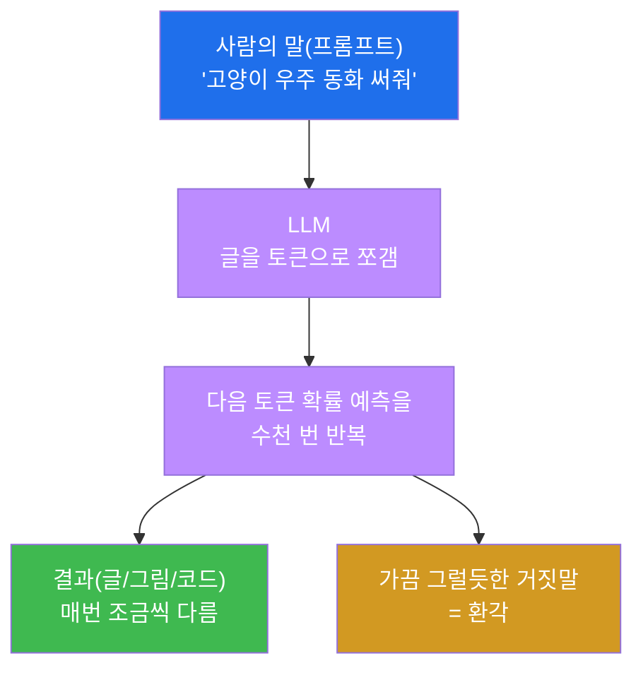
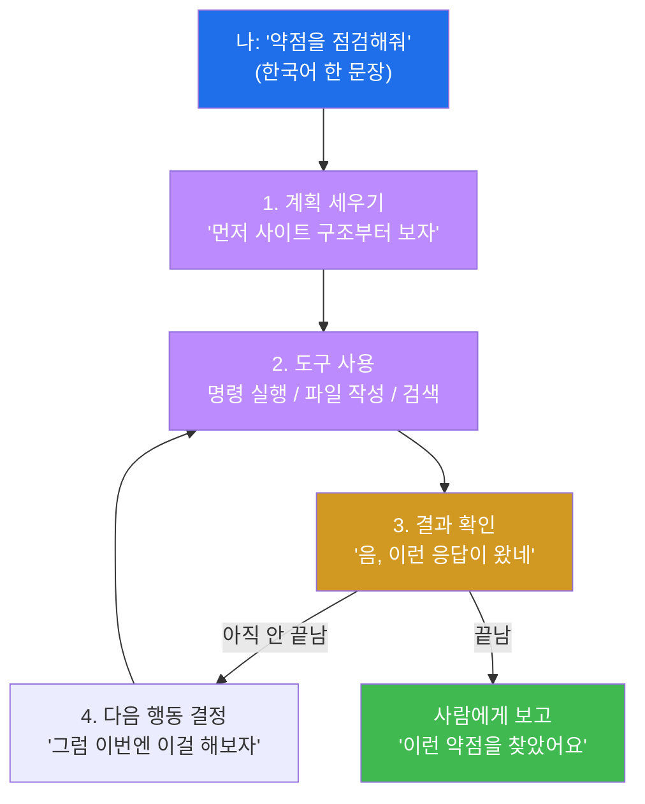
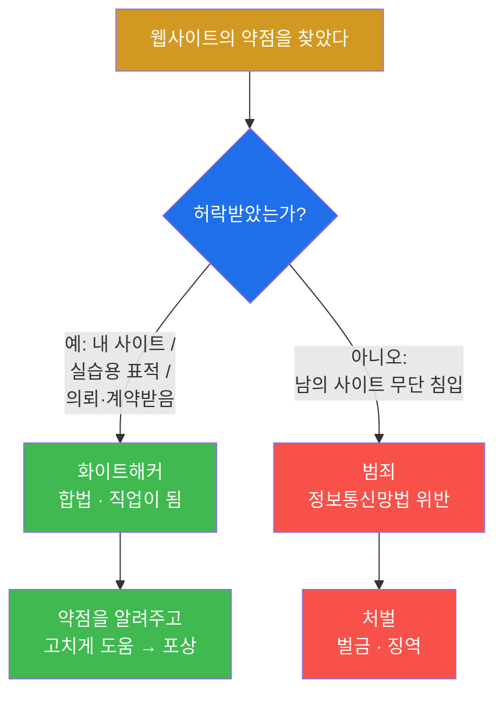

# Week 01 — AI와 AI 에이전트, 그리고 윤리

> **본 주차의 한 줄 요약**
>
> AI가 무슨 마법이 아니라 "엄청 똑똑한 예측 기계"라는 걸 직접 만져보며 이해하고, 그 AI가
> 스스로 도구를 써서 일을 처리하는 **AI 에이전트**가 무엇인지 본다. 마지막엔 이 강력한 도구를
> **"해도 되는 곳"과 "절대 하면 안 되는 곳"** 을 구분하는 약속(서약)을 한다. 이번 주가 재미없으면
> 다음이 없으니, 머리로 외우지 말고 **눈으로 보고 손으로 만지며** 간다.

---

## 학습 목표

이번 주가 끝나면 학생은 다음을 **직접** 할 수 있다.

1. AI가 "정답을 아는 기계"가 아니라 "다음에 올 것을 확률로 예측하는 기계"임을 친구에게 1분 안에 설명한다.
2. LLM이 글을 토막(토큰) 단위로 쪼개 "다음 토막"을 예측한다는 원리와, **왜 환각(거짓말)이 생기는지** 그 이유까지 말한다.
3. 그냥 챗봇(AI)과 **AI 에이전트**의 차이를 "조언자 vs 비서" 비유로 구분하고, 에이전트의 동작 루프(계획→도구사용→결과확인→다음행동)를 그림으로 그린다.
4. AI가 자주 하는 실수·위험 네 가지(환각·편향·딥페이크·저작권/사생활)를 실제 사례 1개씩 들어 설명한다.
5. 어떤 해킹이 "공부"이고 어떤 해킹이 "범죄"인지, 우리나라 법(정보통신망법 제48조) 기준으로 "허락"이라는 한 단어로 구분한다.
6. "나는 허락된 곳에서만 실습한다"는 **해킹 서약서**에 본인 이름으로 서명한다.

---

## 시간 배분 (총 4시간)

| 시간 | 내용 | 유형 |
|------|------|------|
| 0:00–0:50 | AI가 뭐길래? — 글·이미지 생성 데모, "예측 기계" 원리, 토큰·환각의 정체 | 이론(가벼움) |
| 0:50–1:40 | AI 에이전트 = 스스로 도구를 쓰는 AI + 동작 루프 + Claude Code 1분 시연 | 이론+시연 |
| 1:40–2:00 | 휴식 | — |
| 2:00–2:50 | AI 윤리 — 환각/편향/딥페이크/저작권, 실제 사례로 우리 반 토론 | 토론 |
| 2:50–3:40 | 사이버보안 윤리 — 해킹은 언제 범죄? 정보통신망법, 화이트해커 직업 | 토론 |
| 3:40–4:00 | 자주 하는 오해 FAQ + 해킹 서약서 작성 + 다음 주 예고 | 정리 |

---

## 0. 용어 해설 (오늘 처음 나오는 말)

수업에 들어가기 전에, 오늘 등장할 낯선 단어들을 한자리에 모았다. 지금 다 외울 필요는 없다.
본문을 읽다가 "이 단어 뭐였지?" 싶으면 여기로 돌아오면 된다. 모든 단어에는 일상에서 떠올릴 수
있는 **비유**를 붙여 두었다.

| 용어 | 영문 | 뜻 | 비유 |
|------|------|----|------|
| **AI** | Artificial Intelligence | 사람처럼 보이는 판단·생성을 하는 프로그램 | 엄청 책을 많이 읽은 친구 |
| **LLM** | Large Language Model | 글을 학습해 "다음 단어"를 확률로 예측하는 거대한 AI | 끝말잇기를 신처럼 잘하는 기계 |
| **토큰** | Token | AI가 글을 다루는 최소 단위(단어·글자 토막) | 레고 블록 한 조각 |
| **학습/훈련** | Training | 엄청난 양의 글을 읽혀 패턴을 익히게 하는 과정 | 수십 년치 신문을 다 읽힌 것 |
| **프롬프트** | Prompt | AI에게 시키는 말(질문·지시) | 비서에게 건네는 메모 |
| **환각** | Hallucination | AI가 그럴듯하게 **틀린 말**을 지어내는 현상 | 모르면서 아는 척하는 친구 |
| **AI 에이전트** | AI Agent | 스스로 도구(파일·명령·검색)를 써서 일을 끝내는 AI | 시키면 알아서 처리하는 비서 |
| **도구 사용** | Tool Use | 에이전트가 파일 생성·명령 실행·검색 같은 행동을 하는 것 | 비서가 직접 손을 쓰는 것 |
| **Claude Code** | — | 터미널에서 도는 AI 에이전트(우리가 쓸 도구) | 내 컴퓨터에 사는 해커 비서 |
| **편향** | Bias | 학습 데이터가 치우쳐 AI 판단도 치우치는 것 | 한쪽 얘기만 들은 사람 |
| **딥페이크** | Deepfake | AI로 진짜 같은 가짜 얼굴·목소리를 만드는 것 | 완벽한 가면 |
| **저작권** | Copyright | 창작물에 대해 만든 사람이 갖는 권리 | 내가 그린 그림은 내 것 |
| **화이트해커** | White Hat | **허락받고** 약점을 찾아 고치게 돕는 해커 | 의뢰받은 자물쇠 점검 기사 |
| **버그 바운티** | Bug Bounty | 약점을 신고하면 회사가 포상금을 주는 제도 | 잃어버린 물건 찾아주면 사례금 |
| **정보통신망법** | — | 허락 없이 남의 시스템에 들어가는 걸 처벌하는 우리나라 법 | 남의 집 무단침입 금지법 |

---

## 0.5 가장 헷갈리는 핵심 — 비유로 깊게 풀기

용어 해설 표는 한 줄짜리라서, 진짜 중요한 네 가지는 따로 한 단락씩 풀어서 설명한다. 이 네 개만
확실히 잡으면 오늘 수업의 90%는 끝난 것이다.

### 0.5.1 "AI는 정답을 아는 기계"가 아니다 — 끝말잇기·자동완성 천재다

스마트폰으로 문자를 칠 때, 키보드 위에 다음 단어 후보가 뜨는 걸 본 적 있을 것이다. "오늘 학교
끝나고"라고 치면 "만나자 / 뭐해 / 집에" 같은 단어가 추천된다. 이게 바로 LLM의 정체다. LLM은
**앞에 나온 글을 보고, 가장 그럴듯한 다음 토막을 확률로 골라 이어 붙이는 자동완성**일 뿐이다.
끝말잇기로 바꿔 생각해도 똑같다. "사과 → 과자 → 자전거 …"처럼, 앞 글자를 보고 가장 자연스러운
다음 것을 고른다. 다만 LLM은 인터넷에 있는 거의 모든 책·기사·대화를 다 읽어서, 이 "다음에 뭐가
올까?" 게임을 **인간이 흉내 낼 수 없을 만큼 잘하게** 된 것이다. 그래서 마치 생각하고 말하는 것처럼
보이지만, 실제로 내부에서 벌어지는 일은 "다음 토막 확률 계산 → 하나 고르기 → 또 계산"을 수천 번
반복하는 것뿐이다. 이 사실 하나만 알면 AI가 왜 가끔 멍청한 실수를 하는지 전부 설명된다.

### 0.5.2 토큰 — AI가 글을 씹어 먹는 한 입의 크기

AI는 글을 우리처럼 "단어 하나, 문장 하나"로 보지 않는다. **토큰**이라는 작은 토막으로 잘라서
다룬다. 토큰은 보통 짧은 단어 하나, 또는 긴 단어의 일부 조각이다. 영어 "unbelievable"은
"un / believ / able"처럼 몇 토막으로 쪼개지고, 한국어도 비슷하게 잘린다. 비유하자면 피자를
한 입에 통째로 못 먹으니 조각으로 잘라 먹듯, AI도 글을 토큰 조각으로 잘라서 "다음 조각은
뭘까?"를 예측한다. 그래서 AI가 글을 만든다는 건 정확히는 **토큰을 한 조각씩 차례로 뱉어내는
것**이다. 화면에 글자가 또르륵 이어서 나오는 게 바로 이 장면이다 — 다음 토큰, 또 다음 토큰을
실시간으로 예측해 붙이는 중인 것이다.

### 0.5.3 환각 — 왜 AI는 자신 있게 거짓말을 할까

여기가 가장 중요하다. AI는 "다음 토막으로 **가장 그럴듯한 것**"을 고르도록 훈련됐을 뿐, "**사실인
것**"을 고르도록 훈련된 게 아니다. 이 둘은 보통 같지만, 가끔 어긋난다. 예를 들어 존재하지도 않는
책 제목을 주고 "그 책 줄거리 알려줘"라고 하면, AI는 "그런 책 없는데요"라고 멈추기보다 자기가
읽은 수많은 줄거리 패턴을 흉내 내 **그럴듯한 가짜 줄거리**를 술술 만들어낸다. 모르는 시험 문제에
빈칸을 두기 싫어서 아무 말이나 자신 있게 적는 학생과 똑같다. 이렇게 그럴듯하지만 사실이 아닌
답을 만들어내는 현상을 **환각(hallucination)**이라고 부른다. 환각은 AI가 고장 나서 생기는 게
아니라, "그럴듯함"을 최우선으로 추구하는 원리 그 자체에서 나오는 부작용이다. 그래서 AI의 말은
**언제나 사람이 사실 확인을 해야 한다.** 오늘 실습에서 우리는 일부러 AI가 환각을 일으키게 만들어
이 순간을 직접 잡아낼 것이다.

### 0.5.4 챗봇 AI vs AI 에이전트 — "조언자" vs "비서"

그냥 챗봇은 **말로 조언**만 한다. "라면 끓이려면 물 끓이고 면 넣으세요"라고 알려주지만, 물을
끓여주진 않는다. **AI 에이전트**는 다르다. 부엌(컴퓨터)에 직접 들어가 **냄비를 올리고 면을
넣는다.** 즉 파일을 만들고, 명령을 실행하고, 인터넷을 검색하는 **행동**을 한다. 더 정확히 말하면,
에이전트는 한 번에 끝내지 않고 "계획을 세우고 → 도구를 한 번 써보고 → 결과를 확인하고 → 그
결과를 보고 다음에 뭘 할지 다시 정하는" 과정을 스스로 반복한다. 라면 봉지를 뜯다가 "어, 물이
아직 안 끓었네? 그럼 좀 더 기다리자"라고 스스로 판단하는 비서인 셈이다. 이 차이가 이번 특강의
핵심이다 — 우리는 "조언만 듣는" 게 아니라 "대신 일해주는 비서"를 부린다. 어려운 해킹 명령어는
이 비서가 다 치고, 학생은 한국어로 "이 사이트 약점 좀 점검해줘"라고 시키기만 하면 된다.

---

## 1. AI가 뭐길래? — 직접 보면 안다

### 1-1. 한 줄 정의
AI(특히 우리가 쓰는 LLM)는 **엄청난 양의 글·그림을 학습해서, 다음에 올 것을 확률로 예측하는
프로그램**이다.

### 1-2. 왜 중요한가 — 그리고 AI는 왜 갑자기 똑똑해졌나
예전엔 컴퓨터에게 무언가 시키려면 **사람이 코드를 한 줄 한 줄** 짜야 했다. 이제는 **사람의 말
(프롬프트)** 로 시키면 AI가 알아서 한다. 코딩을 몰라도 컴퓨터를 부릴 수 있는 시대가 됐다 —
그래서 컴퓨터를 잘 모르는 우리도 오늘부터 "웹 해킹"을 체험할 수 있는 것이다.

그런데 AI는 왜 몇 년 사이에 갑자기 이렇게 똑똑해졌을까? 답은 단순하다. **읽힌 글의 양**과
**계산하는 힘**이 폭발적으로 커졌기 때문이다. 인터넷에는 수십 년치 책·기사·대화가 쌓여 있고,
이걸 전부 읽혀서 "다음 토막 맞히기" 연습을 어마어마하게 많이 시키면, AI는 단순히 단어를
잇는 수준을 넘어 문법·상식·코딩까지 흉내 낼 수 있게 된다. 비유하면, 한 사람에게 세상의 거의
모든 책을 읽히고 "빈칸 채우기" 문제를 수십억 번 풀게 했더니, 어느 순간 사람처럼 글을 쓰기
시작한 것이다. 마법이 아니라 **데이터 + 학습량**의 결과다.

### 1-3. 어떻게 체험하나 (수업 데모)
강사가 챗봇에 "고양이가 우주를 여행하는 4컷 동화 써줘"라고 입력하면 글이 줄줄 나온다. 이미지
생성 AI에 "사이버펑크 도시의 비 오는 밤"이라고 넣으면 그림이 생긴다. 여기서 가장 중요한 관찰
포인트는 **똑같은 프롬프트를 두 번 넣으면 결과가 조금씩 다르다**는 것이다. 정해진 답을 서랍에서
꺼내는 게 아니라, 매번 "그럴듯한 다음 토막"을 새로 예측해 이어 붙이기 때문에 결과가 달라진다.
이것이야말로 "AI = 확률적 예측 기계"라는 가장 확실한 증거다.

### 1-4. 주의
AI의 말은 **항상 사실 확인**이 필요하다. 특히 숫자·날짜·법 조항·인용·책 제목은 환각이 자주
나오는 단골 메뉴다. AI는 "빠른 초안"을 주는 도구지 "최종 정답지"가 아니다. AI가 술술 자신 있게
말한다고 해서 그게 맞다는 뜻이 절대 아니라는 걸 오늘 실습에서 몸으로 배운다.

---

## 2. AI 에이전트 — 스스로 도구를 쓰는 AI

### 2-1. 한 줄 정의
AI 에이전트는 **"무엇을 할지 스스로 판단하고, 컴퓨터의 도구(파일·명령·검색)를 직접 써서 일을
끝내는"** AI다.

### 2-2. 왜 중요한가
이번 특강에서 우리가 "해커가 하는 일"을 직접 할 수 있는 비결이 바로 이것이다. 복잡한 명령어와
공격 기법은 **에이전트(Claude Code)가 대신** 실행한다. 학생은 **"이 사이트의 약점을 점검해줘"**
같은 한국어 한 문장만 던지면 된다. 챗봇이 "이렇게 하세요"라고 설명서를 읽어주는 데서 멈춘다면,
에이전트는 그 설명서대로 **직접 손을 움직여 끝까지 해낸다**는 게 결정적 차이다.

### 2-3. 챗봇 vs 에이전트 — 한눈에 비교

| 비교 항목 | 그냥 챗봇 (조언자) | AI 에이전트 (비서) |
|-----------|-------------------|--------------------|
| 하는 일 | 말로 답·조언만 함 | 직접 파일 생성·명령 실행·검색 |
| 결과물 | 글(텍스트) | 진짜 파일, 실행된 명령의 결과 |
| 반복 판단 | 한 번 답하고 끝 | 결과 보고 다음 행동을 스스로 결정 |
| 도구 사용 | 못 함 | 컴퓨터의 도구를 직접 사용 |
| 비유 | "라면 끓이는 법 알려줄게" | 부엌에 들어가 라면을 끓여 줌 |
| 위험도 | 낮음(말뿐) | 높음(진짜 실행 → 윤리가 필수) |

### 2-4. 에이전트의 동작 루프 — 계획 → 도구 → 확인 → 다음 행동

에이전트가 똑똑해 보이는 진짜 비결은 **루프(반복)**에 있다. 사람이 일을 처리하는 방식과 똑같다.
먼저 머릿속으로 계획을 세우고, 한 단계 행동해 보고, 그 결과가 어떤지 확인한 다음, "그럼 다음은
이걸 해야겠다"라고 다시 정한다. 이걸 일이 끝날 때까지 반복한다.

위 그림에서 핵심은 **C→D→E→C의 반복 고리**다. 에이전트는 한 번 실행하고 결과를 본 뒤 "그럼
다음은 이걸 해야겠다"를 스스로 정해 다시 실행한다. 사람이 옆에서 명령어를 일일이 알려주지 않아도
된다. 이 루프가 있어서, 우리는 어려운 해킹 절차를 외우지 않고도 한 문장으로 일을 시킬 수 있다.

### 2-5. 어떻게 체험하나 (1분 시연)
오늘은 아직 아무것도 설치하지 않았으므로, 에이전트는 **강사 화면으로 구경만** 한다. 강사가
Claude Code에게 이렇게 말한다: *"지금 폴더에 'hello.txt' 파일을 만들고 안에 'AI 해킹 특강
1일차'라고 써줘."* 그러면 에이전트가 **진짜로 파일을 생성**한다. 학생들은 화면에서 파일이 짠
하고 생기는 걸 본다 — "어? AI가 말만 하는 게 아니라 진짜 만들었네?" 이 순간이 오늘의 첫
"우와!"다. 챗봇이라면 "메모장을 열고 이렇게 저장하세요"라고 설명만 했을 텐데, 에이전트는
그냥 만들어 버린다.

### 2-6. 주의
강력한 만큼 위험하다. 에이전트는 시키면 **진짜로 실행**하므로, "남의 사이트를 공격해줘" 같은
지시는 그대로 **범죄가 될 수 있다.** 챗봇이 잘못 말하면 그냥 틀린 말로 끝나지만, 에이전트가
잘못 행동하면 실제 사건이 된다. 그래서 §3·§4의 윤리가 이 도구에 반드시 짝으로 따라온다.

---

## 3. AI 윤리 — 똑똑한 도구의 그림자

AI는 만능이 아니고, 잘못 쓰면 사람을 다치게 한다. 네 가지만 확실히 기억하자. 각각 **실제로
일어날 법한 사례**와 함께 본다.

| 문제 | 무엇인가 | 실제로 일어날 법한 사례 |
|------|----------|--------------------------|
| **환각** | 그럴듯한 거짓 정보 | 변호사가 AI에게 받은 "판례"를 법정에 냈는데, 그 판례가 통째로 AI가 지어낸 가짜여서 망신당함 |
| **편향** | 치우친 학습 → 치우친 판단 | 채용에 쓴 AI가 과거 데이터를 그대로 배워 특정 성별·출신에게 불리하게 점수를 매김 |
| **딥페이크** | 가짜 얼굴·목소리 | 친구 얼굴을 합성한 가짜 영상으로 명예를 훼손하거나, 유명인 목소리를 흉내 내 보이스피싱에 악용 |
| **저작권/사생활** | 남의 창작물·개인정보 도용 | 특정 작가 그림체를 그대로 베껴 팔거나, 동의 없이 남의 사진을 학습·합성에 사용 |

### 3-1. 환각 — 자신 있게 거짓말하는 AI
앞에서 본 그 환각이다. 실제로 해외에서 한 변호사가 AI가 알려준 판례를 법원에 제출했는데, 그
판례들이 전부 AI가 지어낸 가짜였던 사건이 있었다. AI는 "그럴듯한 판례 문장"을 만들어냈을 뿐,
"진짜 있는 판례"를 찾은 게 아니었다. 숙제에 AI가 지어낸 책·통계를 인용했다가 0점을 받는 것도
똑같은 일이다. 교훈은 하나 — **AI 말은 검증 없이 쓰지 않는다.**

### 3-2. 편향 — 한쪽 이야기만 들은 AI
AI는 학습한 데이터를 그대로 닮는다. 만약 과거 데이터가 한쪽으로 치우쳐 있으면, AI의 판단도
똑같이 치우친다. 실제로 한 회사가 채용 심사를 AI에게 맡겼더니, 과거에 특정 집단을 많이 뽑았던
기록을 학습한 AI가 그 패턴을 그대로 따라 해 불공정한 결과를 냈다. AI는 객관적인 기계처럼
보이지만, **배운 게 편향돼 있으면 편향된 판단을 한다.**

### 3-3. 딥페이크 — 완벽한 가짜 얼굴과 목소리
AI는 이제 진짜와 구분하기 어려운 가짜 얼굴·목소리를 만들 수 있다. 친구 사진으로 "장난" 영상을
만드는 것도, 그게 친구를 모욕하거나 가짜 상황에 합성하는 순간 **명예훼손이자 범죄**가 된다.
유명인 목소리를 흉내 내 가족인 척 전화해 돈을 가로채는 보이스피싱에도 쓰인다. "장난"과 "범죄"의
경계가 생각보다 가깝다는 걸 알아야 한다.

### 3-4. 저작권·사생활 — 남의 것을 함부로 쓰는 문제
AI는 누군가가 만든 그림·글·음악을 학습한다. 그래서 특정 작가의 그림체를 똑같이 베껴 내거나,
동의받지 않은 남의 사진을 합성에 쓰는 일이 생긴다. "AI가 했으니 내 책임 아니다"라는 말은
통하지 않는다. **도구를 쓴 사람의 책임**이다.

**토론 거리(정답 없음, 의견 나누기):**
AI가 그린 그림으로 미술 대회에서 상을 받았다면 그건 정말 "내 작품"일까? 친구 사진으로 딥페이크
"장난"을 만들면 그건 장난일까 범죄일까, 어디서부터 선을 넘을까? AI 답을 그대로 베껴 과제를
내면 정확히 어떤 점이 문제일까? AI가 인터넷 그림을 학습하는 건 "배우는 것"일까 "베끼는 것"일까?
정답은 없다. 친구들과 서로 다른 의견을 나눠 보자.

> **한 줄 결론.** AI는 **도구**다. 칼이 요리도 되고 흉기도 되듯, **쓰는 사람의 책임**이 전부다.

---

## 4. 사이버보안 윤리 — 해킹은 언제 "범죄"가 되나

해킹 기술 자체는 죄가 아니다. **허락 없이 남의 시스템에 들어가는 것**이 죄다. 자물쇠를 따는
기술을 아는 것은 죄가 아니지만, 남의 집 자물쇠를 허락 없이 따면 범죄인 것과 똑같다.

### 4-1. 우리나라 법 — 정보통신망법 제48조, 딱 이것만 기억
우리나라에는 **정보통신망법 제48조**라는 조항이 있다. 어려운 법 문장을 쉽게 풀면 이렇다 —
*"정당한 접근권한 없이, 또는 허락받은 범위를 넘어서 남의 정보통신망(웹사이트·서버·시스템)에
들어가면 처벌한다."* 핵심 단어는 딱 하나, **"허락"**이다. 기술이 얼마나 대단하냐가 아니라,
**허락을 받았느냐 안 받았느냐**가 합법과 범죄를 가른다. 정리하면 이렇다.

- 허락 없이 남의 사이트 로그인을 뚫어보면 → **범죄** (호기심이었어도 마찬가지다)
- 친구가 "내 블로그 좀 점검해줘"라고 **부탁**하면 → 그 범위 안에서는 **OK**
- 회사·기관이 **계약**으로 의뢰한 모의해킹을 하면 → **합법적인 직업**(화이트해커)
- 우리 특강처럼 **연습하라고 만든 표적**을 공격하면 → **OK** (그러라고 만든 것)

### 4-2. 화이트해커라는 직업
약점을 찾아 **고치도록 돕고 돈을 버는** 사람들이 있다. 이들을 화이트해커(또는 보안 전문가)라고
부른다. 또 많은 회사가 **버그 바운티(Bug Bounty)**라는 제도를 운영한다. 누군가 자기 회사
서비스의 약점을 찾아 신고하면, 회사가 **포상금**을 주는 제도다. 잃어버린 지갑을 찾아주면 사례금을
받는 것과 같다. 큰 회사는 약점 하나 신고에 수백만 원에서 수억 원을 주기도 한다. 즉, 오늘
배우는 기술은 **방향만 바르면 멋진 직업이자 돈벌이**가 된다. 같은 기술이 한쪽으로 가면 범죄,
다른 쪽으로 가면 전문직이라는 게 이 분야의 매력이자 무게다.

### 4-3. 우리 특강의 약속
이 특강의 모든 표적은 **연습하라고 일부러 약하게 만든 우리 것**이다. 다음 주차부터 우리가
공격할 대상은 정해져 있다 — 연습용 취약 웹 DVWA(`:8088`), 가짜 은행 NeoBank(`:3001`), 가짜
의료 게시판 MediForum(`:3003`), 그리고 해킹 문제풀이 사이트 CTFd(`:8000`)다. 이들은 전부 우리가
세운 연습용 서버이고, 그러라고 만든 표적이다. **실제 타인의 사이트는 절대 건드리지 않는다.**
이 약속이 깨지면 그건 특강이 아니라 사건이 된다.

---

## 5. 자주 하는 오해 / FAQ

수업을 듣다 보면 누구나 한 번쯤 떠올리는 오해들이 있다. 미리 정리하고 가자.

**Q1. AI는 똑똑하니까 항상 맞는 말을 하지 않나요?**
아니다. AI는 "사실"이 아니라 "그럴듯함"을 좇는다. 그래서 자신 있게 틀린다(환각). 특히 숫자·
날짜·법·인용에서 자주 틀리므로, 중요한 건 반드시 사람이 확인해야 한다.

**Q2. 같은 질문에 답이 매번 다른 건 AI가 고장 난 건가요?**
아니다. 정상이다. AI는 정해진 답을 꺼내는 게 아니라 매번 확률로 새로 예측하기 때문에 결과가
조금씩 달라진다. 이게 오히려 "예측 기계"라는 증거다.

**Q3. 해킹을 배우면 다 범죄자가 되는 거 아닌가요?**
아니다. 해킹 기술 자체는 죄가 아니다. **허락 없이** 남의 시스템을 건드리는 것이 죄다. 허락받고
약점을 찾아 고쳐 주는 화이트해커는 존경받는 전문직이다.

**Q4. 에이전트가 다 해주면 나는 아무것도 안 배우는 거 아닌가요?**
아니다. 에이전트는 어려운 "타이핑"을 대신할 뿐, **무엇을 왜 시키는지, 결과가 무슨 뜻인지**는
사람이 이해해야 한다. 운전은 AI가 해도, 어디로 갈지 정하는 건 너다.

**Q5. 호기심으로 딱 한 번 남의 사이트를 봐보는 건 괜찮지 않나요?**
아니다. 단 한 번, 호기심이었더라도 허락이 없으면 정보통신망법 위반이다. 호기심은 허락된
표적에서만 푼다.

---

## 6. 실습 안내 (lab_week01.yaml)

오늘 실습은 가볍다. 아직 아무것도 설치하지 않으며, **브라우저로 AI 챗봇에 말 걸기 + 윤리 감각
점검**이 전부다. 각 실습을 **왜 하나 / 무엇을 알게 되나 / 결과 해석 / 실전 의미** 네 축으로
설명한다. (lab_week01.yaml의 5개 step과 정확히 짝을 이룬다.)

### 실습 1 — AI 챗봇에 말 걸어 글 '생성'시키기
- **왜 하나?** AI가 정답을 꺼내는 게 아니라 매번 새로 예측한다는 걸 직접 체감하기 위해서다.
- **무엇을 알게 되나?** 브라우저에서 챗봇(예: claude.ai)을 열고 *"고양이가 우주를 여행하는 4컷
  동화를 재미있게 써줘"*라고 입력하면 글이 생성된다. 같은 문장을 **두 번** 보내 본다.
- **결과 해석:** 두 번의 결과가 **조금 다르면** 성공이다. 이게 "정해진 답이 아니라 확률 예측"
  이라는 증거다. 두 동화의 다른 점을 한 가지만 말할 수 있으면 통과.
- **실전 의미:** 앞으로 모든 해킹 실습을 이렇게 "AI에게 한국어로 시키는" 방식으로 진행한다.
  오늘 그 첫 대화를 나누는 것이다.

### 실습 2 — AI의 환각 직접 잡아내기
- **왜 하나?** AI를 맹신하면 안 되는 이유를 머리가 아니라 눈으로 확인하기 위해서다.
- **무엇을 알게 되나?** 일부러 존재하지 않는 걸 사실인 척 묻는다. 예: *"세종대왕이 만든
  스마트폰 모델명과 출시연도를 알려줘"*, 또는 지어낸 책 제목으로 "그 책 줄거리 알려줘".
- **결과 해석:** AI가 **있지도 않은 사실을 그럴듯하게 지어내면** 그것이 환각이다. 그 화면을
  1건 캡처하면 통과. (최신 AI는 "그건 없습니다"라고 바로잡기도 한다. 그러면 더 애매한 질문으로
  한 번 더 시도한다.)
- **실전 의미:** 앞으로 AI가 알려준 명령어·정보도 **항상 의심하고 확인**해야 한다는 습관의 출발점.

### 실습 3 — 에이전트는 '말'이 아니라 '행동'을 한다 (강사 시연 구경)
- **왜 하나?** 챗봇과 에이전트의 결정적 차이를 직접 보기 위해서다.
- **무엇을 알게 되나?** 강사가 Claude Code에게 *"지금 폴더에 hello.txt 파일을 만들고 안에
  'AI 해킹 특강 1일차'라고 써줘"*라고 시키면, 화면에 파일이 **진짜로 생긴다.**
- **결과 해석:** "챗봇과 에이전트의 차이는?"에 *"에이전트는 직접 행동(파일 생성·명령 실행)을
  한다"*는 취지로 자기 말로 답하면 통과.
- **실전 의미:** 다음 주(Week 02)에 이 도구를 **본인 컴퓨터에 직접 설치**한다. 오늘은 동기
  부여를 위한 "구경"이다.

### 실습 4 — 윤리 OX 퀴즈 (합법 vs 범죄)
- **왜 하나?** "허락"이라는 한 단어로 합법과 범죄를 가르는 감각을 손에 익히기 위해서다.
- **무엇을 알게 되나?** 다섯 문제를 OX로 푼다. (1) 내가 만든 연습용 사이트 약점 찾기 (2) 친구가
  부탁한 친구 블로그 점검 (3) 호기심에 학교 홈페이지 관리자 로그인 몰래 뚫기 (4) 회사와 계약한
  모의해킹 (5) 남의 SNS 비밀번호 추측해 로그인.
- **결과 해석:** 정답은 **1)O 2)O 3)X 4)O 5)X** 이고, 4개 이상 맞히면 통과. 허락 없는 3·5번이
  범죄다. 헷갈리면 "허락받았나?" 한 가지만 떠올린다 — 허락 없으면 거의 다 X.
- **실전 의미:** 이 감각이 다음 주차부터 우리가 표적을 고를 때의 기준이 된다.

### 실습 5 — 해킹 서약서 서명
- **왜 하나?** 강력한 도구일수록 약속이 먼저이기 때문이다. 이 서약이 다음 모든 주차의 입장권이다.
- **무엇을 알게 되나?** *"나 ___ 은(는) 이 특강의 허락된 실습 환경에서만 해킹 기술을 사용하며,
  타인의 시스템을 허락 없이 공격하지 않겠습니다. (날짜/서명)"*를 종이나 메모에 옮겨 적고, 이름과
  날짜를 쓴다.
- **결과 해석:** 본인 이름·날짜·서명이 적힌 서약서를 제출하면 통과.
- **실전 의미:** Week 02부터 실제 도구를 설치하므로, **서명한 학생만 다음 단계로** 간다. 이
  서약 위에서 모든 실습이 이루어진다.

---

## 7. 다음 주차 예고

다음 주(Week 02)엔 드디어 **내 손으로** 컴퓨터를 부린다. 리눅스라는 운영체제와 친해지고,
**Claude Code를 내 컴퓨터에 설치**한 뒤, AI와 함께 **나만의 심리테스트 웹사이트**를 뚝딱 만든다.
그리고 그걸 전 세계가 쓰는 **GitHub**에 올려 "내가 만든 거 봐!"라고 자랑할 수 있게 된다.
오늘 구경만 했던 그 에이전트가, 다음 주엔 **네 컴퓨터 안의 비서**가 되는 것이다. 서약서에
서명했다면, 준비 끝이다.
