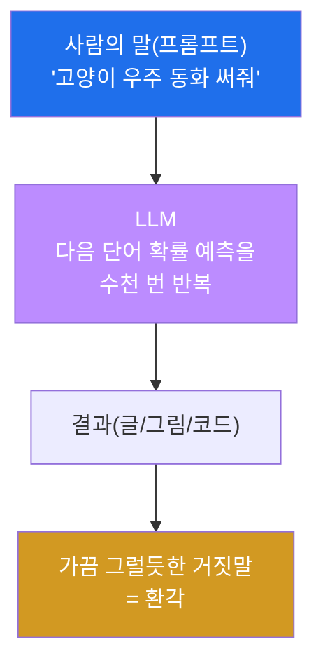
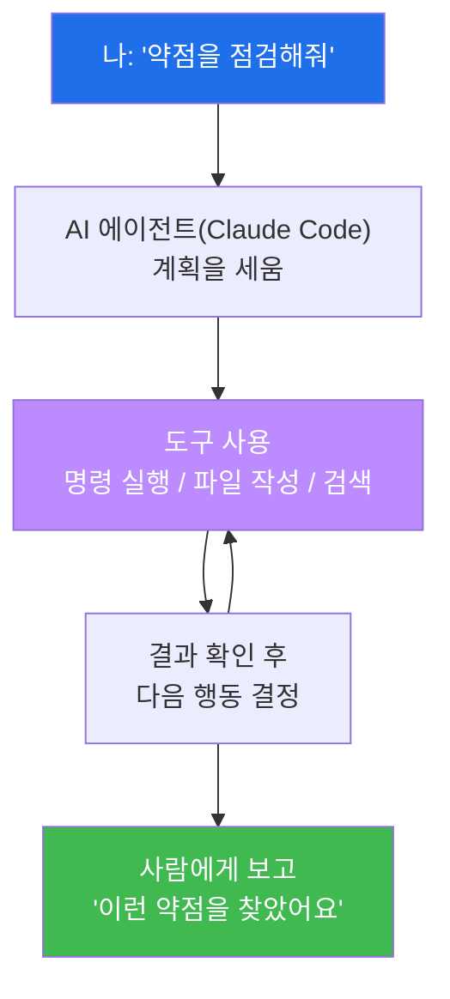
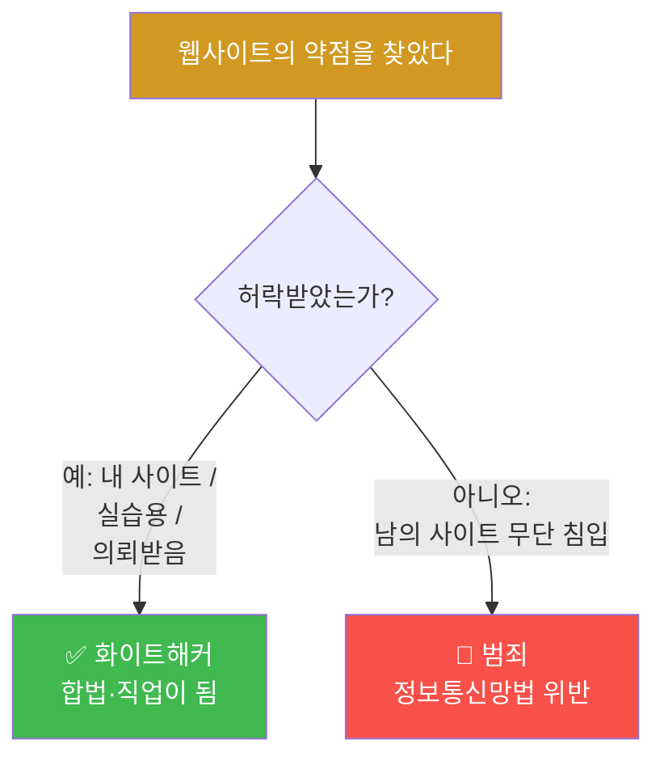

# Week 01 — AI와 AI 에이전트, 그리고 윤리

> **본 주차의 한 줄 요약**
>
> AI가 무슨 마법이 아니라 "엄청 똑똑한 예측 기계"라는 걸 직접 만져보며 이해하고, 그 AI가
> 스스로 도구를 써서 일을 처리하는 **AI 에이전트**가 무엇인지 본다. 마지막엔 이 강력한 도구를
> **"해도 되는 곳"과 "절대 하면 안 되는 곳"** 을 구분하는 약속(서약)을 한다. 이번 주가 재미없으면
> 다음이 없으니, 머리로 외우지 말고 **눈으로 보고 손으로 만지며** 간다.

---

## 학습 목표

이번 주가 끝나면 학생은 다음을 **직접** 할 수 있다.

1. AI가 "정답을 아는 기계"가 아니라 "다음에 올 것을 확률로 예측하는 기계"임을 친구에게 1분 안에 설명한다.
2. 그냥 챗봇(AI)과 **AI 에이전트**의 차이를 "조언자 vs 비서" 비유로 구분한다.
3. AI 에이전트(Claude Code)가 실제로 파일을 만들고 명령을 실행하는 장면을 보고, 무엇이 신기한지 말한다.
4. AI가 자주 하는 실수(환각·편향)와 위험(딥페이크·저작권)을 예시 1개씩 든다.
5. 어떤 해킹이 "공부"이고 어떤 해킹이 "범죄"인지, 우리나라 법(정보통신망법) 기준으로 구분한다.
6. "나는 허락된 곳에서만 실습한다"는 **해킹 서약서**에 서명한다.

---

## 시간 배분 (총 4시간)

| 시간 | 내용 | 유형 |
|------|------|------|
| 0:00–0:50 | AI가 뭐길래? — 글·이미지 생성 데모, "예측 기계" 원리 | 이론(가벼움) |
| 0:50–1:40 | AI 에이전트 = 스스로 도구를 쓰는 AI + Claude Code 1분 시연 | 이론+시연 |
| 1:40–2:00 | 휴식 | — |
| 2:00–2:50 | AI 윤리 — 환각/편향/딥페이크/저작권, 우리 반 토론 | 토론 |
| 2:50–3:40 | 사이버보안 윤리 — 해킹은 언제 범죄? 화이트해커 직업 | 토론 |
| 3:40–4:00 | 해킹 서약서 작성 + 다음 주 예고 | 정리 |

---

## 0. 용어 해설 (오늘 처음 나오는 말)

| 용어 | 영문 | 뜻 | 비유 |
|------|------|----|------|
| **AI** | Artificial Intelligence | 사람처럼 보이는 판단·생성을 하는 프로그램 | 엄청 책을 많이 읽은 친구 |
| **LLM** | Large Language Model | 글을 학습해 "다음 단어"를 예측하는 거대한 AI | 끝말잇기를 신처럼 잘하는 기계 |
| **프롬프트** | Prompt | AI에게 시키는 말(질문/지시) | 비서에게 건네는 메모 |
| **AI 에이전트** | AI Agent | 스스로 도구(파일·명령·검색)를 써서 일을 끝내는 AI | 시키면 알아서 처리하는 비서 |
| **Claude Code** | — | 터미널에서 도는 AI 에이전트(우리가 쓸 도구) | 내 컴퓨터에 사는 해커 비서 |
| **환각** | Hallucination | AI가 그럴듯하게 **틀린 말**을 지어내는 현상 | 모르면서 아는 척하는 친구 |
| **편향** | Bias | 학습 데이터가 치우쳐 AI 판단도 치우치는 것 | 한쪽 얘기만 들은 사람 |
| **딥페이크** | Deepfake | AI로 진짜 같은 가짜 얼굴/목소리를 만드는 것 | 완벽한 가면 |
| **화이트해커** | White Hat | **허락받고** 약점을 찾아 고치게 돕는 해커 | 의뢰받은 자물쇠 점검 기사 |

### 0.5 가장 헷갈리는 두 가지 — 비유로 풀기

**(1) "AI는 정답을 아는 기계"가 아니다 — 예측 기계다.**
끝말잇기를 떠올려 보자. "사과 → 과자 → 자전거 …" 처럼, 앞 단어를 보고 **가장 그럴듯한 다음
것**을 고른다. LLM도 똑같다. "오늘 날씨가 너무" 다음에는 "좋다 / 덥다 / 춥다" 같은 단어가 올
확률이 높다는 걸 어마어마한 양의 글로 배워서, **확률이 가장 높은 다음 말**을 한 단어씩 이어
붙인다. 그래서 가끔 자신 있게 **틀린 말(환각)** 도 한다. AI를 "척척박사"가 아니라 "끝말잇기
천재"로 생각하면, 왜 가끔 헛소리를 하는지 자연스럽게 이해된다.

**(2) 챗봇 AI vs AI 에이전트 — "조언자" vs "비서".**
그냥 챗봇은 **말로 조언**만 한다. "라면 끓이려면 물 끓이고 면 넣으세요"라고 알려주지만, 물을
끓여주진 않는다. **AI 에이전트**는 다르다. 부엌(컴퓨터)에 들어가 **직접 냄비를 올리고 면을
넣는다.** 즉 파일을 만들고, 명령을 실행하고, 인터넷을 검색하는 **행동**을 한다. 이 차이가
이번 특강의 핵심이다 — 우리는 "조언만 듣는" 게 아니라 "대신 일해주는 비서"를 부린다.

---

## 1. AI가 뭐길래? — 직접 보면 안다

### 1-1. 한 줄 정의
AI(특히 우리가 쓰는 LLM)는 **엄청난 양의 글·그림을 학습해서, 다음에 올 것을 확률로 예측하는
프로그램**이다.

### 1-2. 왜 중요한가
예전엔 컴퓨터에게 무언가 시키려면 **사람이 코드를 한 줄 한 줄** 짜야 했다. 이제는 **사람의 말
(프롬프트)** 로 시키면 AI가 알아서 한다. 코딩을 몰라도 컴퓨터를 부릴 수 있는 시대가 됐다 —
그래서 컴퓨터를 잘 모르는 우리도 오늘부터 "웹 해킹"을 체험할 수 있는 것이다.

### 1-3. 어떻게 체험하나 (수업 데모)
- 강사가 챗봇에 "고양이가 우주를 여행하는 4컷 동화 써줘"라고 입력 → 글이 줄줄 나온다.
- 이미지 생성 AI에 "사이버펑크 도시의 비 오는 밤" → 그림이 생긴다.
- 똑같은 프롬프트를 두 번 넣으면 **결과가 조금씩 다르다.** 정해진 답을 꺼내는 게 아니라
  매번 "그럴듯한 것"을 새로 예측하기 때문이다.

### 1-4. 주의
AI의 말은 **항상 사실 확인**이 필요하다. 특히 숫자·날짜·법·인용은 자주 틀린다. AI는
"빠른 초안"을 주는 도구지, "최종 정답지"가 아니다.

---

## 2. AI 에이전트 — 스스로 도구를 쓰는 AI

### 2-1. 한 줄 정의
AI 에이전트는 **"무엇을 할지 스스로 판단하고, 컴퓨터의 도구(파일·명령·검색)를 직접 써서 일을
끝내는"** AI다.

### 2-2. 왜 중요한가
이번 특강에서 우리가 "해커가 하는 일"을 직접 할 수 있는 비결이 바로 이것이다. 복잡한 명령어와
공격 기법은 **에이전트(Claude Code)가 대신** 실행한다. 학생은 **"이 사이트의 약점을 점검해줘"**
같은 한국어 한 문장만 던지면 된다.

### 2-3. 어떻게 체험하나 (1분 시연)
강사가 Claude Code에게 이렇게 말한다: *"지금 폴더에 'hello.txt' 파일을 만들고 안에 내 이름을
써줘."* 그러면 에이전트가 **진짜로 파일을 생성**한다. 학생들은 화면에서 파일이 짠 하고 생기는
걸 본다 — "어? AI가 말만 하는 게 아니라 진짜 만들었네?" 이 순간이 오늘의 첫 "우와!"다.

위 그림에서 핵심은 **C↔D의 반복**이다. 에이전트는 한 번 실행하고 결과를 보고 "그럼 다음은
이걸 해야겠다"를 스스로 정해 다시 실행한다. 사람이 옆에서 일일이 안 시켜도 된다.

### 2-4. 주의
강력한 만큼 위험하다. 에이전트는 시키면 **진짜로 실행**하므로, "남의 사이트를 공격해줘" 같은
지시는 그대로 범죄가 될 수 있다. 그래서 §3·§4의 윤리가 반드시 짝으로 따라온다.

---

## 3. AI 윤리 — 똑똑한 도구의 그림자

AI는 만능이 아니고, 잘못 쓰면 사람을 다치게 한다. 네 가지만 기억하자.

| 문제 | 무엇인가 | 우리 생활 예시 |
|------|----------|----------------|
| **환각** | 그럴듯한 거짓 정보 | AI가 없는 책·판례를 지어내 숙제에 인용 → 0점 |
| **편향** | 치우친 학습 → 치우친 판단 | 특정 집단에 불리한 추천/평가 |
| **딥페이크** | 가짜 얼굴·목소리 | 친구 얼굴 합성 → 명예훼손·범죄 |
| **저작권/사생활** | 남의 창작물·개인정보 학습·도용 | 남 그림체 베끼기, 사진 무단 합성 |

**토론 거리(정답 없음, 의견 나누기):**
- AI가 그린 그림으로 상을 받으면, 그건 "내 작품"일까?
- 친구 사진으로 딥페이크 "장난"을 만들면, 장난일까 범죄일까?
- AI 답을 그대로 베껴 과제를 내면 어떤 점이 문제일까?

> **한 줄 결론.** AI는 **도구**다. 칼이 요리도 되고 흉기도 되듯, **쓰는 사람의 책임**이 전부다.

---

## 4. 사이버보안 윤리 — 해킹은 언제 "범죄"가 되나

해킹 기술 자체는 죄가 아니다. **허락 없이 남의 시스템에 들어가는 것**이 죄다.

### 4-1. 우리나라 법 — 딱 이것만 기억
**정보통신망법 제48조**: *정당한 접근권한 없이 또는 허락된 범위를 넘어 정보통신망에 침입하면
처벌*된다. 즉 **"허락"이 모든 것**을 가른다.
- 허락 없이 남의 사이트 로그인 뚫기 → **범죄**
- 친구가 "내 블로그 좀 점검해줘"라고 **부탁** → 그 범위 안에서는 OK
- 회사/기관이 **계약**으로 의뢰한 모의해킹 → 합법적인 직업(화이트해커)

### 4-2. 화이트해커라는 직업
약점을 찾아 **고치도록 돕고 돈을 버는** 사람들이 있다. 버그를 신고하면 포상하는
**버그 바운티(Bug Bounty)** 제도도 있다. 오늘 배우는 기술은, 방향만 바르면 **멋진 직업**이 된다.

### 4-3. 우리 특강의 약속
이 특강의 모든 표적(DVWA·NeoBank·MediForum)은 **연습하라고 일부러 약하게 만든 우리 것**이다.
**실제 타인의 사이트는 절대 건드리지 않는다.** 이게 깨지면 특강이 아니라 사건이 된다.

---

## 실습 안내 (lab_week01.yaml)

오늘 실습은 가볍다. "AI 에이전트와 인사하기" + "윤리 감각 점검"이다.

1. **AI에게 말 걸어 결과 만들기** — *왜 하나?* 에이전트가 말이 아니라 행동을 한다는 걸 체감.
   *무엇을 알게 되나?* 프롬프트 한 줄로 결과물이 나온다. *결과 해석:* 내가 시킨 대로 파일/글이
   생기면 성공. *실전 의미:* 앞으로 모든 해킹 실습을 이 방식으로 진행한다.
2. **AI의 환각 잡아내기** — 일부러 헷갈리는 걸 물어 AI가 틀리는 순간을 포착. AI를 맹신하면 안
   되는 이유를 직접 본다.
3. **윤리 OX 퀴즈** — "이건 합법일까 범죄일까?"를 판단. 허락의 유무로 가르는 감각을 기른다.
4. **해킹 서약서 서명** — "허락된 곳에서만 실습한다"를 본인 이름으로 약속. 이 서약이 다음 모든
   주차의 입장권이다.

---

## 다음 주차 예고

다음 주(Week 02)엔 드디어 **내 손으로** 컴퓨터를 부린다. 리눅스라는 운영체제와 친해지고,
**Claude Code를 내 컴퓨터에 설치**한 뒤, AI와 함께 **나만의 심리테스트 웹사이트**를 뚝딱 만든다.
그리고 그걸 전 세계가 쓰는 **GitHub**에 올려 "내가 만든 거 봐!"라고 자랑할 수 있게 된다.
