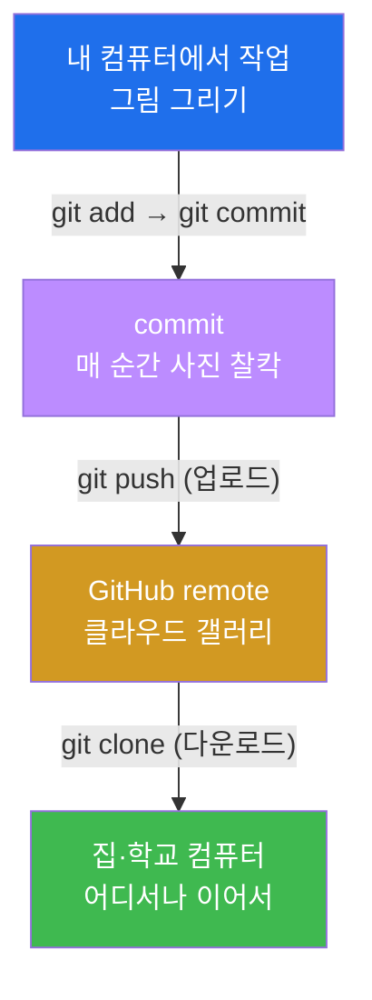
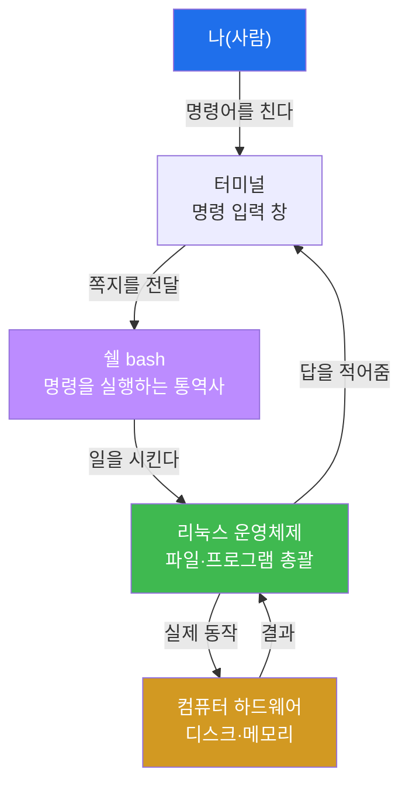
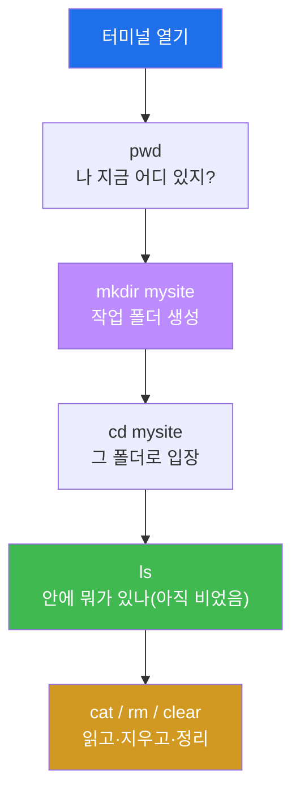
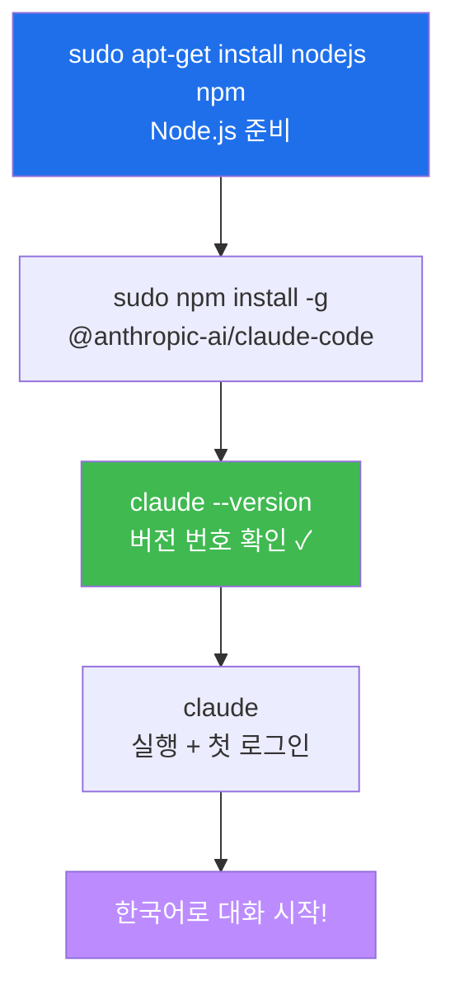
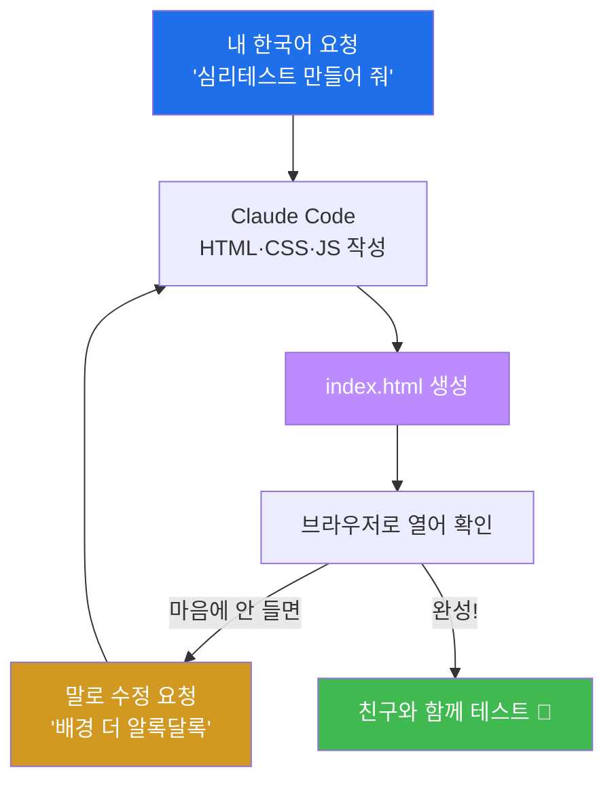
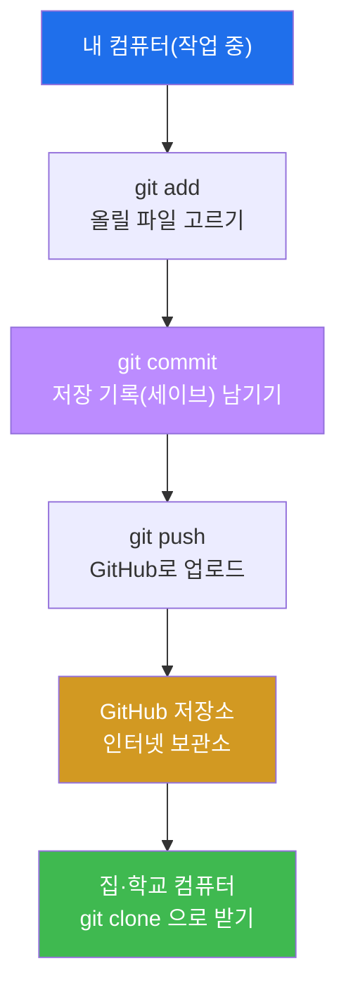

# Week 02 — 리눅스·Claude Code 첫걸음 + 내 첫 웹사이트(심리테스트) + GitHub

> **본 주차의 한 줄 요약**
>
> 검은 화면(터미널)을 무서워하지 않게 되는 게 첫 번째 목표다. 리눅스라는 운영체제와 인사하고,
> 명령어는 딱 **7개만** 손에 익힌다. 그다음 **Claude Code(AI 비서)** 를 내 컴퓨터에 직접 설치해,
> AI와 함께 **나만의 심리테스트 웹사이트** 를 진짜로 만든다. 마지막엔 그걸 전 세계가 볼 수 있는
> **GitHub** 에 올려, 집에서도 다시 받을 수 있게 한다. 오늘은 "우와, 내가 만들었어!" 가 **세 번**
> 나온다 — 첫 파일을 AI가 만들 때, 내 사이트가 브라우저에 뜰 때, 그리고 인터넷에 내 작품 주소가
> 생길 때.

---

## 학습 목표

이번 주가 끝나면 학생은 다음을 **본인 손으로** 할 수 있다.

1. 터미널을 두려움 없이 열고, 리눅스 기본 명령어 7개(`pwd ls cd mkdir cat rm clear`)로 파일과 폴더를 다룬다.
2. "절대경로 vs 상대경로", "홈 디렉터리(`~`)" 가 무엇인지 비유로 설명하고, `cd` 로 자유롭게 이동한다.
3. Claude Code 를 본인 컴퓨터에 설치하고, 첫 대화로 AI에게 파일 하나를 만들게 시킨다.
4. Claude Code 에게 한국어로 지시해 **심리테스트 웹사이트**(질문 → 결과)를 완성하고, 마음에 안 드는 부분을 "말로" 고친다.
5. 로컬 웹서버(`python3 -m http.server`)를 띄워 내가 만든 사이트를 브라우저로 직접 연다.
6. GitHub 저장소를 만들어 내 사이트를 `push` 로 올리고, 다른 위치에서 `git clone` 으로 다시 받는다.
7. GitHub에 **비밀번호·토큰을 올리면 안 되는 이유** 를 설명하고, 흔한 실수(오타·폴더 위치·인증)를 스스로 진단한다.

---

## 시간 배분 (총 4시간)

| 시간 | 내용 | 유형 |
|------|------|------|
| 0:00–0:30 | 운영체제·리눅스·터미널이 뭐야? 검은 화면 무서워하지 않기 | 이론 |
| 0:30–0:50 | 절대경로/상대경로, 홈 디렉터리(`~`), 명령어 7개 개념 | 이론 |
| 0:50–1:30 | 실습 1 — 터미널 열기 + 명령어 7개로 작업 폴더 만들기 | 실습 |
| 1:30–2:10 | 실습 2 — Claude Code 설치 & 첫 대화(첫 번째 우와!) | 실습 |
| 2:10–3:00 | 실습 3·4 — 심리테스트 사이트 만들기 + 브라우저로 열기(두 번째 우와!) | 실습 |
| 3:00–3:50 | 실습 5·6·7 — GitHub에 push / 집에서 clone(세 번째 우와!) | 실습 |
| 3:50–4:00 | 자주 하는 실수·FAQ 정리 + 다음 주 예고 | 정리 |

---

## 0. 용어 해설 (오늘 처음 나오는 말)

아래 표는 한 줄 정의만 담는다. 헷갈리기 쉬운 핵심어는 §0.5에서 일상 비유로 더 깊게 풀어 설명하니,
본문을 읽다가 막히면 언제든 이 표와 §0.5로 돌아오면 흐름이 끊기지 않는다.

| 용어 | 영문 | 뜻 | 비유 |
|------|------|----|------|
| **운영체제** | OS (Operating System) | 컴퓨터의 모든 부품·프로그램을 총괄하는 기본 소프트웨어 | 건물 전체를 돌리는 관리실 |
| **리눅스** | Linux | 서버·해킹 실습에서 가장 많이 쓰는 무료 운영체제 | 전문가들이 입는 작업복 |
| **터미널** | Terminal | 명령어를 글로 쳐서 컴퓨터에 일을 시키는 검은 창 | 컴퓨터와 쪽지로 대화하는 창구 |
| **쉘** | Shell | 터미널에 친 명령을 받아 실제로 실행해 주는 통역사 프로그램(예: bash) | 쪽지를 읽고 심부름하는 비서 |
| **프롬프트** | Prompt | 명령을 기다리며 깜빡이는 줄(예: `ccc@ubuntu:~$`) | "주문하세요" 하고 기다리는 점원 |
| **명령어** | Command | 터미널에 입력하는 한 줄 지시 | 쪽지에 적는 한 가지 심부름 |
| **디렉터리** | Directory | 파일을 담는 칸, 곧 폴더 | 서랍 |
| **경로** | Path | 파일·폴더가 있는 위치 주소 | 서랍의 위치(건물→층→방→칸) |
| **절대경로** | Absolute Path | 맨 꼭대기(`/`)부터 적은 완전한 주소 | 우편번호까지 다 적은 풀 주소 |
| **상대경로** | Relative Path | 지금 내 위치를 기준으로 적은 짧은 주소 | "여기서 두 칸 옆" |
| **홈 디렉터리** | Home (`~`) | 로그인한 내 개인 폴더(`/home/내이름`) | 내 방 |
| **Claude Code** | — | 터미널 안에서 도는 AI 에이전트(앤트로픽 제작) | 내 컴퓨터 속 비서 |
| **에이전트** | Agent | 말만 하는 게 아니라 직접 파일을 만들고 명령을 실행하는 AI | 시키면 진짜로 움직이는 일꾼 |
| **HTML** | HyperText Markup Language | 웹페이지의 뼈대(제목·버튼·글) | 집의 골조 |
| **CSS** | Cascading Style Sheets | 웹페이지의 꾸밈(색·폰트·배치) | 페인트·인테리어 |
| **JavaScript** | JS | 웹페이지의 움직임(클릭하면 결과 계산) | 전기·스위치 |
| **로컬 웹서버** | local web server | 내 컴퓨터에서 내 사이트에 임시 주소를 붙여 띄우는 작은 서버 | 내 방에 임시로 단 문패 |
| **Git** | — | 파일의 변경 역사를 통째로 저장하는 도구 | 무한 '저장'이 되는 타임머신 |
| **GitHub** | — | Git 저장소를 인터넷에 보관·공유하는 사이트 | 작품을 올리는 클라우드 갤러리 |
| **저장소** | Repository (repo) | 프로젝트 파일 + 변경 역사가 함께 담긴 폴더 | 작품 폴더 |
| **commit** | — | "여기까지 했음" 하고 한 시점을 저장 기록으로 남기는 것 | 게임의 세이브 포인트 |
| **branch** | — | 원본은 두고 따로 갈라 나와 실험하는 작업 갈래 | 시험지 복사본에 낙서 |
| **remote** | — | 인터넷에 있는 내 저장소의 짝(보통 GitHub) | 내 작품의 클라우드 사본 |
| **push / clone** | — | 내 변경을 인터넷에 올리기 / 저장소를 통째로 내려받기 | 업로드 / 다운로드 |
| **토큰** | Token | 비밀번호 대신 쓰는 긴 인증 열쇠(절대 공개 금지) | 내 통장 비밀번호 |

---

## 0.5 친화 비유 심화 — 헷갈리는 개념을 깊게

위 표의 한 줄 정의만으로는 부족한 개념이 몇 개 있다. 이번 절에서는 본격 학습 전에, 학생이 가장
많이 막히는 **네 가지** 를 일상 비유로 천천히 풀어 본다.

### 0.5.1 터미널·쉘·프롬프트 — "쪽지 심부름" 비유

터미널의 검은 화면은 무서운 게 아니라 **컴퓨터와 쪽지를 주고받는 창구** 일 뿐이다. 이 장면을
편의점에 비유해 보자.

학생이 편의점 카운터(터미널)에 가서 "삼각김밥 어디 있어요?"라고 적은 쪽지(명령어)를 내민다.
이 쪽지를 받아 읽고 매장 안을 돌아다니며 실제로 일을 처리하는 직원이 **쉘(shell)** 이다. 우리가
쓰는 쉘은 보통 `bash` 라는 직원이다. 일을 마치면 직원은 "2번 진열대에 있어요"라고 답을 적어
준다 — 이게 터미널에 출력되는 결과다.

그리고 직원이 "다음 주문하세요" 하고 기다리며 깜빡이는 줄이 **프롬프트(prompt)** 다. 실제로는
이렇게 생겼다.

```
ccc@ubuntu:~$
```

이 한 줄에 정보가 빼곡히 담겨 있다. `ccc` 는 내 이름(로그인 계정), `ubuntu` 는 이 컴퓨터의 이름,
`~` 는 지금 내가 있는 위치(홈 디렉터리, 곧 내 방), 그리고 `$` 는 "명령 기다리는 중" 표시다.
`$` 뒤에 깜빡이는 커서가 있으면 "주문 받을 준비 완료" 라는 뜻이다.

마우스로 폴더를 더블클릭하는 것과 터미널에 명령을 치는 것은 **결국 똑같은 일** 이다. 단지 손가락
대신 글로 시킬 뿐이다. 그런데 글로 시키면 좋은 점이 있다 — **AI 비서(Claude Code)에게도 똑같이
글로 시킬 수 있다.** 그래서 우리는 명령어를 잔뜩 외울 필요가 없다. 7개만 알면 되고, 나머지
어려운 건 전부 Claude Code 가 대신 친다.

### 0.5.2 절대경로 vs 상대경로 — "주소 적는 두 가지 방법" 비유

파일이 어디 있는지 컴퓨터에 알려주는 방법은 두 가지다. 친구에게 우리 집 위치를 알려주는
상황으로 생각하면 쉽다.

**절대경로** 는 우편번호부터 시·구·동·번지까지 빠짐없이 적은 **풀 주소** 다. 어디서 출발하든
이 주소만 있으면 우리 집을 찾을 수 있다. 컴퓨터에서는 맨 꼭대기인 `/`(루트, 곧 "건물 1층 정문")
부터 시작한다.

```
/home/ccc/mysite/index.html
```

이건 "정문(`/`) → home 방향 → ccc(내 방) → mysite(작업 폴더) → index.html(그 안의 파일)"
이라는 완전한 주소다. 내가 지금 어디에 서 있든 이 주소는 항상 같은 파일을 가리킨다.

**상대경로** 는 **지금 내가 서 있는 곳을 기준으로 한** 짧은 주소다. 친구가 이미 우리 동네에
와 있다면 "여기서 두 블록 직진하고 왼쪽" 처럼 짧게 알려주는 것과 같다. 내가 지금 `/home/ccc`
(내 방)에 있다면, 그냥

```
mysite/index.html
```

라고만 적어도 같은 파일을 가리킨다. "지금 위치에서 mysite 안의 index.html" 이라는 뜻이다.

상대경로에는 특별한 두 약속이 있다. `.`(점 하나)은 "지금 이 위치", `..`(점 둘)은 "한 칸 위
(부모 폴더)" 다. 그래서 `cd ..` 는 "한 단계 위 서랍으로 올라가기" 라는 뜻이 된다. 헷갈리면
언제든 `pwd` 를 쳐서 "나 지금 어디 있지?"를 확인하면 된다. 이게 오늘 가장 자주 쓰게 될 안전장치다.

### 0.5.3 홈 디렉터리 `~` — "내 방" 비유

리눅스 건물에는 사람마다 자기 방이 하나씩 있다. 학생의 방은 `/home/ccc` 같은 주소를 갖는다.
이 "내 방" 을 **홈 디렉터리** 라고 부르고, 너무 자주 쓰니까 `~`(물결표) 한 글자로 줄여 부른다.

```bash
cd ~        # 어디에 있든 내 방으로 즉시 귀가
cd          # 인자 없이 cd 만 쳐도 똑같이 내 방으로
pwd         # /home/ccc 처럼 내 방 주소가 찍힘
```

터미널을 처음 열면 보통 이 내 방(`~`)에서 시작한다. 길을 잃고 어디 있는지 모르겠으면 `cd ~`
한 줄이면 항상 집으로 돌아온다. 오늘 만들 작업 폴더 `mysite` 도 이 내 방 안에 만든다.

### 0.5.4 Git·GitHub — "타임머신 + 클라우드 갤러리" 비유

마지막으로 오늘 가장 강력한 도구인 Git을 비유로 잡아 두자. 학생이 학교 미술 시간에 그림을
그린다고 하자.

**Git** 은 그림을 그리는 매 순간을 사진으로 찍어 두는 **타임머신** 이다. 색을 칠할 때마다 "찰칵"
사진을 남기면(이 한 번의 사진이 **commit**), 나중에 "아, 아까 그 색이 더 나았어" 싶을 때 그
시점으로 정확히 되돌아갈 수 있다. AI와 함께 일하면 코드가 정말 빠르게, 많이 바뀌기 때문에 이
"되돌리기" 능력이 특히 소중하다.

**branch(브랜치)** 는 원본 그림은 안전하게 두고, **복사본 한 장을 더 떠서 거기다 마음껏 실험** 하는
것이다. 망쳐도 원본은 멀쩡하다. 실험이 마음에 들면 그때 원본에 합친다.

**GitHub** 은 그렇게 찍은 사진첩(저장소) 전체를 인터넷의 **클라우드 갤러리** 에 통째로 올려 두는
곳이다. 그 갤러리에 있는 내 작품의 인터넷 주소를 **remote** 라고 부른다. 내 컴퓨터의 변경을
갤러리로 올리는 게 **push(업로드)**, 갤러리에 있는 작품을 다른 컴퓨터로 통째로 내려받는 게
**clone(다운로드)** 다.



이 네 비유(쪽지 심부름 / 주소 두 방법 / 내 방 / 타임머신·갤러리)만 손에 쥐면 오늘 나오는 모든
명령이 "아, 그거" 하고 이해된다.

---

## 1. 운영체제·리눅스·터미널 — 무대를 이해하기

### 1.1 한 줄 정의

**운영체제(OS)** 는 컴퓨터의 부품과 프로그램을 총괄 지휘하는 기본 소프트웨어이고, **리눅스** 는
그중 서버·해킹에서 가장 많이 쓰는 무료 운영체제다. **터미널** 은 그 리눅스에게 **글(명령어)** 로
일을 시키는 창이다.

### 1.2 왜 중요한가 — 왜 하필 리눅스, 왜 검은 화면인가

학생이 평소 쓰는 윈도우나 맥도 운영체제다. 그런데 왜 우리는 굳이 리눅스를 쓸까? 세 가지 이유다.

첫째, **세상의 서버 대부분이 리눅스로 돌아간다.** 우리가 매일 쓰는 웹사이트, 게임 서버, 인터넷
뱅킹의 뒷단은 거의 다 리눅스다. 그러니 웹을 공격하고 방어하는 법을 배우려면, 그 표적이 사는
집인 리눅스를 알아야 한다.

둘째, **해킹 도구와 AI 에이전트 대부분이 터미널에서 돈다.** 다음 주부터 우리가 쓸 도구들도,
오늘 설치할 Claude Code 도 모두 터미널 위에서 동작한다. 검은 화면이 우리의 작업대다.

셋째, **글로 시키면 자동화와 AI 협업이 쉽다.** 마우스 클릭은 사람만 할 수 있지만, 글 명령은
AI에게도 똑같이 시킬 수 있다. 그래서 "AI가 운전하고 학생은 절차만 따른다" 는 이 강의의 방식이
가능해진다.



### 1.3 어떻게 시작하나 — 터미널을 처음 열면 보이는 것

Ubuntu에서 터미널을 열면(보통 `Ctrl`+`Alt`+`T` 또는 앱 목록에서 "Terminal" 검색) 다음 같은
프롬프트가 깜빡인다.

```
ccc@ubuntu:~$
```

§0.5.1에서 봤듯이 `ccc` 는 내 계정, `~` 는 지금 내 방(홈 디렉터리), `$` 는 "명령 기다림" 표시다.
이 `$` 뒤에 명령을 한 줄 친 다음 `Enter` 를 누르면 쉘이 실행하고 답을 적어 준다. 첫 명령으로
가볍게 위치부터 확인해 보자.

```bash
pwd
```

출력 예시:

```
/home/ccc
```

이 한 줄이 "나는 지금 `/home/ccc`, 곧 내 방에 서 있다" 는 뜻이다. 이렇게 컴퓨터가 답을 적어 주면
대화가 성공한 것이다. 어렵지 않다.

### 1.4 주의

처음에는 명령을 치고 `Enter` 를 눌렀는데 화면이 멈춘 듯 보일 수 있다. 대부분은 그냥 일을 하는
중이거나, 입력을 더 기다리는 상태다. 정말 멈춰서 빠져나오고 싶으면 `Ctrl`+`C` 를 누르면 "지금
하던 일 취소" 가 된다. 이 단축키는 오늘 여러 번 쓰게 되니 기억해 두자(특히 로컬 웹서버를 끌 때).

---

## 2. 리눅스 명령어 7개 — 이거면 충분하다

해킹과 AI 협업의 모든 무대가 터미널이지만, 오늘 손에 익힐 건 **딱 7개** 다. 각 명령을 "하는 일 →
비유 → 예시 → 자주 하는 실수" 순서로 하나씩 본다.

### 2.1 한눈에 보는 7개

| 명령 | 하는 일 | 비유 | 예시 |
|------|---------|------|------|
| `pwd` | 지금 내가 어느 폴더에 있나 출력 | 내 현재 위치 확인 | `pwd` |
| `ls` | 이 폴더 안에 뭐가 있나 목록 | 서랍 열어 보기 | `ls` |
| `cd` | 다른 폴더로 이동 | 다른 방으로 가기 | `cd mysite` |
| `mkdir` | 새 폴더 만들기 | 새 서랍 만들기 | `mkdir mysite` |
| `cat` | 파일 내용 펼쳐 보기 | 종이 꺼내 읽기 | `cat hello.txt` |
| `rm` | 파일 지우기 (**주의!**) | 휴지통 없이 바로 버리기 | `rm 메모.txt` |
| `clear` | 화면을 깨끗이 | 칠판 지우기 | `clear` |



### 2.2 `pwd` — "나 지금 어디 있지?"

**하는 일.** Print Working Directory의 약자로, 지금 내가 서 있는 폴더의 절대경로를 찍어 준다.

**비유.** 낯선 건물에서 "여기가 몇 층 몇 호지?" 하고 벽의 안내판을 보는 것과 같다.

**예시.**

```bash
pwd
```
```
/home/ccc/mysite
```

**자주 하는 실수.** 사실 실수랄 게 없는 가장 안전한 명령이다. 오히려 다른 명령이 꼬일 때마다
`pwd` 를 먼저 쳐서 "내 위치부터 확인" 하는 습관이 오늘의 핵심 안전장치다. 길을 잃었다 싶으면
무조건 `pwd`.

### 2.3 `ls` — "여기 뭐 있어?"

**하는 일.** List의 약자로, 지금 폴더 안의 파일·폴더 목록을 보여 준다.

**비유.** 서랍을 열어 안에 뭐가 들었는지 들여다보는 것이다.

**예시.**

```bash
ls
```
```
hello.txt  index.html
```

옵션을 붙이면 더 자세히 볼 수 있다. `ls -l` 은 크기·날짜까지 한 줄씩, `ls -a` 는 `.` 으로 시작하는
숨김 파일까지 보여 준다.

```bash
ls -l
```
```
-rw-r--r-- 1 ccc ccc  18 Jun 21 10:02 hello.txt
-rw-r--r-- 1 ccc ccc 842 Jun 21 10:15 index.html
```

여기서 맨 끝 숫자(`18`, `842`)가 파일 크기(바이트)다. 이게 `0` 이면 파일은 있는데 안이 텅 빈
것이라, 나중에 "index.html 크기가 0이 아니어야 한다" 는 합격 기준을 확인할 때 쓴다.

**자주 하는 실수.** 분명히 파일을 만들었는데 `ls` 에 안 보인다면, 십중팔구 **다른 폴더에 서 있는**
것이다. 그럴 땐 `pwd` 로 위치부터 확인하자(§2.2와 한 세트).

### 2.4 `cd` — "다른 방으로 이동"

**하는 일.** Change Directory의 약자로, 다른 폴더로 이동한다.

**비유.** 옆방으로 걸어 들어가는 것이다.

**예시.**

```bash
cd mysite       # 지금 위치 안의 mysite 폴더로 들어가기(상대경로)
cd ..           # 한 칸 위(부모 폴더)로 나가기
cd ~            # 어디에 있든 내 방(홈)으로 즉시 귀가
cd /home/ccc    # 절대경로로 콕 집어 이동
```

§0.5.2에서 본 상대경로(`mysite`, `..`)와 절대경로(`/home/ccc`)가 여기서 둘 다 쓰인다.

**자주 하는 실수.** `cd mysite` 를 쳤는데 `No such file or directory` 가 뜬다면, 그 폴더가 지금
위치에 없는 것이다. `ls` 로 폴더 이름의 철자(대소문자 포함)를 확인하자. 리눅스는 `Mysite` 와
`mysite` 를 **다른 이름** 으로 본다. 또 `cd` 만 치면 항상 홈으로 가니, 길을 잃었을 때 비상 탈출구로
기억해 두자.

### 2.5 `mkdir` — "새 서랍 만들기"

**하는 일.** Make Directory의 약자로, 새 폴더를 만든다.

**비유.** 책상에 새 서랍을 하나 다는 것이다.

**예시.**

```bash
mkdir mysite
ls            # mysite 폴더가 생긴 걸 확인
```

**자주 하는 실수.** 같은 이름의 폴더가 이미 있으면 `File exists` 라고 거절한다. 이건 에러라기보다
"이미 있어요" 라는 알림이니 당황하지 말자. 폴더 이름에 띄어쓰기를 넣으면(`my site`) 나중에 다루기
번거로우니, 오늘은 띄어쓰기 없이 `mysite` 처럼 붙여 쓴다.

### 2.6 `cat` — "파일 펼쳐 읽기"

**하는 일.** 파일의 내용을 화면에 그대로 펼쳐 보여 준다.

**비유.** 서랍에서 종이를 꺼내 눈앞에 펼쳐 읽는 것이다.

**예시.**

```bash
cat hello.txt
```
```
나의 첫 AI 비서
```

이 명령은 "AI가 정말로 파일을 만들었나?"를 두 눈으로 확인할 때 쓴다. 실습 3에서 Claude Code가
`hello.txt` 를 만든 뒤 이 명령으로 검증한다.

**자주 하는 실수.** 사진·실행파일 같은 "글이 아닌" 파일에 `cat` 을 쓰면 알아볼 수 없는 깨진 문자가
와르르 쏟아진다. 화면이 엉망이 되면 §2.8의 `clear` 로 지우면 된다. `cat` 은 글로 된 파일(`.txt`,
`.html` 등)에만 쓰자.

### 2.7 `rm` — "지우기, 가장 조심할 명령"

**하는 일.** Remove의 약자로, 파일을 지운다.

**비유.** 휴지통을 **거치지 않고** 곧바로 파쇄기에 넣는 것이다. 윈도우의 휴지통과 달리, 리눅스의
`rm` 은 한 번 지우면 되살리기 매우 어렵다.

**예시.**

```bash
rm 메모.txt        # 메모.txt 파일 삭제
```

**자주 하는 실수 — 그리고 가장 중요한 경고.** `rm` 은 오늘 7개 명령 중 **유일하게 위험한** 명령이다.
지울 파일 이름을 반드시 두 번 확인하고 쓴다. 특히 `rm -rf *` 같은 형태는 "지금 폴더 안의 모든 것을
묻지도 않고 통째로 삭제" 라는 뜻이라, 위치를 착각하면 큰 사고가 난다. **오늘은 이런 형태를 쓸 일이
전혀 없으니 쓰지 않는다.** 헷갈리면 직접 `rm` 을 치는 대신, Claude Code에게 "이 파일 지워 줘" 라고
시키면 더 안전하게 처리해 준다.

### 2.8 `clear` — "칠판 지우기"

**하는 일.** 터미널 화면을 깨끗이 비운다. 파일이나 작업에는 아무 영향이 없다.

**비유.** 칠판을 지우개로 싹 닦는 것이다. 글씨만 지우지, 교실이 바뀌진 않는다.

**예시.**

```bash
clear
```

**자주 하는 실수.** `clear` 가 파일을 지우는 줄 알고 겁먹는 학생이 있는데, 전혀 아니다. 화면만
깔끔해질 뿐이다. 출력이 너무 많이 쌓여 어지러우면 언제든 마음 편히 쓰자.

---

## 3. Claude Code 설치 — 내 컴퓨터에 AI 비서 들이기

### 3.1 한 줄 정의

**Claude Code** 는 **내 터미널 안에서 도는 AI 에이전트** 다(앤트로픽이 만든 도구다). 한국어로
시키면 그냥 답만 하는 게 아니라, 진짜로 **파일을 만들고 명령을 실행한다.**

### 3.2 왜 중요한가 — "에이전트"가 챗봇과 다른 점

챗봇은 "이렇게 하세요" 하고 **말** 만 한다. 그러면 학생이 그 말을 보고 직접 손으로 해야 한다.
하지만 **에이전트** 는 한 발 더 나아가, 시킨 일을 **본인이 직접 실행** 한다. "hello.txt 파일을
만들어 줘" 라고 하면, 정말로 그 파일이 생긴다. 어려운 코드, 복잡한 명령을 학생 대신 쳐 주는
일꾼인 셈이다. 이게 이 강의가 비전공 고등학생에게도 진짜 웹사이트를 만들게 할 수 있는 비결이다.

### 3.3 어떻게 설치하나 — 한 줄씩 따라 하기

설치는 두 단계다. 먼저 Claude Code가 돌아가는 데 필요한 **Node.js(노드)** 를 깔고, 그다음 Claude
Code 자체를 깐다.

```bash
# 1) Node.js / npm 설치 (처음 1회). Ubuntu 기준:
sudo apt-get update && sudo apt-get install -y nodejs npm

# 2) Claude Code 설치 (컴퓨터 전체에서 쓰도록 -g 전역 설치)
sudo npm install -g @anthropic-ai/claude-code

# 3) 설치가 됐는지 버전으로 확인
claude --version
```

각 조각의 뜻을 풀어 보자. `sudo` 는 "관리자 권한으로" 라는 뜻이라(건물 마스터키와 비슷), 시스템
전체에 프로그램을 깔 때 필요하다. `apt-get` 은 Ubuntu의 프로그램 설치 도구이고, `npm` 은
Node.js용 프로그램 설치 도구다. `install -g` 의 `-g` 는 global, 곧 "이 컴퓨터 어디서나 쓰도록"
이라는 뜻이다.

설치가 잘 끝나면 `claude --version` 이 버전 번호(예: `1.x.x`)를 한 줄 찍는다. 이게 **첫 번째
합격 신호** 다. 그다음 작업 폴더로 가서 그냥

```bash
claude
```

라고 치면 Claude Code가 시작된다. 처음 실행하면 **계정 로그인(연결)** 을 한 번 하는데, 이건
강사가 화면을 함께 보며 안내한다.



### 3.4 흔한 에러와 대처 — "에러를 그대로 AI에게 보여주기"

처음 설치할 때 에러가 나는 건 **정상** 이다. 프로 개발자도 매일 본다. 대표적인 두 가지와 대처법을
알아 두자.

**권한 에러(permission / EACCES).** `npm install` 도중 "permission denied" 가 뜨면, 관리자 권한이
없어서다. 명령 앞에 `sudo` 를 붙였는지 확인한다. `sudo npm install -g @anthropic-ai/claude-code`
처럼. `sudo` 를 치면 비밀번호를 물을 수 있는데, 강사 안내에 따라 입력한다.

**네트워크 에러(network / ETIMEDOUT / ENOTFOUND).** 다운로드가 중간에 끊기면 이런 에러가 난다.
인터넷 연결을 확인하고, 잠시 뒤 같은 명령을 한 번 더 실행하면 대개 해결된다.

그런데 가장 강력한 대처법은 따로 있다. 바로 **에러 메시지를 그대로 복사해 Claude Code(혹은
강사)에게 보여 주는 것** 이다. 이게 오늘 배울 가장 중요한 작업법이다. 에러 화면을 무서워하지 말고,
빨간 글씨를 그대로 긁어서 "이런 에러가 나는데 어떻게 고쳐?" 라고 물으면 된다. AI는 그 에러를 읽고
원인과 해결책을 알려 준다. **에러는 실패가 아니라, AI에게 건넬 단서다.**

### 3.5 첫 대화 — 첫 번째 "우와!"

설치가 끝났으면 작업 폴더에서 `claude` 를 켜고, 그냥 한국어로 말을 건다.

> *"이 폴더에 hello.txt 파일을 만들고 안에 '나의 첫 AI 비서'라고 써 줘."*

잠시 후 에이전트가 "만들었어요" 라고 답한다. Claude Code를 종료한 뒤 `cat` 으로 확인한다.

```bash
cat hello.txt
```
```
나의 첫 AI 비서
```

내 말 한마디로 파일이 진짜로 생겼다. **이게 오늘의 첫 번째 우와!** 다.

### 3.6 주의

Claude Code는 시키면 진짜로 실행하기 때문에, 파일 삭제처럼 되돌리기 어려운 위험한 명령은 보통
**먼저 물어보고** 진행한다. 무엇을 하려는지 잘 모르겠으면 "왜 그렇게 하는지 먼저 설명해 줘" 라고
물으면 된다. AI에게 일을 맡기되, 무슨 일을 하는지 이해하며 따라가는 습관을 들이자.

---

## 4. 내 첫 웹사이트 — 심리테스트 만들기

### 4.1 웹사이트는 무엇으로 되어 있나 — 3대 재료

웹페이지는 세 가지 재료로 만든다. 집 짓기에 비유하면 한 번에 이해된다.

| 재료 | 역할 | 집짓기 비유 |
|------|------|-------------|
| **HTML** | 뼈대 — 제목·버튼·문단 같은 구조 | 집의 골조와 벽 |
| **CSS** | 꾸밈 — 색·폰트·배치·둥근 모서리 | 페인트·벽지·인테리어 |
| **JavaScript(JS)** | 움직임 — 버튼을 누르면 결과를 계산 | 전기·스위치·콘센트 |

HTML만 있으면 흰 배경에 검은 글씨만 있는 밋밋한 집이고, CSS를 입히면 예뻐지고, JS를 더하면
버튼을 눌렀을 때 실제로 반응하는 "살아 있는" 집이 된다. 심리테스트로 치면, 질문과 보기를 화면에
그리는 게 HTML/CSS, "5개 답을 모아 어떤 유형인지 계산해서 결과를 보여 주는" 두뇌가 JS다.

**아주 좋은 소식.** 우리는 이 셋을 **한 줄도 직접 코딩하지 않는다.** Claude Code에게 한국어로
시키면 세 재료를 알아서 다 짜 준다. 학생은 "무엇을 원하는지" 만 잘 말하면 된다.

### 4.2 어떻게 만드나 — 좋은 프롬프트 한 방

작업 폴더(`mysite`)에서 `claude` 를 켜고, 원하는 걸 **구체적으로** 말한다. 두루뭉술하게 "사이트
만들어 줘" 보다, 무엇을·어떻게·어떤 느낌으로까지 적을수록 결과가 좋아진다.

> *"심리테스트 웹사이트를 index.html 한 파일로 만들어 줘. 질문 5개에 답하면 동물 유형
> (고양이/강아지/부엉이/돌고래) 결과가 나오고, 유형마다 설명과 어울리는 이모지가 보이게 해 줘.
> 파스텔톤으로 예쁘게, 모바일에서도 잘 보이게, 결과 화면엔 '다시 하기' 버튼도 넣어 줘."*

이 프롬프트가 좋은 이유를 뜯어 보자. ① 산출물 형태를 못 박았고(`index.html` 한 파일), ② 동작을
구체적으로 정했고(질문 5개 → 4가지 동물 유형), ③ 디자인 톤을 줬고(파스텔, 모바일 대응), ④ 빠진
기능까지 챙겼다('다시 하기' 버튼). 원하는 그림이 머릿속에 또렷할수록 AI가 그걸 정확히 그려 준다.

### 4.3 마음에 안 들면 — "말로" 고치기

한 번에 완벽하지 않아도 괜찮다. 고치고 싶은 부분을 **그냥 말로** 요청하면 된다.

> *"질문을 학교생활 주제로 바꿔 줘."*
>
> *"배경을 더 알록달록하게 하고, 버튼을 더 크게 만들어 줘."*
>
> *"결과가 나올 때 살짝 통통 튀는 애니메이션을 넣어 줘."*

이렇게 짧게 한 가지씩 요청하면 AI가 매번 고쳐 준다. 한꺼번에 열 가지를 쏟아붓기보다, 한 번에
한두 가지씩 다듬는 게 결과를 확인하며 가기에 더 좋다.



### 4.4 만든 사이트 열어보기 — 로컬 웹서버와 두 번째 "우와!"

만든 사이트를 보는 가장 쉬운 방법은 `index.html` 파일을 브라우저로 그냥 더블클릭해 여는 것이다.
하지만 우리는 **로컬 웹서버** 를 띄우는 방법을 배운다. 진짜 웹사이트가 동작하는 방식에 더 가깝고,
다음 주에 배울 "요청과 응답" 개념의 맛보기가 되기 때문이다.

**로컬 웹서버** 란, 내 컴퓨터 안에서 내 사이트에 **임시 주소(`http://localhost:5500`)** 를 붙여
띄워 주는 작은 서버다. 비유하자면 내 방에 임시로 문패를 달아, 브라우저가 그 문패를 보고 찾아오게
하는 것이다. Python에 기본으로 들어 있는 기능을 쓰면 한 줄로 끝난다.

```bash
python3 -m http.server 5500
```

이 명령은 "지금 폴더(`mysite`)를 5500번 포트로 서비스해라" 는 뜻이다. 그러고 나서 브라우저 주소창에

```
http://localhost:5500
```

을 입력하면, **내가 만든 심리테스트가 진짜로 화면에 뜬다.** `localhost` 는 "이 컴퓨터 자신"
이라는 뜻이고, `5500` 은 §0의 문패 번호(포트)다. 질문에 답하고 결과까지 나오는 걸 친구와 함께
해 보자. **이게 오늘의 두 번째 우와!** 다.

서버를 끄려면 터미널에서 `Ctrl`+`C` 를 누른다(§1.4에서 본 "지금 하던 일 취소"). 서버가 켜져 있는
동안에는 그 터미널이 계속 점유되니, 다른 명령을 치려면 새 터미널 창을 열거나 서버를 먼저 끈다.

### 4.5 주의

AI가 만든 코드가 한 번에 완벽하지 않을 수 있다. 화면이 안 뜨거나 이상하면, §3.4에서 배운 그대로
하면 된다 — **에러나 증상을 그대로 Claude Code에게 보여 주고** "이런 화면이 나오는데 고쳐 줘" 라고
말한다. "버튼을 눌러도 결과가 안 나와", "글자가 깨져 보여" 처럼 증상을 구체적으로 말할수록 AI가
정확히 고친다. 이게 AI와 함께 일하는 정석이다.

---

## 5. GitHub — 내 작품을 클라우드에 올리고 어디서나 받기

### 5.1 왜 GitHub가 중요한가 — AI 시대에 특히

AI 에이전트와 일하면 코드가 **빠르게, 아주 많이** 바뀐다. 한 시간 만에 사이트를 열 번도 더 고칠
수 있다. 그래서 "언제든 되돌릴 수 있는 저장 기록(Git)" 과 "어디서나 받을 수 있는 보관소(GitHub)"
가 단순히 편리한 게 아니라 **필수** 가 된다.

이유는 세 가지다. 첫째, AI가 코드를 망쳐도 직전 commit으로 **되돌릴 수 있다**(§0.5.4의 타임머신).
둘째, 학교에서 시작한 작업을 집에서 `clone` 받아 **끊김 없이 이어서** 할 수 있다. 셋째, **다음
주 실습에서 연습용 표적 사이트를 내려받을 때도 똑같이 GitHub를 쓴다.** 그냥 지나치기 쉽지만,
프로처럼 일하려면 GitHub부터다. 오늘 꼭 손에 익힌다.



### 5.2 개념 다지기 — commit·branch·remote·push·clone

명령을 외우기 전에, 각 단어의 정체를 §0.5.4의 비유로 한 번 더 묶어 둔다.

**commit** 은 "여기까지 했음" 하고 한 시점을 사진으로 찍어 저장 기록에 남기는 것이다. 게임의 세이브
포인트와 같다. commit에는 항상 짧은 메모(`-m "내 첫 심리테스트 사이트"`)를 붙여, 나중에 "이 시점이
뭐였더라" 를 알아보게 한다.

**branch(브랜치)** 는 원본을 두고 따로 갈라 나와 실험하는 작업 갈래다. 오늘은 기본 갈래인 `main`
하나만 쓰지만, 앞으로 "원본은 안전하게, 실험은 따로" 라는 습관의 토대가 된다.

**remote(리모트)** 는 인터넷에 있는 내 저장소의 짝, 곧 GitHub 주소다. `origin` 이라는 별명으로
부른다. "내 작품의 클라우드 사본이 사는 곳" 이다.

**push** 는 내 컴퓨터의 commit들을 remote(GitHub)로 올리는 것, **clone** 은 remote에 있는 저장소를
다른 컴퓨터로 통째로 내려받는 것이다. 업로드와 다운로드라고 생각하면 된다.

### 5.3 어떻게 올리나 — push 절차 한 줄씩

먼저 GitHub에 가입하고(없다면), 브라우저에서 **New repository** 를 눌러 이름 `my-psychotest` 로
빈 저장소를 하나 만든다. 그다음 내 사이트 폴더에서 아래를 한 줄씩 실행한다.

```bash
cd mysite
git init                                    # 이 폴더를 Git 저장소로 시작
git add .                                   # 폴더 안 모든 파일을 올릴 후보로 고르기
git commit -m "내 첫 심리테스트 사이트"      # 한 시점을 저장 기록으로 남기기
git branch -M main                          # 기본 갈래 이름을 main 으로
git remote add origin https://github.com/<내아이디>/my-psychotest.git   # GitHub 주소 연결
git push -u origin main                     # 인터넷에 올리기!
```

각 줄을 §5.2의 비유에 대응시키면 이렇다. `git init` 은 "이 폴더에 타임머신 설치", `git add .`
은 "올릴 파일 고르기"(`.` 은 §0.5.2에서 본 "지금 폴더 전부"), `git commit` 은 "세이브 포인트
찍기", `git remote add origin ...` 은 "클라우드 갤러리 주소 등록", `git push` 는 "갤러리에 업로드"
다. 명령이 복잡해 보이면 Claude Code에게 *"이 폴더를 내 GitHub 저장소에 올려 줘"* 라고 시켜도 된다.

push가 끝나고 GitHub 저장소 페이지를 새로고침하면 `index.html` 이 올라와 있다. 인터넷에 내 작품의
주소가 생긴 것이다. **이게 오늘의 세 번째 우와!** 다.

### 5.4 집에서 다시 받기 + 다음 주 표적 미리 받기

올린 작품은 어느 컴퓨터에서든 `git clone` 으로 통째로 받을 수 있다. 집 컴퓨터든, 학교 서버든
명령은 똑같다.

```bash
cd ~
git clone https://github.com/<내아이디>/my-psychotest.git
ls my-psychotest        # index.html 이 받아진 걸 확인

# (다음 주 표적도 미리 받아 두기)
git clone https://github.com/mrgrit/easy_web_hacking_class.git
```

마지막 줄로 다음 주에 쓸 특강 자료까지 미리 받아 둔다. 같은 `clone` 명령으로 "내가 만든 작품"
도, "남이 올린 실습 자료" 도 똑같이 가져올 수 있다는 걸 몸으로 익히는 게 포인트다.

### 5.5 주의 — 비밀과 토큰은 절대 올리지 않는다

GitHub는 기본이 **공개** 다. 한 번 올라간 것은 인터넷에 빠르게 퍼질 수 있고, 지워도 누군가
이미 받아 갔을 수 있다. 그래서 **비밀번호, 개인정보, API 토큰, 인증 키** 같은 비밀은 **절대**
올리면 안 된다. 토큰은 §0의 표대로 내 통장 비밀번호와 같아서, 노출되면 남이 내 계정·서비스를
마음대로 쓸 수 있다. 실제로 실수로 올라간 토큰이 몇 분 만에 악용되는 사고가 흔하다.

오늘은 공개해도 안전한 심리테스트 코드만 올리니 걱정할 게 없지만, 이 원칙은 앞으로 평생 지켜야
한다. 비밀을 담은 파일이 폴더에 있다면 `git add .` 로 통째로 올리는 대신, 그 파일을 빼거나
`.gitignore`(올리지 않을 목록)로 제외한다. 헷갈리면 Claude Code에게 "비밀이 담긴 파일이 안
올라가게 막아 줘" 라고 물어보면 된다.

---

## 6. 자주 하는 실수 & FAQ

오늘 처음 터미널을 만지는 학생들이 가장 많이 부딪히는 상황과 해결법을 모았다. 막히면 여기부터
펼쳐 보자.

**Q. 명령을 쳤는데 `command not found` 가 떠요.**
명령 이름의 오타가 가장 흔한 원인이다. `claer`(→`clear`), `cd..`(→`cd ..`, 띄어쓰기 필요)처럼
철자와 띄어쓰기를 확인하자. `claude --version` 에서 이게 뜨면 설치가 안 끝난 것이니 §3.3을 다시
실행한다.

**Q. `No such file or directory` 가 떠요.**
대부분 **내가 엉뚱한 폴더에 서 있어서** 다. `pwd` 로 현재 위치를 확인하고, `ls` 로 그 폴더에
정말 그 파일·폴더가 있는지 본다. 길을 잃었으면 `cd ~` 로 내 방에 돌아간 뒤 다시 출발한다.

**Q. 파일을 만들었는데 `ls` 에 안 보여요.**
십중팔구 만든 폴더와 지금 보고 있는 폴더가 다른 것이다. `pwd` 와 `ls` 를 한 세트로 확인하자.
리눅스는 대소문자를 구분하니 `Index.html` 과 `index.html` 도 다른 파일로 본다.

**Q. `git push` 에서 로그인·인증을 자꾸 물어요.**
GitHub는 이제 계정 비밀번호 대신 **토큰(Personal Access Token)** 으로 인증한다. 비밀번호 칸에
토큰을 넣어야 한다. 이 토큰은 §5.5의 경고대로 코드에 적거나 GitHub에 올리면 안 된다. 인증이
계속 막히면 강사에게 도움을 청하거나, Claude Code에게 화면의 메시지를 그대로 보여 주고 물어본다.

**Q. `python3 -m http.server` 를 켰더니 터미널이 멈춘 것 같아요.**
멈춘 게 아니라 서버가 잘 돌고 있는 것이다. 그 창은 서버 전용으로 계속 켜 두고, 명령을 더 치려면
**새 터미널 창** 을 열자. 서버를 끌 땐 그 창에서 `Ctrl`+`C`.

**Q. AI가 만든 사이트가 이상하게 동작해요.**
당황하지 말자. §3.4·§4.5에서 배운 그대로, **증상이나 에러 메시지를 그대로 Claude Code에게
보여 주고** 고쳐 달라고 한다. 한 번에 한 가지씩 요청하면 빠르게 좋아진다.

**Q. `rm` 으로 중요한 걸 지울까 봐 무서워요.**
좋은 두려움이다(§2.7). 직접 `rm` 을 치기 전에 항상 파일 이름을 두 번 확인하고, `rm -rf *`
같은 형태는 오늘 절대 쓰지 않는다. 불안하면 삭제는 Claude Code에게 맡기자.

---

## 실습 안내 (lab_week02.yaml — 총 7단계)

이번 주 실습은 lab의 7단계와 정확히 맞물린다. 각 단계를 **4축**(왜 하나 / 무엇을 알게 되나 /
결과 해석 / 실전 의미)으로 안내한다.

### 실습 1 — 명령어 7개로 작업 폴더 만들기 (Step 1)

> **왜 하는가?** 앞으로 모든 도구·AI·해킹의 무대가 터미널이기 때문이다. 검은 화면과 친해지는 게
> 모든 것의 출발점이다.
> **무엇을 알게 되나?** `pwd`로 위치를 보고, `mkdir`로 폴더를 만들고, `cd`로 들어가고, `ls`로
> 내용을 보는 흐름. "나 지금 어디 있지?"를 스스로 확인하는 습관.
> **결과 해석.** 마지막 `pwd` 결과가 `.../mysite` 로 끝나면 성공. 안 끝나면 §6의 "엉뚱한 폴더"
> FAQ로 진단.
> **실전 의미.** 다음 주부터 바로 이 화면에서 진짜 해킹 실습을 한다. 오늘이 그 무대 적응이다.

### 실습 2 — Claude Code 설치 (Step 2)

> **왜 하는가?** 어려운 코드를 대신 쳐 줄 AI 일꾼을 내 컴퓨터에 들이기 위해서다.
> **무엇을 알게 되나?** `sudo`, `npm install -g` 의 뜻과, 설치 검증법(`claude --version`).
> 무엇보다 "에러를 그대로 AI에게 보여주기" 라는 작업법.
> **결과 해석.** `claude --version` 이 버전 번호를 찍으면 성공. 에러가 나면 §3.4(권한/네트워크)로
> 대처하고, 그래도 막히면 에러 화면을 그대로 강사·AI에게 보여 준다.
> **실전 의미.** 오늘 이후 모든 제작·수정·디버깅을 이 AI 비서와 함께 한다.

### 실습 3 — AI 비서와 첫 대화, 첫 파일 (Step 3)

> **왜 하는가?** 에이전트가 "말"이 아니라 "행동"을 한다는 걸 두 눈으로 확인하기 위해서다.
> **무엇을 알게 되나?** 한국어 한마디로 파일이 진짜 생긴다는 사실. `cat` 으로 검증하는 법.
> **결과 해석.** `cat hello.txt` 출력에 `나의 첫 AI 비서` 가 보이면 성공. **첫 번째 우와!**
> **실전 의미.** 자연어로 AI에게 일을 시키고 결과를 검증하는, 오늘 강의의 핵심 작업 사이클.

### 실습 4 — 심리테스트 사이트 제작 (Step 4)

> **왜 하는가?** "내가 만든 진짜 웹사이트"를 가져 보기 위해서다. HTML·CSS·JS를 직접 안 짜고도
> 완성품을 얻는 경험이 핵심이다.
> **무엇을 알게 되나?** 좋은 프롬프트 쓰는 법(구체적으로 원하는 것 말하기)과, 말로 반복 수정하는 법.
> **결과 해석.** `ls` 에 `index.html` 이 보이고 크기가 0이 아니면 성공. 완성도는 §4.3처럼 말로
> 다듬어 끌어올린다.
> **실전 의미.** AI에게 자연어로 지시해 산출물을 얻는 능력은 이 강의 전체를 관통하는 무기다.

### 실습 5 — 로컬 웹서버로 사이트 열기 (Step 5)

> **왜 하는가?** 내가 만든 사이트가 실제 브라우저에서 동작하는 걸 확인하고, "요청과 응답"의
> 맛보기를 하기 위해서다.
> **무엇을 알게 되나?** `python3 -m http.server 5500` 으로 임시 주소를 띄우는 법, `localhost`
> 와 포트의 뜻, `Ctrl`+`C` 로 끄는 법.
> **결과 해석.** `http://localhost:5500` 에 심리테스트가 뜨고 5문항 후 결과가 나오면 성공.
> **두 번째 우와!**
> **실전 의미.** 다음 주의 웹 요청·응답 개념이 여기서 시작된다.

### 실습 6 — GitHub에 올리기 (Step 6)

> **왜 하는가?** 빠르게 바뀌는 코드를 안전히 보관하고, 어디서나 이어서 작업하는 프로의 습관을
> 들이기 위해서다.
> **무엇을 알게 되나?** `init → add → commit → branch → remote → push` 의 전체 흐름과 각 단계의 의미.
> 그리고 비밀·토큰을 올리지 않는 보안 원칙(§5.5).
> **결과 해석.** GitHub 저장소 페이지를 새로고침해 `index.html` 이 보이면 성공. **세 번째 우와!**
> 인증이 막히면 §6의 push FAQ로 진단.
> **실전 의미.** 버전관리와 원격 백업은 모든 개발·보안 작업의 기본 위생이다.

### 실습 7 — 집에서 다시 받기 + 다음 주 표적 미리 받기 (Step 7)

> **왜 하는가?** "어디서나 이어서"가 진짜 되는지 확인하고, 다음 주 실습 자료를 미리 확보하기 위해서다.
> **무엇을 알게 되나?** `git clone` 으로 내 작품과 남의 자료를 똑같이 받는 법.
> **결과 해석.** `ls my-psychotest` 에 `index.html` 이 보이면 성공. 이어서 특강 자료
> (`easy_web_hacking_class`)도 받아 둔다.
> **실전 의미.** 다음 주에 이 받아 둔 자료로 곧장 실습에 들어간다. 오늘 익힌 GitHub 실력이 그대로 쓰인다.

---

## 다음 주차 예고

다음 주(Week 03)엔 **웹이 도대체 어떻게 움직이는지** 들여다본다 — 브라우저가 보내는 요청과
서버가 돌려주는 응답, 그리고 쿠키·세션·데이터베이스의 정체. 오늘 띄워 본 로컬 웹서버
(`http://localhost:5500`)의 "주소를 치면 화면이 뜨는" 그 마법의 뒤편을 열어 본다.

그리고 그 원리를 알자마자, 오늘 미리 `clone` 받아 둔 연습용 표적 **DVWA**(Security 등급 **Low**
고정)에서 **SQL 인젝션·XSS** 같은 진짜 해킹 기법을 **내 손으로** 성공시킨다. 이번 주에 익힌
터미널·Claude Code·GitHub 실력이 그대로 무기가 된다. 오늘 검은 화면과 친해진 학생은, 다음 주엔
그 화면에서 첫 해킹에 성공한다.
