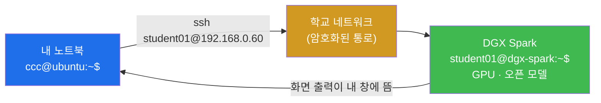
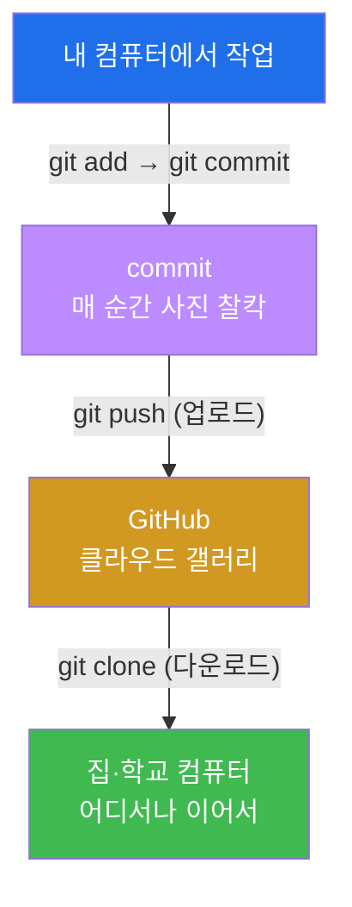
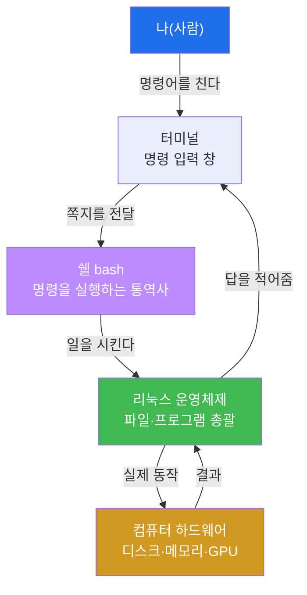
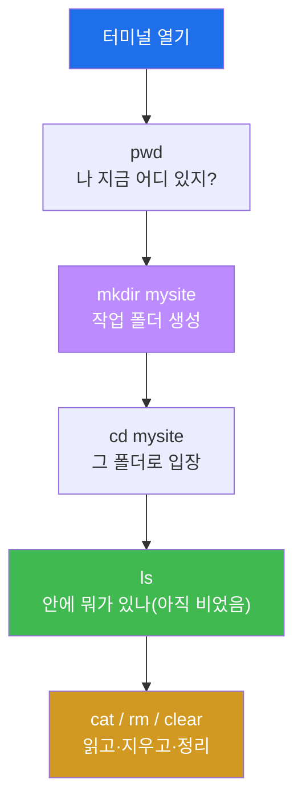
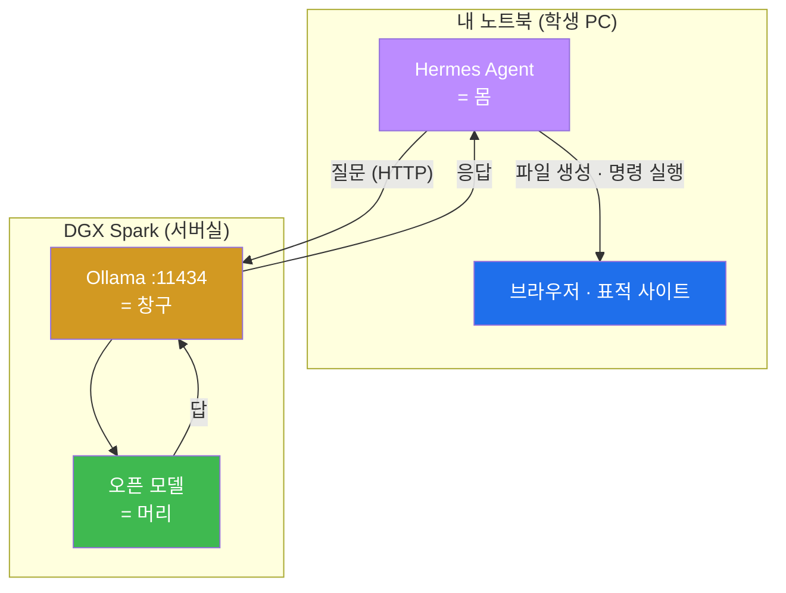
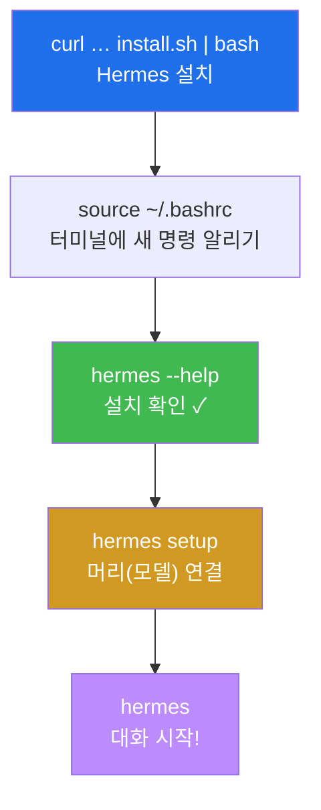
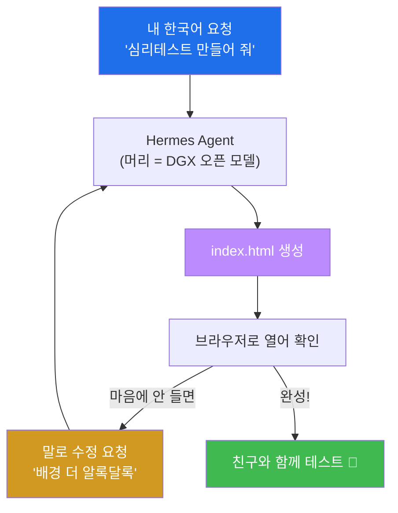
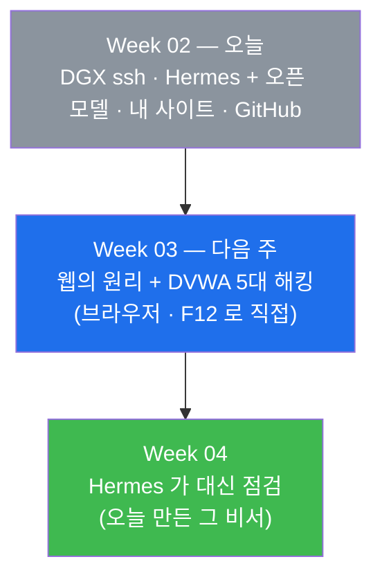

# Week 02 — 리눅스 · DGX Spark 접속 · Hermes Agent + 오픈 모델 · 내 첫 웹사이트 · GitHub

> **본 주차의 한 줄 요약**
>
> 검은 화면(터미널)을 무서워하지 않게 되는 게 첫 번째 목표다. 리눅스와 인사하고 명령어는 딱
> **7개만** 손에 익힌다. 그다음 **ssh** 로 우리 반의 "두뇌"인 **DGX Spark** 에 접속해, AI 모델이
> 실제로 어느 컴퓨터의 어느 프로그램으로 돌아가는지 **눈으로 확인**한다. 이어서 내 컴퓨터에
> **Hermes Agent** 를 설치하고, 지난주에 그림으로 그린 **몸(에이전트) + 머리(오픈 모델)** 을
> 진짜로 연결한다. 연결이 되면 바로 부려 먹는다 — 일상적인 일 몇 가지를 시켜 보고, **나만의
> 심리테스트 웹사이트**를 만들어 브라우저로 열고, 마지막엔 **GitHub** 에 올린다.
> 오늘은 "우와!"가 **네 번** 나온다 — 모델이 내게 말을 걸 때, 내 컴퓨터의 비서가 파일을 만들 때,
> 내 사이트가 브라우저에 뜰 때, 인터넷에 내 작품 주소가 생길 때.

---

## 학습 목표

이번 주가 끝나면 학생은 다음을 **본인 손으로** 할 수 있다.

1. 터미널을 두려움 없이 열고, 리눅스 기본 명령어 7개(`pwd ls cd mkdir cat rm clear`)로 파일과 폴더를 다룬다.
2. "절대경로 vs 상대경로", "홈 디렉터리(`~`)" 가 무엇인지 비유로 설명하고, `cd` 로 자유롭게 이동한다.
3. **ssh** 가 무엇인지 설명하고, `ssh 계정@주소` 로 **DGX Spark** 에 접속·종료한다.
4. DGX Spark 에서 `nvidia-smi` · `ollama list` · `ollama ps` 로 **GPU 와 모델의 상태를 읽고**, `ollama run` 으로 모델에 직접 말을 건다.
5. 내 컴퓨터에 **Hermes Agent** 를 설치하고, **모델 엔드포인트를 DGX Spark 로 지정**해 몸과 머리를 연결한다.
6. Hermes 에게 한국어로 **일상적인 일**(파일 정리·요약·간단한 스크립트)을 시키고 결과를 검증한다.
7. Hermes 에게 지시해 **심리테스트 웹사이트**를 완성하고, 마음에 안 드는 부분을 "말로" 고친다.
8. 로컬 웹서버(`python3 -m http.server`)를 띄워 내가 만든 사이트를 브라우저로 직접 연다.
9. GitHub 저장소를 만들어 내 사이트를 `push` 하고, 다른 위치에서 `git clone` 으로 다시 받는다.

---

## 시간 배분 (총 6시간)

| 시간 | 내용 | 유형 |
|------|------|------|
| 0:00–0:30 | 운영체제·리눅스·터미널이 뭐야? 검은 화면 무서워하지 않기 | 이론 |
| 0:30–0:50 | 절대경로/상대경로, 홈 디렉터리(`~`), 명령어 7개 개념 | 이론 |
| 0:50–1:20 | 실습 1 — 터미널 열기 + 명령어 7개로 작업 폴더 만들기 | 실습 |
| 1:20–1:50 | **ssh 와 원격 접속 · DGX Spark 소개** | 이론 |
| 1:50–2:00 | 휴식 | — |
| 2:00–2:40 | 실습 2 — **DGX Spark 에 ssh 접속 + GPU·모델 구경 + 모델과 대화** | 실습 |
| 2:40–3:20 | 실습 3·4 — **Hermes Agent 설치 + 오픈 모델 연결**(첫 번째 우와!) | 실습 |
| 3:20–3:30 | 휴식 | — |
| 3:30–4:10 | 실습 5 — **Hermes 에게 일상 작업 시키기**(두 번째 우와!) | 실습 |
| 4:10–5:00 | 실습 6·7 — 심리테스트 사이트 만들기 + 브라우저로 열기(세 번째 우와!) | 실습 |
| 5:00–5:45 | 실습 8·9 — GitHub에 push / 다시 clone(네 번째 우와!) | 실습 |
| 5:45–6:00 | 자주 하는 실수·FAQ 정리 + 다음 주 예고 | 정리 |

---

## 0. 용어 해설 (오늘 처음 나오는 말)

아래 표는 한 줄 정의만 담는다. 헷갈리기 쉬운 핵심어는 §0.5에서 일상 비유로 더 깊게 풀어 설명하니,
본문을 읽다가 막히면 언제든 이 표와 §0.5로 돌아오면 흐름이 끊기지 않는다.

| 용어 | 영문 | 뜻 | 비유 |
|------|------|----|------|
| **운영체제** | OS (Operating System) | 컴퓨터의 모든 부품·프로그램을 총괄하는 기본 소프트웨어 | 건물 전체를 돌리는 관리실 |
| **리눅스** | Linux | 서버·해킹 실습에서 가장 많이 쓰는 무료 운영체제 | 전문가들이 입는 작업복 |
| **터미널** | Terminal | 명령어를 글로 쳐서 컴퓨터에 일을 시키는 검은 창 | 컴퓨터와 쪽지로 대화하는 창구 |
| **쉘** | Shell | 터미널에 친 명령을 받아 실제로 실행해 주는 통역사 프로그램(예: bash) | 쪽지를 읽고 심부름하는 비서 |
| **프롬프트** | Prompt | 명령을 기다리며 깜빡이는 줄(예: `ccc@ubuntu:~$`) | "주문하세요" 하고 기다리는 점원 |
| **디렉터리** | Directory | 파일을 담는 칸, 곧 폴더 | 서랍 |
| **절대경로** | Absolute Path | 맨 꼭대기(`/`)부터 적은 완전한 주소 | 우편번호까지 다 적은 풀 주소 |
| **상대경로** | Relative Path | 지금 내 위치를 기준으로 적은 짧은 주소 | "여기서 두 칸 옆" |
| **홈 디렉터리** | Home (`~`) | 로그인한 내 개인 폴더(`/home/내이름`) | 내 방 |
| **ssh** | Secure Shell | **다른 컴퓨터의 터미널**에 안전하게 원격 접속하는 도구 | 남의 사무실에 놓인 전화로 그 방 컴퓨터 쓰기 |
| **호스트 / IP** | Host / IP address | 네트워크에서 컴퓨터를 가리키는 이름·번호 | 건물 주소 |
| **포트** | Port | 한 컴퓨터 안의 서비스 출입구 번호(예: 11434) | 건물의 몇 번 창구 |
| **DGX Spark** | — | 우리가 빌려 쓰는 AI 전용 소형 슈퍼컴퓨터 | 학교 공용 고성능 오븐 |
| **GPU** | Graphics Processing Unit | AI 계산을 병렬로 처리하는 부품 | 팔이 수천 개 달린 계산기 |
| **VRAM / 통합 메모리** | — | 모델이 올라가 앉는 메모리. 이게 커야 큰 모델이 돈다 | 오븐 안 선반 크기 |
| **Ollama** | — | 오픈 모델을 서버에서 돌려주고 API 로 열어 주는 프로그램 | 모델을 얹어 돌리는 받침대 |
| **모델 태그** | Model tag | `모델이름:크기` 형식의 모델 이름(예: `qwen3:32b`) | 제품명 + 용량 |
| **파라미터(B)** | Parameters | 모델의 크기 단위. 70B = 700억 개 | 오븐에 넣을 반죽의 양 |
| **엔드포인트** | Endpoint | 프로그램이 요청을 보낼 주소 (예: `http://<dgx>:11434/v1`) | 전화번호 |
| **Hermes Agent** | — | 우리가 설치할 오픈소스 터미널 에이전트 | 내 컴퓨터 속 비서 |
| **도구 호출** | Tool calling | 모델이 "이 도구를 이렇게 써 줘"라고 구조화해 요청하는 기능 | 비서가 연장을 집어 드는 능력 |
| **컨텍스트 길이** | Context length | 모델이 한 번에 기억할 수 있는 글의 양 | 책상에 펼쳐 둘 수 있는 종이 수 |
| **HTML / CSS / JS** | — | 웹페이지의 뼈대 / 꾸밈 / 움직임 | 골조 / 인테리어 / 전기 |
| **로컬 웹서버** | local web server | 내 컴퓨터에서 내 사이트에 임시 주소를 붙여 띄우는 작은 서버 | 내 방에 임시로 단 문패 |
| **Git / GitHub** | — | 변경 역사를 저장하는 도구 / 그 저장소를 인터넷에 두는 사이트 | 타임머신 / 클라우드 갤러리 |
| **commit / push / clone** | — | 저장 시점 남기기 / 인터넷에 올리기 / 통째로 내려받기 | 세이브 / 업로드 / 다운로드 |
| **토큰(GitHub)** | Token | 비밀번호 대신 쓰는 긴 인증 열쇠(절대 공개 금지) | 내 통장 비밀번호 |

---

## 0.5 친화 비유 심화 — 헷갈리는 개념을 깊게

위 표의 한 줄 정의만으로는 부족한 개념이 몇 개 있다. 학생이 가장 많이 막히는 **다섯 가지**를
일상 비유로 천천히 풀어 본다.

### 0.5.1 터미널·쉘·프롬프트 — "쪽지 심부름" 비유

터미널의 검은 화면은 무서운 게 아니라 **컴퓨터와 쪽지를 주고받는 창구** 일 뿐이다. 편의점에
비유해 보자. 학생이 카운터(터미널)에 "삼각김밥 어디 있어요?"라고 적은 쪽지(명령어)를 내민다.
이 쪽지를 받아 읽고 매장 안을 돌아다니며 실제로 일을 처리하는 직원이 **쉘(shell)** 이다. 우리가
쓰는 쉘은 보통 `bash` 라는 직원이다. 일을 마치면 직원은 "2번 진열대에 있어요"라고 답을 적어
준다 — 이게 터미널에 출력되는 결과다.

그리고 직원이 "다음 주문하세요" 하고 기다리며 깜빡이는 줄이 **프롬프트(prompt)** 다.

```
ccc@ubuntu:~$
```

이 한 줄에 정보가 빼곡히 담겨 있다. `ccc` 는 내 이름(로그인 계정), `ubuntu` 는 **이 컴퓨터의
이름**, `~` 는 지금 내가 있는 위치(홈 디렉터리, 곧 내 방), `$` 는 "명령 기다리는 중" 표시다.

> **오늘 특히 중요한 것 — 컴퓨터 이름을 보는 습관.** 오늘 우리는 컴퓨터 **두 대**를 오간다.
> 내 노트북과 DGX Spark. ssh 로 접속하면 프롬프트가 `ccc@ubuntu:~$` 에서
> `student01@dgx-spark:~$` 처럼 **바뀐다.** 이 이름이 "나는 지금 어느 컴퓨터에 명령하고 있나"를
> 알려 주는 유일한 표시다. 오늘 사고의 90%는 "내 컴퓨터인 줄 알고 DGX 에서 명령한" 데서 나온다.
> 헷갈리면 `hostname` 을 쳐서 확인하자.

### 0.5.2 절대경로 vs 상대경로 — "주소 적는 두 가지 방법" 비유

**절대경로** 는 우편번호부터 시·구·동·번지까지 빠짐없이 적은 **풀 주소** 다. 컴퓨터에서는 맨
꼭대기인 `/`(루트, 곧 "건물 1층 정문")부터 시작한다.

```
/home/ccc/mysite/index.html
```

"정문(`/`) → home 방향 → ccc(내 방) → mysite(작업 폴더) → index.html" 이라는 완전한 주소다.

**상대경로** 는 **지금 내가 서 있는 곳을 기준으로 한** 짧은 주소다. 내가 지금 `/home/ccc` 에
있다면 `mysite/index.html` 만 적어도 같은 파일을 가리킨다. 특별한 두 약속이 있다 — `.`(점 하나)은
"지금 이 위치", `..`(점 둘)은 "한 칸 위(부모 폴더)". 그래서 `cd ..` 는 "한 단계 위로". 헷갈리면
언제든 `pwd` 로 "나 지금 어디 있지?"를 확인하면 된다.

### 0.5.3 홈 디렉터리 `~` — "내 방" 비유

리눅스 건물에는 사람마다 자기 방이 하나씩 있다. 학생의 방은 `/home/ccc` 같은 주소를 갖는다.
너무 자주 쓰니까 `~`(물결표) 한 글자로 줄여 부른다.

```bash
cd ~        # 어디에 있든 내 방으로 즉시 귀가
pwd         # /home/ccc 처럼 내 방 주소가 찍힘
```

### 0.5.4 ssh — "남의 사무실 컴퓨터를 내 자리에서 쓰기" ★

오늘 새로 배우는 개념이다. **ssh(Secure Shell)** 는 **다른 컴퓨터의 터미널을 내 화면에 끌어오는**
도구다.

비유하자면 이렇다. 우리 반의 AI 두뇌(DGX Spark)는 서버실에 있다. 그 컴퓨터에 뭔가 시키려고
매번 서버실까지 걸어갈 수는 없다. 대신 내 자리에서 전화를 걸어 그 방의 컴퓨터를 조종하는 것 —
그게 ssh 다. 접속하면 **내 화면에 뜨는 검은 창이 사실은 저쪽 컴퓨터의 창**이 된다. 거기서
`ls` 를 치면 내 파일이 아니라 **DGX Spark 의 파일**이 나온다.

명령의 모양은 아주 단순하다.

```bash
ssh 계정이름@컴퓨터주소
```

예를 들어 `ssh student01@192.168.0.60` 이다. `@` 앞은 "누구로 들어갈지", 뒤는 "어느 컴퓨터로".
이메일 주소와 똑같은 모양이라 외우기 쉽다. 나올 때는 `exit` 를 치거나 `Ctrl+D` 를 누른다.

`Secure` 가 이름에 붙은 이유는, 오가는 내용이 **전부 암호화**되기 때문이다. 옛날에는 `telnet`
이라는 도구를 썼는데 비밀번호가 그대로 네트워크에 흘러 다녔다. 그래서 지금은 아무도 쓰지 않는다.



### 0.5.5 Git·GitHub — "타임머신 + 클라우드 갤러리" 비유

**Git** 은 작업하는 매 순간을 사진으로 찍어 두는 **타임머신** 이다. 한 번의 사진이 **commit**
이고, 나중에 "아까가 더 나았어" 싶을 때 그 시점으로 되돌아갈 수 있다. AI와 함께 일하면 코드가
정말 빠르게 바뀌기 때문에 이 "되돌리기" 능력이 특히 소중하다.

**GitHub** 은 그 사진첩(저장소)을 인터넷의 **클라우드 갤러리** 에 통째로 올려 두는 곳이다.
내 컴퓨터의 변경을 갤러리로 올리는 게 **push**, 갤러리의 작품을 다른 컴퓨터로 받는 게 **clone**.



---

## 1. 운영체제·리눅스·터미널 — 무대를 이해하기

### 1.1 한 줄 정의

**운영체제(OS)** 는 컴퓨터의 부품과 프로그램을 총괄 지휘하는 기본 소프트웨어이고, **리눅스** 는
그중 서버·해킹에서 가장 많이 쓰는 무료 운영체제다. **터미널** 은 그 리눅스에게 **글(명령어)** 로
일을 시키는 창이다.

### 1.2 왜 중요한가 — 왜 하필 리눅스, 왜 검은 화면인가

첫째, **세상의 서버 대부분이 리눅스로 돌아간다.** 우리가 오늘 접속할 DGX Spark 도 리눅스
(Ubuntu 계열)다. 웹을 공격하고 방어하는 법을 배우려면, 그 표적이 사는 집인 리눅스를 알아야 한다.

둘째, **해킹 도구와 AI 에이전트 대부분이 터미널에서 돈다.** 오늘 설치할 Hermes Agent 도
터미널 위에서 동작한다. 검은 화면이 우리의 작업대다.

셋째, **글로 시키면 자동화와 AI 협업이 쉽다.** 마우스 클릭은 사람만 할 수 있지만, 글 명령은
AI에게도 똑같이 시킬 수 있다. 그래서 "AI가 운전하고 학생은 절차만 따른다"는 이 강의의 방식이
가능해진다.



### 1.3 주의

명령을 치고 `Enter` 를 눌렀는데 화면이 멈춘 듯 보일 수 있다. 대부분은 그냥 일을 하는 중이다.
정말 빠져나오고 싶으면 `Ctrl`+`C` 를 누르면 "지금 하던 일 취소"가 된다. 오늘 여러 번 쓴다
(특히 로컬 웹서버를 끌 때, 모델과의 대화를 멈출 때).

---

## 2. 리눅스 명령어 7개 — 이거면 충분하다

### 2.1 한눈에 보는 7개

| 명령 | 하는 일 | 비유 | 예시 |
|------|---------|------|------|
| `pwd` | 지금 내가 어느 폴더에 있나 출력 | 내 현재 위치 확인 | `pwd` |
| `ls` | 이 폴더 안에 뭐가 있나 목록 | 서랍 열어 보기 | `ls` |
| `cd` | 다른 폴더로 이동 | 다른 방으로 가기 | `cd mysite` |
| `mkdir` | 새 폴더 만들기 | 새 서랍 만들기 | `mkdir mysite` |
| `cat` | 파일 내용 펼쳐 보기 | 종이 꺼내 읽기 | `cat hello.txt` |
| `rm` | 파일 지우기 (**주의!**) | 휴지통 없이 바로 버리기 | `rm 메모.txt` |
| `clear` | 화면을 깨끗이 | 칠판 지우기 | `clear` |



### 2.2 각 명령의 자주 하는 실수

- **`pwd`** — 실수랄 게 없는 가장 안전한 명령. 다른 명령이 꼬일 때마다 먼저 쳐서 위치부터
  확인하는 습관이 오늘의 핵심 안전장치다. 길을 잃었다 싶으면 무조건 `pwd`.
- **`ls`** — 분명히 파일을 만들었는데 안 보인다면 십중팔구 **다른 폴더에 서 있는** 것이다.
  `ls -l` 을 쓰면 크기·날짜까지 보인다. 크기가 `0` 이면 파일은 있는데 안이 비었다는 뜻이다.
- **`cd`** — `No such file or directory` 가 뜨면 그 폴더가 지금 위치에 없는 것이다. 리눅스는
  `Mysite` 와 `mysite` 를 **다른 이름**으로 본다. `cd` 만 치면 항상 홈으로 간다(비상 탈출구).
- **`mkdir`** — 같은 이름이 이미 있으면 `File exists` 라고 알려 준다. 에러가 아니라 알림이다.
  폴더 이름에 띄어쓰기는 넣지 말자.
- **`cat`** — 사진·실행파일에 쓰면 깨진 문자가 쏟아진다. 글로 된 파일(`.txt`, `.html`)에만 쓴다.
- **`rm`** — 오늘 7개 중 **유일하게 위험한** 명령. 휴지통을 거치지 않고 바로 지운다.
  `rm -rf *` 같은 형태는 **오늘 절대 쓰지 않는다.** 헷갈리면 Hermes 에게 "이 파일 지워 줘"라고
  시키자(에이전트는 위험한 삭제 전에 확인을 받는다).
- **`clear`** — 화면만 지운다. 파일에는 아무 영향이 없으니 마음 편히 쓰자.

---

## 3. DGX Spark — 우리 반의 "두뇌"를 만나러 간다 ★

### 3.1 한 줄 정의

**DGX Spark** 는 엔비디아가 만든 **책상 위에 올려 두는 AI 전용 소형 컴퓨터**다. 우리 반은 이
기계를 빌려 쓰고, 그 위에서 **오픈 모델**을 돌려 Hermes Agent 의 "머리"로 쓴다.

### 3.2 이 기계가 왜 특별한가

보통 노트북으로는 큰 AI 모델을 못 돌린다. 이유는 단순하다 — **모델이 앉을 자리(메모리)가
부족해서**다. 70억 개 파라미터짜리 작은 모델도 몇 GB 를 먹고, 700억 개짜리는 수십 GB 를 먹는다.
일반 노트북의 그래픽 메모리는 보통 8GB 안팎이라 큰 모델은 아예 올라가지 않는다.

DGX Spark 는 **CPU 와 GPU 가 메모리를 함께 쓰는 구조(통합 메모리)** 로 **128GB** 라는 큰 자리를
제공한다. 그래서 노트북에서는 꿈도 못 꿀 **수백억 파라미터급 모델**이 이 작은 상자 하나에서 돈다.
게다가 콘센트 하나면 되고, 소음도 작아서 교실에 둘 수 있다.

| 항목 | 대략적인 사양 | 왜 우리에게 중요한가 |
|------|---------------|----------------------|
| 프로세서 | GB10 Grace Blackwell (CPU+GPU 한 몸) | AI 계산 전용 설계 |
| 통합 메모리 | **약 128GB** | **큰 오픈 모델이 통째로 올라간다** |
| AI 연산 성능 | 약 1 PFLOP 급(저정밀 기준) | 반 전체가 동시에 물어봐도 버틴다 |
| 운영체제 | DGX OS (Ubuntu 계열 리눅스) | 우리가 배운 리눅스 명령이 그대로 통한다 |
| 접속 방법 | **ssh** | 오늘 배울 그 명령 하나로 들어간다 |

> **주의 — 숫자는 참고용.** 정확한 사양은 강사가 안내하는 실제 장비 기준을 따른다. 오늘 외울
> 것은 숫자가 아니라 **"모델이 앉을 자리(메모리)가 커야 큰 모델이 돈다"** 는 원리다.

### 3.3 그 위에서 도는 프로그램 — Ollama

DGX Spark 자체는 그냥 리눅스 컴퓨터다. 거기서 **모델을 실제로 돌리고, 다른 컴퓨터가 물어볼 수
있게 창구를 열어 주는** 프로그램이 필요한데, 그게 **Ollama** 다.

Ollama 는 세 가지 일을 한다. ① 모델 파일을 내려받아 보관하고(`ollama pull`), ② 요청이 오면
모델을 메모리에 올려 답을 만들고, ③ **`11434` 번 포트**로 다른 컴퓨터의 요청을 받아 준다.

이 세 번째가 오늘의 핵심이다. 내 노트북의 Hermes Agent 가 `http://<dgx주소>:11434` 로 질문을
보내면, DGX 의 Ollama 가 모델을 돌려 답을 돌려준다. **몸은 내 노트북, 머리는 DGX** 인 구조가
바로 이렇게 완성된다.



### 3.4 어떻게 접속하나 — 실제 명령

강사가 계정 이름과 주소를 알려 준다. 예를 들어 계정이 `student01`, 주소가 `192.168.0.60` 이면:

```bash
ssh student01@192.168.0.60
```

처음 접속하면 이런 질문이 뜬다.

```
The authenticity of host '192.168.0.60' can't be established.
ED25519 key fingerprint is SHA256:xxxxx...
Are you sure you want to continue connecting (yes/no/[fingerprint])?
```

"이 컴퓨터 처음 보는데, 진짜 맞아?"라는 확인이다. `yes` 를 치고 Enter. 그다음 비밀번호를
입력한다(**입력해도 화면에 아무것도 안 보이는 게 정상**이다 — 보안을 위해 별표도 안 찍는다).

접속에 성공하면 프롬프트가 바뀐다.

```
student01@dgx-spark:~$
```

§0.5.1에서 말한 그 표시다. **이제부터 치는 명령은 전부 DGX Spark 에서 실행된다.**

### 3.5 들어가서 볼 것 세 가지

**① GPU 상태 보기**

```bash
nvidia-smi
```

GPU 이름, 온도, 메모리 사용량, 지금 GPU 를 쓰고 있는 프로그램 목록이 표로 나온다. 수업 중에
친구가 모델을 쓰면 이 숫자가 올라가는 게 보인다 — "AI 가 진짜로 어떤 기계의 자원을 쓰는구나"를
눈으로 확인하는 순간이다.

**② 모델 목록 보기**

```bash
ollama list
```

```
NAME                 ID            SIZE      MODIFIED
qwen3:32b            xxxxxxxxxxxx  20 GB     2 days ago
deepseek-r1:70b      xxxxxxxxxxxx  43 GB     3 days ago
llama3.3:70b         xxxxxxxxxxxx  43 GB     1 week ago
```

우리 반이 쓸 수 있는 "머리" 목록이다. `SIZE` 가 그 모델이 차지하는 자리다.

**③ 지금 켜져 있는 모델 보기**

```bash
ollama ps
```

방금 누군가 쓴 모델이 메모리에 올라가 있으면 여기 나온다. 아무도 안 쓰면 비어 있다.
(Ollama 는 한동안 안 쓰이면 모델을 자동으로 내려놓는다.)

### 3.6 모델에게 직접 말 걸기 — 오늘의 첫 번째 "우와!"

에이전트 없이, 모델과 **직접** 대화해 볼 수 있다.

```bash
ollama run qwen3:32b
```

잠시 기다리면(처음엔 모델을 메모리에 올리느라 수십 초 걸릴 수 있다) `>>>` 프롬프트가 뜬다.
한국어로 아무 말이나 걸어 보자.

```
>>> 너는 어떤 모델이고, 어디서 돌고 있어? 두 문장으로 대답해줘.
```

답이 또르륵 나온다. **이게 우리 학교 서버실 안에서, 인터넷 없이, 우리 반만을 위해 돌아가는
AI 다.** 나올 때는 `/bye` 를 입력하거나 `Ctrl+D`.

> **관찰 포인트.** 답이 나오는 **속도**를 잘 보자. 클라우드 챗봇보다 느릴 수 있다. 왜? 저쪽은
> 수천 대의 서버가 받쳐 주고, 여기는 상자 하나이기 때문이다. 대신 **공짜고, 계정이 필요 없고,
> 내 말이 학교 밖으로 안 나간다.** 세상에 공짜 점심은 없고, 무엇을 얻고 무엇을 내주는지 아는
> 것이 기술을 고르는 일이다.

### 3.7 주의 — 공용 장비 예절

DGX Spark 는 **반 전체가 함께 쓰는 장비**다. 세 가지만 지키자.

1. **남의 폴더를 건드리지 않는다.** 내 홈 디렉터리(`~`) 안에서만 작업한다.
2. **거대한 모델을 마음대로 내려받지 않는다.** `ollama pull` 은 강사만 한다(수십 GB 를 먹는다).
3. **작업이 끝나면 나온다.** `exit`. 접속을 켜 둔 채 방치하지 않는다.

---

## 4. Hermes Agent — 내 컴퓨터에 비서 들이기 ★

### 4.1 한 줄 정의

**Hermes Agent** 는 **내 터미널 안에서 도는 오픈소스 AI 에이전트**다(Nous Research 제작, MIT
라이선스). 한국어로 시키면 답만 하는 게 아니라 **파일을 만들고 명령을 실행한다.** 그리고 결정적으로,
**두뇌(모델)를 내 마음대로 골라 붙일 수 있다.**

### 4.2 왜 이걸 쓰나 (지난주 §3-3 복습)

① 학생 개인 계정·결제가 필요 없다. ② 대화 내용이 학교 밖으로 나가지 않는다. ③ 반 전체가 같은
조건으로 쓴다. ④ 오픈소스라 안이 들여다보인다.

### 4.3 설치 — 한 줄

**주의: 이 명령은 DGX 가 아니라 "내 노트북"에서 친다.** DGX 에 접속해 있었다면 `exit` 로 먼저
나온다. `hostname` 을 쳐서 내 컴퓨터가 맞는지 확인하는 습관을 들이자.

```bash
exit                 # (DGX 에 접속해 있었다면) 내 컴퓨터로 돌아오기
hostname             # 내 노트북 이름이 맞는지 확인

curl -fsSL https://hermes-agent.nousresearch.com/install.sh | bash
```

설치 스크립트가 필요한 것(파이썬 환경, Node.js, 검색 도구 등)을 알아서 다 깔아 준다. 몇 분
걸린다. 끝나면 터미널 설정을 다시 읽고 확인한다.

```bash
source ~/.bashrc     # (zsh 를 쓰면 source ~/.zshrc)
hermes --help
```

도움말이 주르륵 나오면 **설치 성공**이다.

> **왜 명령 하나에 이렇게 많은 게 깔릴까?** 에이전트는 "몸"이라서 손발이 많이 필요하다 —
> 파일을 읽고, 명령을 돌리고, 웹을 검색하고, 코드를 실행한다. 그 도구들을 함께 설치하는 것이다.



### 4.4 자주 만나는 설치 에러

처음 설치할 때 에러가 나는 건 **정상**이다. 프로 개발자도 매일 본다.

**`command not found: hermes`** — 설치는 됐는데 터미널이 아직 모르는 상태다. `source ~/.bashrc`
를 다시 실행하거나, 터미널 창을 닫았다 새로 연다.

**네트워크 에러(ETIMEDOUT / 연결 실패)** — 다운로드가 끊긴 것이다. 잠시 뒤 같은 명령을 한 번 더.

**권한 에러(permission denied)** — 설치 위치 권한 문제다. 강사에게 알린다(홈 디렉터리에 설치되므로
보통은 나지 않는다).

그리고 가장 강력한 대처법 — **에러 메시지를 그대로 복사해 강사(또는 나중엔 Hermes 자신)에게
보여 주는 것**이다. **에러는 실패가 아니라, 건네줄 단서다.**

### 4.5 머리 연결하기 — Hermes ↔ DGX Spark ★★

설치가 끝났으면 이제 **머리를 꽂는다.** 두 가지 방법이 있고, 둘 중 하나만 하면 된다.

#### 방법 A — 대화형 설정 마법사 (권장)

```bash
hermes setup
```

질문이 순서대로 뜬다. 다음처럼 답한다.

| 질문 | 우리가 넣을 값 |
|------|----------------|
| 어떤 공급자(provider)를 쓸까? | **Custom Endpoint**(직접 입력) 선택 |
| Base URL | `http://<dgx주소>:11434/v1` (예: `http://192.168.0.60:11434/v1`) |
| API Key | 비워 두거나 `no-key` (우리 서버는 열쇠가 필요 없다) |
| Model | 강사가 알려 준 모델 태그 (예: `qwen3:32b`) |

> **`/v1` 을 빼먹지 말 것.** Ollama 는 두 가지 창구를 연다. `/api` 는 Ollama 고유 방식이고,
> `/v1` 은 **여러 프로그램이 공통으로 쓰는 표준 방식**이다. Hermes 는 표준 방식으로 말을 걸기
> 때문에 주소 끝에 `/v1` 이 반드시 붙는다.

#### 방법 B — 설정 파일 직접 수정

`~/.hermes/config.yaml` 파일을 열어 `model` 부분을 이렇게 만든다.

```yaml
model:
  default: "qwen3:32b"
  provider: "custom"
  base_url: "http://192.168.0.60:11434/v1"
```

파일 편집이 어렵다면 방법 A 를 쓰자.

#### 로컬 모델은 느리다 — 기다림 여유 주기

우리 모델은 상자 하나에서 도니까, 클라우드보다 답이 늦게 올 수 있다. 기본 대기 시간이 짧으면
"시간 초과" 에러가 난다. `~/.hermes/.env` 파일에 아래 한 줄을 넣어 넉넉히 기다리게 한다.

```bash
HERMES_API_TIMEOUT=1800
```

### 4.6 연결 확인 — 첫 대화

```bash
hermes
```

Hermes 가 뜨면 한국어로 말을 건다.

> *"안녕! 너는 지금 어떤 모델을 쓰고 있어? 한 문장으로 대답해줘."*

답이 오면 **몸과 머리의 연결 성공**이다. 지난주 종이에 그렸던 그림이 진짜가 된 순간이다.

세션 안에서 쓸 수 있는 유용한 명령 몇 가지:

| 입력 | 하는 일 |
|------|---------|
| `/model` | 지금 쓰는 모델 확인 · 바꾸기 |
| `/new` | 대화를 새로 시작(앞의 내용을 잊음) |
| `/compress` | 대화가 길어졌을 때 요약해서 줄이기 |
| `Ctrl+C` | 지금 하는 일 중단 |
| `/exit` | 종료 |

터미널에서 상태를 점검하는 명령도 있다.

```bash
hermes doctor      # 설정·연결에 문제가 없는지 자동 진단
hermes model       # 모델 골라 바꾸기
```

### 4.7 ⚠️ 아주 중요한 함정 — "도구를 못 쓰는 모델"

에이전트가 파일을 만들고 명령을 실행하려면, 모델이 **도구 호출(tool calling)** 이라는 기능을
지원해야 한다. 이건 모델마다 다르다.

- 대화는 잘하는데 **도구 호출을 못 하는** 모델이 꽤 있다. 이런 모델을 꽂으면 Hermes 는 말만
  하고 파일을 안 만든다. "왜 아무 일도 안 일어나지?"의 90%가 이 문제다.
- 특히 **추론(reasoning) 모델**은 생각을 길게 하는 대신 도구 호출 지원이 버전마다 들쭉날쭉하다.
  `deepseek-r1:70b` 같은 모델은 **설명과 추론에는 훌륭하지만**, 에이전트의 손발로 쓰려면 그
  버전이 도구 호출을 지원하는지 반드시 확인해야 한다.

**그래서 오늘 반드시 하는 확인 절차:**

```
(hermes 안에서)
지금 폴더에 hello.txt 파일을 만들고 안에 '나의 첫 AI 비서'라고 써줘.
```

그리고 Hermes 를 빠져나와 확인한다.

```bash
cat hello.txt
```

**파일이 실제로 생겼으면 그 모델은 우리 수업에 쓸 수 있다.** 말만 하고 파일이 없으면 `/model`
로 다른 모델(강사가 지정한 도구 호출 가능 모델)로 바꾼 뒤 다시 시도한다.

> **수업 운영 메모(강사용).** 도구 호출이 확인된 모델을 1~2개 미리 골라 칠판에 적어 둘 것.
> 추론 모델은 "설명을 아주 잘해 주는 조수"로 따로 활용하면 좋다(개념 질문 전용).

---

## 5. Hermes 에게 일상적인 일 시키기 — 두 번째 "우와!"

해킹으로 바로 가기 전에, **평범한 일**을 시켜 보는 게 중요하다. 이 단계에서 학생은 "AI에게 일을
제대로 시키는 법"을 배운다. 그게 이번 특강 전체를 관통하는 진짜 기술이다.

### 5.1 좋은 지시의 세 가지 조건

| 조건 | 나쁜 예 | 좋은 예 |
|------|---------|---------|
| **무엇을** 구체적으로 | "정리해줘" | "이 폴더의 .txt 파일 목록을 만들어줘" |
| **어디에** 결과를 | (말 안 함) | "결과를 result.md 파일로 저장해줘" |
| **어떻게** 확인할지 | (말 안 함) | "다 끝나면 그 파일 내용을 보여줘" |

### 5.2 오늘 시켜 볼 일상 작업 4종

작업 폴더(`~/mysite`)에서 `hermes` 를 켜고, 아래를 하나씩 시켜 본다.

**① 파일 만들기 (도구 호출 확인 겸용)**
> *"지금 폴더에 hello.txt 파일을 만들고 안에 '나의 첫 AI 비서'라고 써줘."*

**② 폴더 정리·목록 만들기**
> *"지금 폴더에 어떤 파일들이 있는지 확인하고, 파일 이름과 크기를 표로 정리해서
> files.md 라는 파일로 저장해줘."*

**③ 글 요약하기**
> *"방금 만든 files.md 를 읽고, 이 폴더가 무슨 폴더인지 두 문장으로 설명해줘."*

**④ 간단한 자동화 스크립트 만들기**
> *"오늘 날짜와 시간을 화면에 예쁘게 출력하는 파이썬 스크립트를 today.py 로 만들고,
> 실제로 한 번 실행해서 결과를 보여줘."*

### 5.3 결과를 반드시 '검증'한다

에이전트가 "했습니다"라고 말하는 것과 **실제로 된 것**은 다르다(지난주 §5-1 환각을 떠올리자).
그래서 매번 내 눈으로 확인한다.

```bash
ls              # 파일이 진짜 생겼나
cat files.md    # 내용이 말한 대로인가
python3 today.py  # 스크립트가 진짜 도나
```

이 "시키고 → 확인하기" 습관이 오늘 배우는 가장 값진 것이다. Week 04에서 에이전트가 "취약점을
찾았습니다"라고 보고할 때도, 우리는 똑같이 브라우저로 직접 확인할 것이다.

### 5.4 안 될 때 — 다시 시키는 법

한 번에 안 되는 건 정상이다. 이렇게 말하면 에이전트가 스스로 고친다.

> *"방금 건 잘 안 된 것 같아. 왜 안 됐는지 결과를 보고, 다른 방법으로 한 번 더 해줘."*

에러 메시지가 화면에 있다면 그걸 그대로 붙여 주는 것이 가장 빠르다.

### 5.5 주의 — 에이전트에게 주면 안 되는 것

지난주 §4-4에서 배운 "과도한 권한"을 기억하자. 오늘부터 지킬 세 가지 습관:

1. **작업 폴더 안에서만** 에이전트를 켠다(`~/mysite`). 홈 최상위나 시스템 폴더에서 켜지 않는다.
2. **삭제·이동은 확인 후.** "지워도 될까?"라고 물으면 내용을 보고 답한다.
3. **비밀은 주지 않는다.** 비밀번호·토큰을 대화창에 붙여 넣지 않는다.

---

## 6. 내 첫 웹사이트 — 심리테스트 만들기

### 6.1 웹사이트는 무엇으로 되어 있나 — 3대 재료

| 재료 | 역할 | 집짓기 비유 |
|------|------|-------------|
| **HTML** | 뼈대 — 제목·버튼·문단 같은 구조 | 집의 골조와 벽 |
| **CSS** | 꾸밈 — 색·폰트·배치·둥근 모서리 | 페인트·벽지·인테리어 |
| **JavaScript(JS)** | 움직임 — 버튼을 누르면 결과를 계산 | 전기·스위치·콘센트 |

**아주 좋은 소식.** 우리는 이 셋을 **한 줄도 직접 코딩하지 않는다.** Hermes 에게 한국어로 시키면
세 재료를 알아서 다 짜 준다. 학생은 "무엇을 원하는지"만 잘 말하면 된다.

### 6.2 어떻게 만드나 — 좋은 프롬프트 한 방

작업 폴더(`~/mysite`)에서 `hermes` 를 켜고 원하는 걸 **구체적으로** 말한다.

> *"심리테스트 웹사이트를 index.html 한 파일로 만들어 줘. 질문 5개에 답하면 동물 유형
> (고양이/강아지/부엉이/돌고래) 결과가 나오고, 유형마다 설명과 어울리는 이모지가 보이게 해 줘.
> 파스텔톤으로 예쁘게, 모바일에서도 잘 보이게, 결과 화면엔 '다시 하기' 버튼도 넣어 줘.
> 다 만들면 파일 크기를 알려 줘."*

이 프롬프트가 좋은 이유: ① 산출물 형태를 못 박았고(`index.html` 한 파일), ② 동작을 구체적으로
정했고(질문 5개 → 4가지 유형), ③ 디자인 톤을 줬고, ④ 빠진 기능까지 챙겼고('다시 하기'),
⑤ **확인 방법까지 지시**했다(파일 크기 알려 줘).

> **로컬 모델 팁.** 오픈 모델은 한 번에 긴 코드를 완벽히 뽑지 못할 때가 있다. 그럴 땐
> **작게 나눠서** 시키자. "먼저 질문 5개와 결과 4종만 정해서 알려 줘" → "이제 그걸로
> index.html 을 만들어 줘" → "이제 디자인을 파스텔톤으로 바꿔 줘". 나눠 시키면 성공률이 확 오른다.

### 6.3 마음에 안 들면 — "말로" 고치기

> *"질문을 학교생활 주제로 바꿔 줘."*
> *"배경을 더 알록달록하게 하고, 버튼을 더 크게 만들어 줘."*
> *"결과가 나올 때 살짝 통통 튀는 애니메이션을 넣어 줘."*

한 번에 열 가지를 쏟아붓기보다, **한 번에 한두 가지씩** 다듬는 게 결과를 확인하며 가기에 좋다.



### 6.4 만든 사이트 열어보기 — 로컬 웹서버

`index.html` 을 그냥 더블클릭해도 열리지만, 우리는 **로컬 웹서버**를 띄운다. 진짜 웹사이트가
동작하는 방식에 더 가깝고, 다음 주에 배울 "요청과 응답" 개념의 맛보기가 되기 때문이다.

```bash
python3 -m http.server 5500
```

"지금 폴더를 5500번 창구로 서비스해라"는 뜻이다. 그다음 브라우저 주소창에:

```
http://localhost:5500
```

**내가 만든 심리테스트가 진짜로 화면에 뜬다.** `localhost` 는 "이 컴퓨터 자신", `5500` 은 창구
번호(포트)다. 서버를 끄려면 그 터미널에서 `Ctrl`+`C`. 서버가 켜져 있는 동안 그 터미널은
점유되니, 다른 명령을 치려면 새 터미널 창을 연다.

---

## 7. GitHub — 내 작품을 클라우드에 올리고 어디서나 받기

### 7.1 왜 GitHub가 중요한가 — AI 시대에 특히

AI 에이전트와 일하면 코드가 **빠르게, 아주 많이** 바뀐다. 한 시간에 사이트를 열 번도 더 고칠 수
있다. 그래서 "언제든 되돌릴 수 있는 저장 기록(Git)"과 "어디서나 받을 수 있는 보관소(GitHub)"가
단순히 편리한 게 아니라 **필수**가 된다.

이유는 세 가지다. 첫째, **AI가 코드를 망쳐도 직전 commit으로 되돌릴 수 있다**(§0.5.5의 타임머신).
둘째, 학교에서 시작한 작업을 집에서 `clone` 받아 **끊김 없이 이어서** 할 수 있다. 셋째, **다음
주 실습 자료를 내려받을 때도 똑같이 GitHub를 쓴다.**

### 7.2 push 절차 한 줄씩

먼저 GitHub에 가입하고, 브라우저에서 **New repository** 를 눌러 이름 `my-psychotest` 로 빈
저장소를 만든다. 그다음 내 사이트 폴더에서 아래를 한 줄씩 실행한다.

```bash
cd ~/mysite
git init                                    # 이 폴더를 Git 저장소로 시작
git add .                                   # 폴더 안 모든 파일을 올릴 후보로 고르기
git commit -m "내 첫 심리테스트 사이트"      # 한 시점을 저장 기록으로 남기기
git branch -M main                          # 기본 갈래 이름을 main 으로
git remote add origin https://github.com/<내아이디>/my-psychotest.git
git push -u origin main                     # 인터넷에 올리기!
```

명령이 복잡해 보이면 Hermes 에게 *"이 폴더를 내 GitHub 저장소에 올려 줘"* 라고 시켜도 된다.

push가 끝나고 GitHub 저장소 페이지를 새로고침하면 `index.html` 이 올라와 있다.
**인터넷에 내 작품의 주소가 생긴 것이다.**

### 7.3 집에서 다시 받기 + 다음 주 표적 미리 받기

```bash
cd ~
git clone https://github.com/<내아이디>/my-psychotest.git
ls my-psychotest        # index.html 이 받아진 걸 확인

# (다음 주 표적·실습 자료도 미리 받아 두기)
git clone https://github.com/mrgrit/easy_web_hacking_class.git
```

같은 `clone` 명령으로 "내가 만든 작품"도, "남이 올린 실습 자료"도 똑같이 가져올 수 있다는 걸
몸으로 익히는 게 포인트다.

### 7.4 주의 — 비밀과 토큰은 절대 올리지 않는다

GitHub는 기본이 **공개**다. 한 번 올라간 것은 인터넷에 빠르게 퍼질 수 있고, 지워도 누군가 이미
받아 갔을 수 있다. 그래서 **비밀번호, 개인정보, API 토큰, 인증 키** 는 **절대** 올리면 안 된다.
실제로 실수로 올라간 토큰이 몇 분 만에 악용되는 사고가 흔하다.

특히 오늘 우리가 만든 `~/.hermes/` 설정 폴더에는 접속 정보가 들어 있다. **작업 폴더 밖에 있으니
평소엔 문제없지만**, 실수로 복사해 오지 않도록 주의하자. 헷갈리면 Hermes 에게 "비밀이 담긴
파일이 안 올라가게 `.gitignore` 로 막아 줘"라고 시키면 된다.

---

## 8. 자주 하는 실수 & FAQ

**Q. 지금 내가 어느 컴퓨터에 명령하고 있는지 헷갈려요.**
`hostname` 을 치거나 프롬프트를 보자. `student01@dgx-spark` 면 DGX, 내 계정@내 컴퓨터 이름이면
내 노트북이다. DGX 에서 나오려면 `exit`.

**Q. `ssh` 접속이 안 돼요 (Connection refused / timed out).**
① 주소·계정을 정확히 쳤는지, ② 같은 네트워크(학교 와이파이)에 있는지, ③ DGX 가 켜져 있는지
확인한다. 비밀번호를 쳐도 화면에 안 보이는 건 **정상**이다.

**Q. Hermes 가 답을 안 하고 "connection refused" 라고 해요.**
모델 주소를 잘못 넣은 것이다. `~/.hermes/config.yaml` 의 `base_url` 이
`http://<dgx주소>:11434/v1` 형태인지 확인한다. **`/v1` 을 빼먹는 실수가 가장 흔하다.**
브라우저로 `http://<dgx주소>:11434` 를 열었을 때 `Ollama is running` 이 보이면 서버는 정상이다.

**Q. Hermes 가 시간 초과(timeout) 로 죽어요.**
로컬 모델이 느려서 그렇다. `~/.hermes/.env` 에 `HERMES_API_TIMEOUT=1800` 을 넣는다.

**Q. Hermes 가 말만 하고 파일을 안 만들어요.**
§4.7의 함정이다 — 지금 모델이 **도구 호출을 못 하는** 모델일 가능성이 높다. `/model` 로 강사가
지정한 모델로 바꾼 뒤 다시 시도한다.

**Q. 답이 너무 느려요.**
반 전체가 동시에 물어보면 줄을 선다. DGX 에서 `ollama ps` 로 지금 상황을 볼 수 있다. 급하지 않은
질문은 잠시 뒤에, 그리고 프롬프트를 짧고 구체적으로 쓰면 빨라진다.

**Q. `command not found` 가 떠요.**
명령 이름의 오타가 가장 흔하다(`claer`→`clear`, `cd..`→`cd ..`). `hermes` 에서 이게 뜨면
`source ~/.bashrc` 를 다시 실행하거나 터미널을 새로 연다.

**Q. `No such file or directory` 가 떠요.**
대부분 **내가 엉뚱한 폴더에 서 있어서**다. `pwd` 로 위치 확인, `ls` 로 파일 확인. 길을 잃었으면
`cd ~` 로 내 방에 돌아간 뒤 다시 출발한다.

**Q. `git push` 에서 로그인·인증을 자꾸 물어요.**
GitHub는 계정 비밀번호 대신 **토큰(Personal Access Token)** 으로 인증한다. 비밀번호 칸에 토큰을
넣어야 한다. 이 토큰은 §7.4의 경고대로 코드에 적거나 올리면 안 된다.

**Q. `python3 -m http.server` 를 켰더니 터미널이 멈춘 것 같아요.**
멈춘 게 아니라 서버가 잘 돌고 있는 것이다. 그 창은 서버 전용으로 두고, 명령을 더 치려면 **새
터미널 창**을 연다. 끌 땐 그 창에서 `Ctrl`+`C`.

**Q. `rm` 으로 중요한 걸 지울까 봐 무서워요.**
좋은 두려움이다. 파일 이름을 두 번 확인하고, `rm -rf *` 같은 형태는 오늘 절대 쓰지 않는다.
불안하면 삭제는 Hermes 에게 맡기자.

---

## 9. 실습 안내 (lab_week02.yaml — 총 9단계)

이번 주 실습은 lab의 9단계와 정확히 맞물린다. 각 단계를 **4축**(왜 하나 / 무엇을 알게 되나 /
결과 해석 / 실전 의미)으로 안내한다.

### 실습 1 — 명령어 7개로 작업 폴더 만들기 (Step 1)
> **왜 하는가?** 앞으로 모든 도구·AI·해킹의 무대가 터미널이기 때문이다.
> **무엇을 알게 되나?** `pwd`→`mkdir`→`cd`→`ls` 흐름과 "나 지금 어디 있지?" 습관.
> **결과 해석.** 마지막 `pwd` 가 `.../mysite` 로 끝나면 성공.
> **실전 의미.** 다음 주부터 바로 이 화면에서 진짜 해킹 실습을 한다.

### 실습 2 — DGX Spark 에 ssh 접속하고 두뇌 구경하기 (Step 2) ★
> **왜 하는가?** AI가 마법 상자가 아니라 "어느 컴퓨터의 어느 프로그램"이라는 걸 눈으로 보기 위해서다.
> **무엇을 알게 되나?** `ssh 계정@주소` 로 접속하는 법, 프롬프트가 바뀌는 것, `nvidia-smi`·
> `ollama list`·`ollama ps` 로 GPU와 모델 상태를 읽는 법, `ollama run` 으로 모델과 직접 대화.
> **결과 해석.** 프롬프트가 DGX 이름으로 바뀌고, 모델 목록이 보이고, 모델이 한국어로 답하면 성공.
> **첫 번째 우와!** 나올 때는 `/bye` → `exit`.
> **실전 의미.** 오늘 이후 이 서버가 우리 반 모든 AI 작업의 두뇌가 된다. 느려질 때 원인을 스스로 진단할 수 있게 된다.

### 실습 3 — Hermes Agent 설치 (Step 3)
> **왜 하는가?** 어려운 명령을 대신 쳐 줄 "몸"을 내 컴퓨터에 들이기 위해서다.
> **무엇을 알게 되나?** 설치 한 줄, `source ~/.bashrc` 의 의미, `hermes --help` 로 검증.
> **결과 해석.** 도움말이 출력되면 성공. 에러가 나면 §4.4로 대처하고, 안 되면 화면을 그대로 강사에게 보여 준다.
> **실전 의미.** 오늘 이후 모든 제작·수정·디버깅을 이 비서와 함께 한다.

### 실습 4 — 몸과 머리 연결 + 도구 호출 검증 (Step 4) ★★
> **왜 하는가?** 지난주 종이에 그린 "몸 + 머리" 구조를 진짜로 조립하는 단계다. 오늘의 핵심.
> **무엇을 알게 되나?** `hermes setup` 에서 Custom Endpoint 를 고르고 `http://<dgx>:11434/v1`
> 을 넣는 법, `/v1` 이 왜 필요한지, `HERMES_API_TIMEOUT` 으로 여유를 주는 법.
> 그리고 **도구 호출 검증** — "hello.txt 만들어 줘" → `cat hello.txt` 로 확인.
> **결과 해석.** `cat hello.txt` 에 `나의 첫 AI 비서` 가 보이면 성공. 말만 하고 파일이 없으면
> 모델이 도구 호출을 못 하는 것이니 `/model` 로 교체(§4.7).
> **실전 의미.** "에이전트가 말한 것"과 "실제로 된 것"을 구분해 검증하는 습관 — 이번 특강 전체의 뼈대다.

### 실습 5 — 일상 작업 4종 시키기 (Step 5)
> **왜 하는가?** 해킹 전에 "AI에게 일을 제대로 시키는 법"을 먼저 익히기 위해서다.
> **무엇을 알게 되나?** 파일 목록 정리 → 요약 → 스크립트 생성·실행. 좋은 지시의 3조건
> (무엇을/어디에/어떻게 확인).
> **결과 해석.** `files.md` 와 `today.py` 가 생기고 스크립트가 실제로 실행되면 성공. **두 번째 우와!**
> **실전 의미.** Week 04에서 똑같은 방식으로 "취약점 점검"과 "보고서 작성"을 시킨다.

### 실습 6 — 심리테스트 사이트 제작 (Step 6)
> **왜 하는가?** "내가 만든 진짜 웹사이트"를 가져 보기 위해서다.
> **무엇을 알게 되나?** 좋은 프롬프트 쓰는 법과, 말로 반복 수정하는 법. 로컬 모델에서는
> **작게 나눠 시키기**가 성공률을 크게 올린다는 것.
> **결과 해석.** `ls` 에 `index.html` 이 보이고 크기가 0이 아니면 성공.
> **실전 의미.** AI에게 자연어로 지시해 산출물을 얻는 능력은 이 강의 전체를 관통하는 무기다.

### 실습 7 — 로컬 웹서버로 사이트 열기 (Step 7)
> **왜 하는가?** 내 사이트가 실제 브라우저에서 동작하는 걸 확인하고, "요청과 응답"을 맛보기 위해서다.
> **무엇을 알게 되나?** `python3 -m http.server 5500`, `localhost`와 포트의 뜻, `Ctrl+C`로 끄기.
> **결과 해석.** `http://localhost:5500` 에 심리테스트가 뜨고 결과까지 나오면 성공. **세 번째 우와!**
> **실전 의미.** 다음 주의 웹 요청·응답 개념이 여기서 시작된다.

### 실습 8 — GitHub에 올리기 (Step 8)
> **왜 하는가?** 빠르게 바뀌는 코드를 안전히 보관하고, 어디서나 이어서 작업하기 위해서다.
> **무엇을 알게 되나?** `init → add → commit → branch → remote → push` 흐름과 각 단계의 의미,
> 비밀·토큰을 올리지 않는 원칙.
> **결과 해석.** GitHub 저장소에 `index.html` 이 보이면 성공. **네 번째 우와!**
> **실전 의미.** 버전관리와 원격 백업은 모든 개발·보안 작업의 기본 위생이다.

### 실습 9 — 다시 받기 + 다음 주 자료 확보 (Step 9)
> **왜 하는가?** "어디서나 이어서"가 진짜 되는지 확인하고, 다음 주 실습 자료를 미리 받기 위해서다.
> **무엇을 알게 되나?** `git clone` 으로 내 작품과 남의 자료를 똑같이 받는 법.
> **결과 해석.** `ls my-psychotest` 에 `index.html` 이 보이면 성공.
> **실전 의미.** 다음 주에 이 자료로 곧장 실습에 들어간다.

---

## 10. 다음 주차 예고

다음 주(Week 03)엔 **웹이 도대체 어떻게 움직이는지** 들여다본다 — 브라우저가 보내는 요청과
서버가 돌려주는 응답, 그리고 쿠키·세션·데이터베이스의 정체. 오늘 띄워 본 로컬 웹서버
(`http://localhost:5500`)의 "주소를 치면 화면이 뜨는" 그 마법의 뒤편을 열어 본다.

그리고 그 원리를 알자마자, 연습용 표적 **DVWA**(Security 등급 **Low** 고정)에서 **SQL 인젝션·
XSS·인증우회·CSRF·웹셸** 같은 진짜 해킹 기법을 **내 손으로** 성공시킨다. 다음 주는 도구가 아니라
**브라우저와 개발자도구(F12)** 만으로 간다 — 에이전트가 대신 해 주기 전에, 사람이 무엇을 하는지
먼저 알아야 하기 때문이다. 그리고 Week 04에서 오늘 조립한 Hermes 가 그 일을 대신 하기 시작한다.


