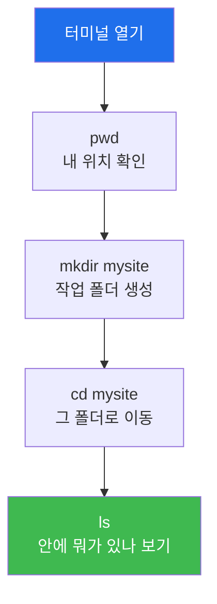
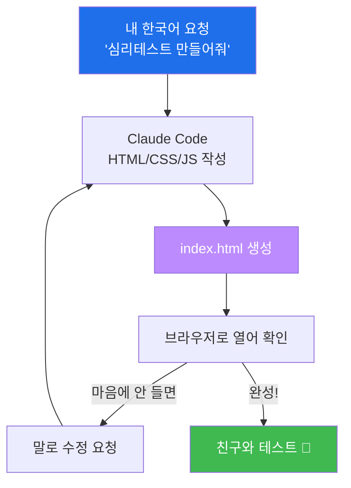
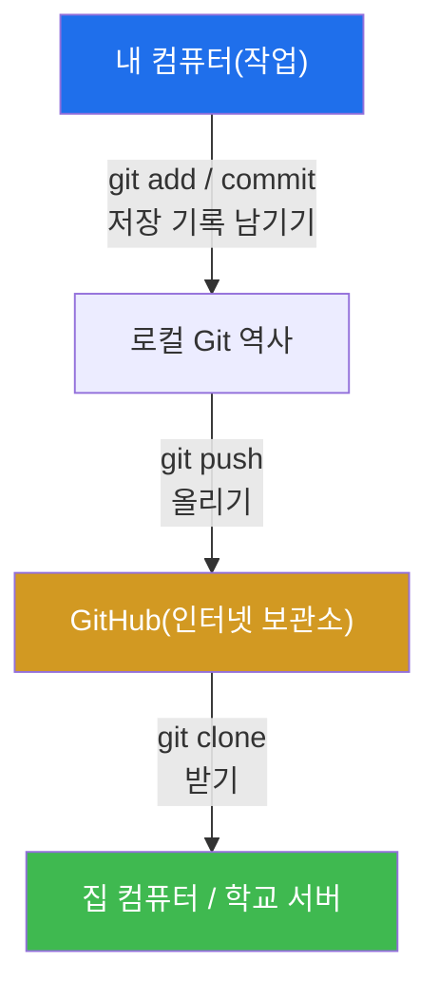

# Week 02 — 리눅스·Claude Code 첫걸음 + 내 첫 웹사이트 + GitHub

> **본 주차의 한 줄 요약**
>
> 검은 화면(터미널)을 무서워하지 않게 되는 게 목표다. 리눅스라는 운영체제와 인사하고,
> 명령어는 딱 **7개만** 익힌다. 그다음 **Claude Code(AI 비서)** 를 내 컴퓨터에 설치해, AI와 함께
> **나만의 심리테스트 웹사이트** 를 진짜로 만든다. 마지막엔 그걸 전 세계가 보는 **GitHub** 에
> 올려, 집에서도 다시 받을 수 있게 한다. 오늘은 "우와, 내가 만들었어!" 가 세 번 나온다.

---

## 학습 목표

이번 주가 끝나면 학생은 다음을 **직접** 할 수 있다.

1. 터미널을 열고, 리눅스 기본 명령어 7개(`pwd ls cd mkdir cat rm` + 도움 명령)로 파일·폴더를 다룬다.
2. Claude Code 를 본인 컴퓨터에 설치하고, 첫 대화로 파일 하나를 만들게 시킨다.
3. Claude Code 에게 한국어로 지시해 **심리테스트 웹사이트**(질문→결과)를 완성한다.
4. 만든 사이트를 브라우저로 직접 열어 친구와 해본다.
5. GitHub 저장소를 만들고, 내 사이트를 `push` 로 올린다.
6. 집(다른 컴퓨터)에서 `git clone` 으로 내 사이트를 다시 가져온다.

---

## 시간 배분 (총 4시간)

| 시간 | 내용 | 유형 |
|------|------|------|
| 0:00–0:40 | 리눅스·터미널이 뭐야? 파일/폴더 비유, 무서워하지 않기 | 이론 |
| 0:40–1:30 | 실습 1 — 터미널 열기 + 명령어 7개 | 실습 |
| 1:30–2:10 | 실습 2 — Claude Code 설치 & 첫 대화 | 실습 |
| 2:10–3:00 | 실습 3 — 심리테스트 사이트 만들기(우와!) | 실습 |
| 3:00–3:50 | 실습 4 — GitHub에 올리기 / 집에서 받기 | 실습 |
| 3:50–4:00 | 정리 + 다음 주 예고 | 정리 |

---

## 0. 용어 해설 (오늘 처음 나오는 말)

| 용어 | 영문 | 뜻 | 비유 |
|------|------|----|------|
| **운영체제** | OS | 컴퓨터를 움직이는 기본 프로그램(윈도우/리눅스/맥) | 건물의 관리실 |
| **리눅스** | Linux | 서버·해킹 실습에서 많이 쓰는 무료 운영체제 | 전문가들이 쓰는 작업복 |
| **터미널** | Terminal | 명령어를 글로 쳐서 컴퓨터를 시키는 검은 창 | 컴퓨터와 쪽지로 대화 |
| **명령어** | Command | 터미널에 입력하는 한 줄 지시 | 쪽지에 적는 심부름 |
| **디렉터리** | Directory | 폴더(파일을 담는 칸) | 서랍 |
| **경로** | Path | 파일이 있는 위치 주소 | 서랍의 위치(방→장→칸) |
| **Claude Code** | — | 터미널에서 도는 AI 에이전트 | 내 컴퓨터 속 비서 |
| **HTML/CSS/JS** | — | 웹페이지를 이루는 3대 재료(뼈대/꾸밈/움직임) | 집의 골조/페인트/전기 |
| **Git** | — | 파일의 변경 역사를 저장하는 도구 | 무한 '저장' 타임머신 |
| **GitHub** | — | Git 저장소를 인터넷에 보관·공유하는 사이트 | 작품을 올리는 클라우드 갤러리 |
| **저장소** | Repository(repo) | 프로젝트 파일 + 역사가 담긴 폴더 | 작품 폴더 |
| **push / clone** | — | 올리기 / 통째로 내려받기 | 업로드 / 다운로드 |

### 0.5 터미널이 무섭지 않은 이유 — "쪽지 심부름" 비유

터미널의 검은 화면은 사실 **컴퓨터와 쪽지를 주고받는 창**일 뿐이다. 내가 `ls` 라고 쪽지를
건네면, 컴퓨터가 "여기 폴더 안에 이런 파일들이 있어요"라고 답을 적어준다. 마우스로 폴더를
더블클릭하는 것과 **똑같은 일**을, 글로 시키는 것뿐이다. 다른 점은 단 하나 — **AI 비서에게
시킬 수 있다**는 것. 그래서 우리는 명령어를 많이 외울 필요가 없다. 7개만 알면 되고, 나머지
어려운 건 Claude Code 가 대신 친다.

---

## 1. 리눅스와 터미널 — 7개면 충분하다

### 1-1. 한 줄 정의
리눅스는 무료 운영체제고, 터미널은 거기에 **명령어(글)** 로 일을 시키는 창이다.

### 1-2. 왜 중요한가
해킹 도구와 AI 에이전트(Claude Code)는 대부분 **터미널에서** 돌아간다. 그래서 검은 화면과
친해지는 게 모든 것의 출발점이다. 다만 우리는 **딱 7개 명령어**만 손에 익히면 된다.

### 1-3. 오늘 익힐 명령어 7개

| 명령 | 하는 일 | 비유 | 예시 |
|------|---------|------|------|
| `pwd` | 지금 내가 어느 폴더에 있나 | 내 현재 위치 확인 | `pwd` |
| `ls` | 이 폴더 안에 뭐가 있나 | 서랍 열어보기 | `ls` |
| `cd` | 다른 폴더로 이동 | 다른 방으로 가기 | `cd mysite` |
| `mkdir` | 새 폴더 만들기 | 새 서랍 만들기 | `mkdir mysite` |
| `cat` | 파일 내용 보기 | 종이 펼쳐 읽기 | `cat index.html` |
| `rm` | 파일 지우기(주의!) | 휴지통에 버리기 | `rm 메모.txt` |
| `clear` | 화면 깨끗이 | 칠판 지우기 | `clear` |



### 1-4. 주의
`rm` 은 **휴지통 없이 바로 삭제**다. 지울 파일 이름을 꼭 확인하고 쓴다. 헷갈리면 그냥 Claude
Code 에게 "이 파일 지워줘"라고 시키면 안전하게 처리해 준다.

---

## 2. Claude Code 설치 — 내 컴퓨터에 AI 비서 들이기

### 2-1. 한 줄 정의
Claude Code 는 **내 터미널 안에서 도는 AI 에이전트**다. 한국어로 시키면 파일을 만들고 명령을
실행한다.

### 2-2. 설치 (실습에서 한 줄씩 따라함)
```bash
# 1) Node.js 가 필요하다(처음 1회). Ubuntu 기준:
sudo apt-get update && sudo apt-get install -y nodejs npm

# 2) Claude Code 설치
sudo npm install -g @anthropic-ai/claude-code

# 3) 실행 — 폴더로 가서 'claude' 라고 치면 시작
claude
```
처음 실행하면 로그인(가입한 계정 연결)을 한 번 한다. 강사가 화면을 보며 같이 안내한다.

### 2-3. 첫 대화
`claude` 가 켜지면, 그냥 한국어로 말한다:
> *"이 폴더에 hello.txt 파일을 만들고 안에 '나의 첫 AI 비서'라고 써줘."*

에이전트가 파일을 만들고 "만들었어요"라고 답한다. `ls` 로 확인하면 파일이 진짜 생겨 있다.
**오늘의 첫 번째 우와!**

### 2-4. 주의
Claude Code 는 시키면 진짜로 실행한다. 위험한 명령(파일 삭제 등)은 보통 **물어보고** 진행한다.
잘 모르겠으면 "왜 그렇게 하는지 설명해줘"라고 물으면 된다.

---

## 3. 내 첫 웹사이트 — 심리테스트 만들기

### 3-1. 웹사이트는 무엇으로 되어 있나
웹페이지는 세 가지 재료로 만든다.

| 재료 | 역할 | 비유 |
|------|------|------|
| **HTML** | 뼈대(제목·버튼·글) | 집의 골조 |
| **CSS** | 꾸밈(색·폰트·배치) | 페인트·인테리어 |
| **JavaScript(JS)** | 움직임(클릭하면 결과 계산) | 전기·스위치 |

좋은 소식: 우리는 이 셋을 **직접 코딩하지 않는다.** Claude Code 에게 시키면 다 만들어 준다.

### 3-2. 만드는 절차 (프롬프트 한 방)
작업 폴더(`mysite`)에서 `claude` 를 켜고 이렇게 말한다:
> *"심리테스트 웹사이트를 index.html 한 파일로 만들어줘. 질문 5개에 답하면 'OO 유형'
> 결과가 나오고, 결과마다 설명과 어울리는 이모지가 보이게 해줘. 알록달록 예쁘게, 모바일에서도
> 잘 보이게. 결과 화면엔 '다시 하기' 버튼도 넣어줘."*

에이전트가 `index.html` 을 만들어 준다. 마음에 안 들면 **그냥 말로** 고친다:
> *"결과를 동물 유형(고양이/강아지/부엉이/돌고래)으로 바꾸고, 배경을 파스텔톤으로 해줘."*



### 3-3. 만든 사이트 열어보기
가장 쉬운 방법은 파일을 브라우저로 바로 여는 것이다. 또는 작은 웹서버를 띄운다:
```bash
python3 -m http.server 5500
# 브라우저에서 http://localhost:5500 접속
```
**오늘의 두 번째 우와!** — 내가 만든 사이트가 진짜로 뜬다.

### 3-4. 주의
AI가 만든 코드가 한 번에 완벽하지 않을 수 있다. 안 되면 "에러가 나는데 고쳐줘"라고 **에러 화면을
그대로** 알려주면 에이전트가 고친다. 이게 AI와 일하는 방식이다.

---

## 4. GitHub — 내 작품을 클라우드에 올리고 어디서나 받기

### 4-1. 왜 GitHub가 중요한가 (AI 시대에 특히)
AI 에이전트와 일하면 코드가 **빠르게, 많이** 바뀐다. 그래서 "언제든 되돌릴 수 있는 저장
기록(Git)"과 "어디서나 받을 수 있는 보관소(GitHub)"가 **필수**다. 집에 가서 이어서 하거나,
다음 주 실습에서 **취약한 사이트를 내 서버로 가져올 때** 도 GitHub를 쓴다. 그냥 지나치기 쉽지만,
**프로처럼 일하려면 GitHub부터** 다. 오늘 꼭 손에 익힌다.



### 4-2. 절차 (실습에서 한 줄씩)
```bash
# 1) GitHub 가입 후, 브라우저에서 New repository → 이름 'my-psychotest' 로 생성

# 2) 내 사이트 폴더에서
cd mysite
git init
git add .
git commit -m "내 첫 심리테스트 사이트"
git branch -M main
git remote add origin https://github.com/<내아이디>/my-psychotest.git
git push -u origin main
```
복잡해 보이면 Claude Code 에게 *"이 폴더를 내 GitHub 저장소에 올려줘"* 라고 시켜도 된다.
**오늘의 세 번째 우와!** — 인터넷에 내 작품 주소가 생긴다.

### 4-3. 집에서 다시 받기 / 취약 사이트 가져오기 미리보기
```bash
# 집 컴퓨터에서 내 작품 받기
git clone https://github.com/<내아이디>/my-psychotest.git

# (다음 주 예고) 실습용 취약 사이트도 똑같이 받는다
git clone https://github.com/mrgrit/easy_web_hacking_class.git
```

### 4-4. 주의
GitHub에는 **비밀번호·개인정보·토큰을 올리지 않는다.** 한 번 올라가면 인터넷에 퍼질 수 있다.
실습용 공개 코드만 올린다.

---

## 실습 안내 (lab_week02.yaml)

1. **명령어 7개 길들이기** — *왜?* 모든 도구의 기본 무대가 터미널이라서. *무엇을?* 폴더를 만들고
   이동하고 내용을 본다. *해석:* 명령마다 컴퓨터가 답을 적어주면 성공. *실전:* 다음 주부터 이
   화면에서 해킹을 한다.
2. **Claude Code 설치 + 첫 파일** — AI 비서를 내 컴퓨터에 들이고, 말로 파일을 만들게 한다.
3. **심리테스트 사이트 제작** — 프롬프트 한 줄로 사이트를 만들고, 말로 다듬어 완성한다.
4. **GitHub 업로드 + 클론** — 내 작품을 올리고, 다시 받아본다. 프로의 작업 습관을 체득한다.

---

## 다음 주차 예고

다음 주(Week 03)엔 **웹이 도대체 어떻게 움직이는지** 들여다본다(요청·응답·쿠키·세션·데이터베이스).
그리고 그 원리를 알자마자, 연습용 표적 **DVWA** 에서 **SQL 인젝션·XSS** 같은 진짜 해킹 기법을
**내 손으로** 성공시킨다. 이번 주에 만든 GitHub 실력이 그대로 쓰인다.
