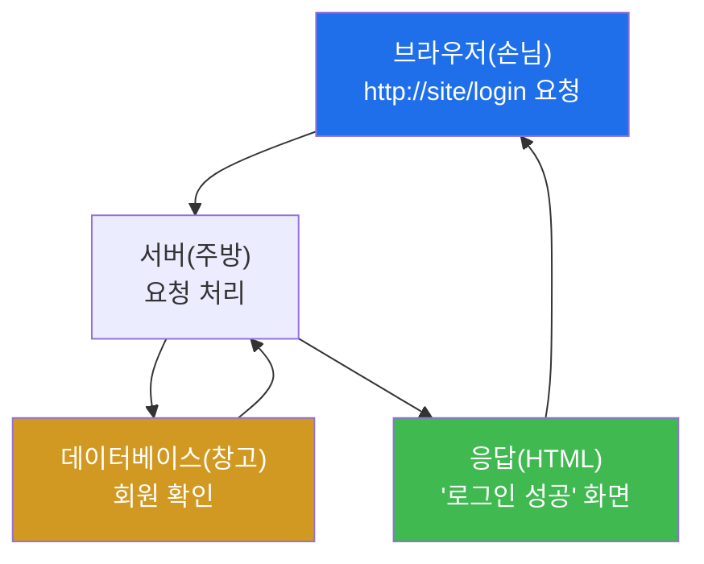
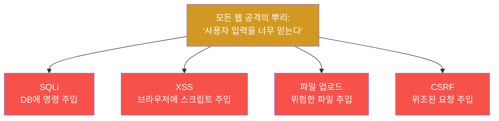
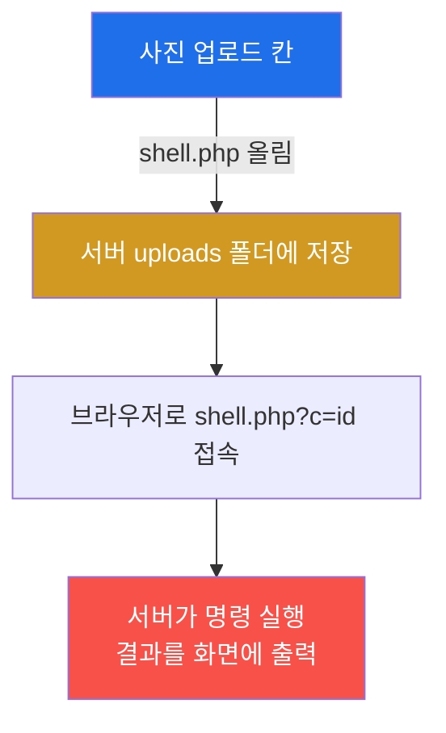

# Week 03 — 웹의 작동 원리 + 직접 해보는 웹 해킹 (DVWA)

> **본 주차의 한 줄 요약**
>
> "웹사이트는 도대체 어떻게 움직일까?"를 먼저 들여다본다(요청·응답·쿠키·세션·데이터베이스).
> 원리를 알자마자, 연습용 표적 **DVWA** 에서 **SQL 인젝션·XSS·인증우회·CSRF·파일 업로드** 같은
> 진짜 해킹 기법을 **내 손으로** 성공시킨다. 여기서부터 어려워서 포기하기 쉬운데, 모든 실습은
> **변수 없이 똑같은 결과**가 나오게 짜여 있다(DVWA 보안등급 Low 고정). 천천히 따라오면 누구나
> "어? 진짜 뚫렸어!" 를 경험한다.

---

## 학습 목표

이번 주가 끝나면 학생은 다음을 **직접** 할 수 있다.

1. 브라우저 주소창에 주소를 치면 화면이 뜨기까지의 과정(요청→응답)을 그림으로 설명한다.
2. 개발자도구(F12)로 **쿠키와 요청**을 직접 들여다보고 "로그인 상태가 어디 저장되나"를 짚는다.
3. OWASP Top 10 이 무엇인지, 그중 우리가 다룰 5가지가 어디 속하는지 안다.
4. DVWA에서 **SQL 인젝션**으로 회원 비밀번호 목록을 뽑아낸다.
5. DVWA에서 **XSS**로 경고창을 띄우고, **CSRF**로 비밀번호를 몰래 바꾸게 만든다.
6. DVWA에서 **파일 업로드**로 웹셸을 올려 서버 명령을 실행한다(가장 강력한 "우와").

---

## 시간 배분 (총 7시간)

| 시간 | 내용 | 유형 |
|------|------|------|
| 0:00–1:00 | 웹 기초 — 요청/응답, HTML, 쿠키·세션, 데이터베이스 | 이론 |
| 1:00–2:00 | 웹 기초 실습 — 개발자도구로 쿠키/요청 보기 | 실습 |
| 2:00–2:30 | OWASP Top 10 한 장 요약 | 이론 |
| 2:30–4:00 | DVWA ① SQL Injection ② XSS | 실습 |
| 4:00–5:30 | DVWA ③ 인증우회/Brute Force ④ CSRF | 실습 |
| 5:30–7:00 | DVWA ⑤ 파일 업로드(웹셸) + 정리 | 실습 |

---

## 0. 용어 해설 (오늘 처음 나오는 말)

| 용어 | 영문 | 뜻 | 비유 |
|------|------|----|------|
| **요청/응답** | Request/Response | 브라우저가 묻고(요청) 서버가 답함(응답) | 손님 주문 / 주방 서빙 |
| **HTTP** | HyperText Transfer Protocol | 웹에서 요청·응답을 주고받는 규칙 | 주문서 양식 |
| **서버** | Server | 웹사이트를 돌리는 컴퓨터 | 식당 주방 |
| **쿠키** | Cookie | 브라우저에 저장되는 작은 메모(로그인 표식 등) | 손목에 찍는 입장 도장 |
| **세션** | Session | 서버가 기억하는 '로그인 상태' | 주방이 든 단골 명단 |
| **데이터베이스** | Database(DB) | 회원·글 등 데이터를 저장하는 창고 | 회원 명부 캐비닛 |
| **SQL** | Structured Query Language | DB에 묻는 언어("admin 회원 찾아줘") | 사서에게 책 요청 |
| **개발자도구** | DevTools | 브라우저 F12로 여는 내부 들여다보기 창 | 자동차 보닛 열기 |
| **OWASP Top 10** | — | 가장 흔하고 위험한 웹 취약점 10가지 목록 | 빈집털이 단골 수법 톱10 |
| **페이로드** | Payload | 공격에 끼워 넣는 '실제 내용물' 문자열 | 자물쇠에 넣는 특수 열쇠 |
| **웹셸** | Web Shell | 서버에 올려 명령을 실행하는 악성 파일 | 몰래 설치한 원격 조종기 |

### 0.5 핵심 비유 — "식당"으로 웹 한 번에 이해하기

웹사이트를 **식당**이라고 생각하자.
- **브라우저(나)** = 손님. **서버** = 주방. **요청** = 주문서, **응답** = 나온 음식.
- **데이터베이스** = 주방 안쪽의 **재료·명부 창고**. 손님이 직접 들어갈 수 없는 곳이다.
- **SQL 인젝션** = 주문서(요청)에 몰래 **"그리고 창고 명부도 같이 가져와"** 라는 글귀를 끼워
  넣는 것. 주방이 주문서를 **그대로 믿고** 처리하면, 손님이 보면 안 될 회원 명부가 음식과 함께
  나온다. 즉 **입력값을 의심 없이 믿는 것**이 모든 웹 해킹의 출발점이다.

이 한 문장만 기억하면 오늘의 모든 공격이 같은 원리임을 알게 된다 — **"사용자가 넣은 글자를
서버가 너무 순진하게 믿는다."**

---

## 1. 웹은 이렇게 움직인다 — 요청과 응답

### 1-1. 한 줄 정의
웹은 **브라우저가 서버에 요청을 보내고, 서버가 응답(HTML)을 돌려주는** 왕복이다.

### 1-2. 왜 중요한가
해킹은 결국 이 **요청을 살짝 바꿔치기** 하는 일이다. 어떤 요청이 오가는지 볼 줄 알아야
어디를 비틀지 알 수 있다.

### 1-3. 어떻게 보나
브라우저에서 **F12(개발자도구)** 를 열고 **Network(네트워크)** 탭을 보면, 페이지가 보낸
요청들이 다 보인다. **Application/저장소** 탭에서는 **쿠키**를 직접 볼 수 있다.

### 1-4. 주의
요청은 사용자가 마음대로 바꿀 수 있다(브라우저·curl로). 그래서 서버는 **사용자 입력을 절대
그냥 믿으면 안 된다.** 이걸 안 지킨 사이트가 오늘의 표적이다.

---

## 2. 쿠키와 세션 — 로그인 상태는 어디 있나

### 2-1. 한 줄 정의
**쿠키**는 브라우저가 들고 다니는 입장 도장, **세션**은 서버가 가진 단골 명단이다. 둘을 맞춰
"너 로그인했지?"를 확인한다.

### 2-2. 왜 중요한가
이 도장(쿠키)을 **훔치거나 위조**하면 남의 로그인 상태를 가로챌 수 있다(다음 XSS와 연결).

### 2-3. 어떻게 보나
F12 → Application(또는 저장소) → Cookies 에서 `PHPSESSID` 같은 값을 본다. 이게 바로 내
"입장 도장"이다.

### 2-4. 주의
중요한 쿠키에는 `HttpOnly`(자바스크립트가 못 읽게) 같은 보호가 필요하다. DVWA·MediForum은
일부러 이런 보호가 약하게 되어 있어 공격이 통한다.

---

## 3. OWASP Top 10 — 빈집털이 단골 수법

OWASP Top 10 은 **가장 흔하고 위험한 웹 취약점 10가지** 목록이다. 오늘 우리가 다루는 5개가
어디에 속하는지만 보자.

| 우리가 할 것 | OWASP 분류 | 한 줄 |
|--------------|-----------|------|
| SQL 인젝션 | A03 Injection | 입력에 SQL을 끼워 DB를 턴다 |
| XSS | A03 Injection | 입력에 스크립트를 끼워 남의 브라우저에서 실행 |
| 인증우회/약한 비번 | A07 인증 실패 | 시도 제한·약한 비번을 노린다 |
| CSRF | A01 접근통제 실패 | 남이 모르게 요청을 대신 보내게 만든다 |
| 파일 업로드(웹셸) | A05 보안설정 오류 | 위험한 파일을 올려 서버를 장악 |

---

## 4. 오늘의 5가지 공격 — 원리 미리보기

### 4-1. SQL 인젝션 (SQLi)
입력칸에 `' OR '1'='1` 같은 글자를 넣어, 서버의 DB 질문을 **항상 참**으로 만들거나 **다른
테이블(비밀번호)** 을 같이 가져오게 한다. → 회원 비밀번호 목록이 화면에 뜬다.

### 4-2. XSS (Cross-Site Scripting)
입력칸에 `` 를 넣어, 그 글을 보는 **다른 사람의 브라우저에서
내 코드가 실행** 되게 한다. → 경고창이 뜨고, 응용하면 쿠키(도장)도 훔칠 수 있다.

### 4-3. 인증우회 / Brute Force
로그인에 **시도 횟수 제한이 없으면**, 흔한 비밀번호를 계속 넣어 뚫는다. 또는 SQLi로 비밀번호
자체를 건너뛴다. → "비번 없이 admin 로그인".

### 4-4. CSRF (Cross-Site Request Forgery)
피해자가 로그인된 상태에서, 공격자가 만든 링크를 누르면 **피해자 몰래 요청이 전송** 된다.
→ 본인도 모르게 비밀번호가 바뀐다.

### 4-5. 파일 업로드 → 웹셸
사진만 올려야 하는 칸에 **PHP 코드 파일** 을 올린다. 서버가 막지 않으면, 그 파일 주소로
접속해 **서버에 명령** 을 내릴 수 있다. → 서버에서 `id`, `cat /etc/passwd` 가 실행된다.
오늘 가장 강력한 "우와".

---

## 실습 안내 (lab_week03.yaml)

> **준비.** 희생자 VM에서 `cd infra && ./start.sh` 로 DVWA를 띄운다. 브라우저로
> `http://<victim-ip>:8080` 접속 → `admin` / `password` 로그인 → 하단 **Create/Reset Database** →
> 좌측 **DVWA Security** 를 **반드시 Low** 로 설정. (Low 여야 변수 없이 똑같은 결과가 나온다.)

1. **개발자도구로 웹 들여다보기** — 쿠키와 요청을 직접 본다. "로그인 상태가 어디 저장되나"를 눈으로 확인.
2. **SQL 인젝션** — 입력 한 줄로 회원 비밀번호 목록을 뽑는다. *결과 해석:* 화면에 user/hash가
   주르륵 나오면 성공. *실전 의미:* 입력을 안 거르면 DB가 통째로 샌다.
3. **XSS** — 경고창을 띄우고, 응용으로 내 쿠키를 출력한다. 남의 브라우저를 조종할 수 있다는 감각.
4. **인증우회 / Brute Force** — 시도 제한이 없음을 확인하고 약한 비번을 맞힌다.
5. **CSRF** — 조작된 링크 하나로 비밀번호가 바뀌게 만든다. 클릭 한 번의 위험.
6. **파일 업로드(웹셸)** — PHP 웹셸을 올려 서버에서 명령을 실행한다. 오늘의 하이라이트.

각 실습은 "넣을 글자(페이로드)"와 "화면에 보여야 할 것"을 정확히 적어 두었다. 그대로만 하면 된다.

---

## 다음 주차 예고

다음 주(Week 04)엔 이걸 **AI 에이전트가 대신** 해준다. 가상 은행 **NeoBank** 를 표적으로, 정해진
**프롬프트를 복사→붙여넣기** 만 하면 Claude Code 가 정찰부터 취약점 점검, **보고서 작성**까지
스스로 진행한다. 오늘 손으로 익힌 SQLi·XSS·인증우회가, AI의 손에서 얼마나 빨라지는지 본다.
