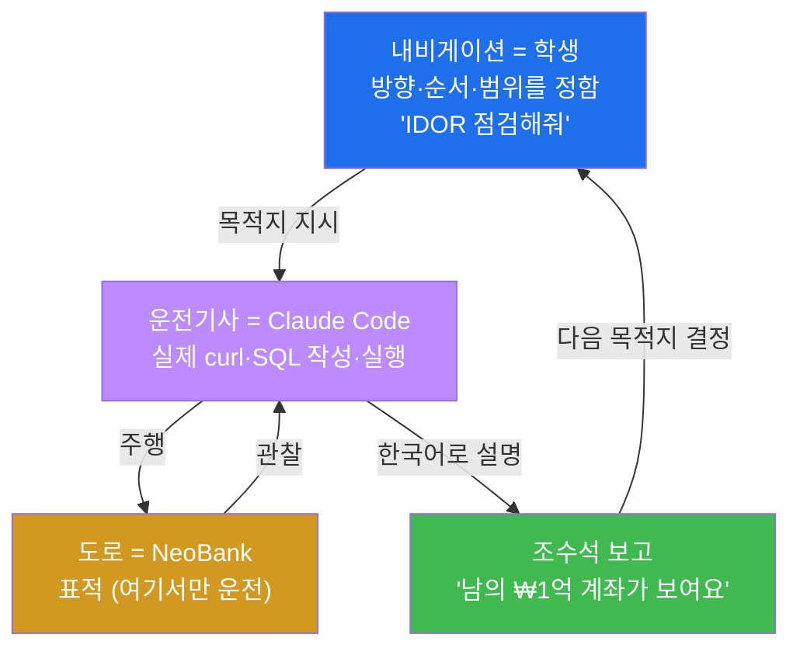
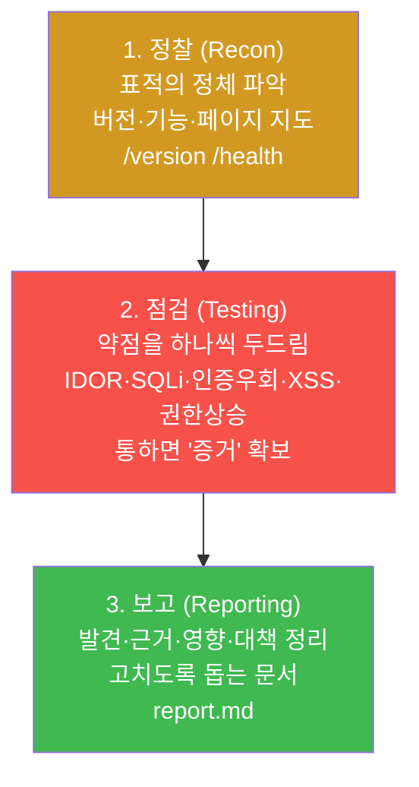
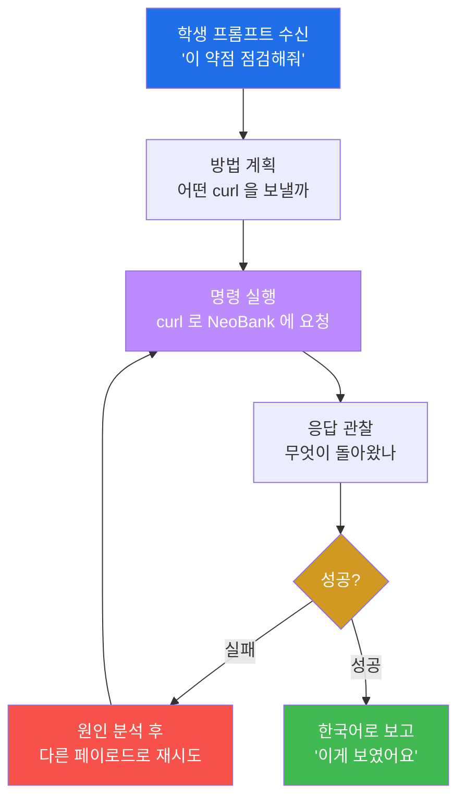
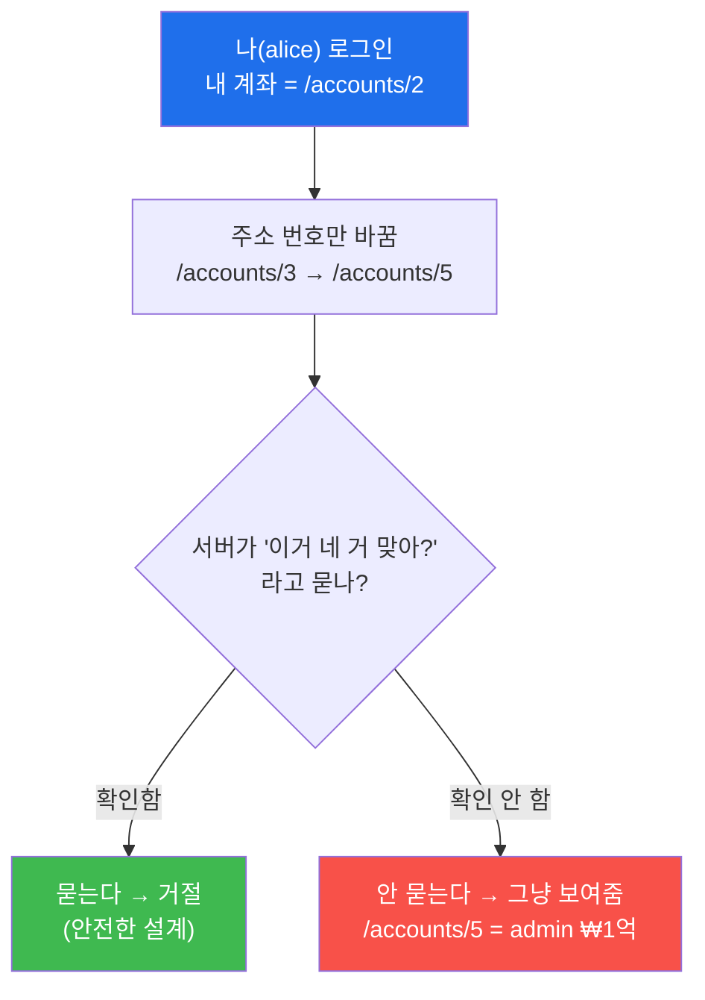
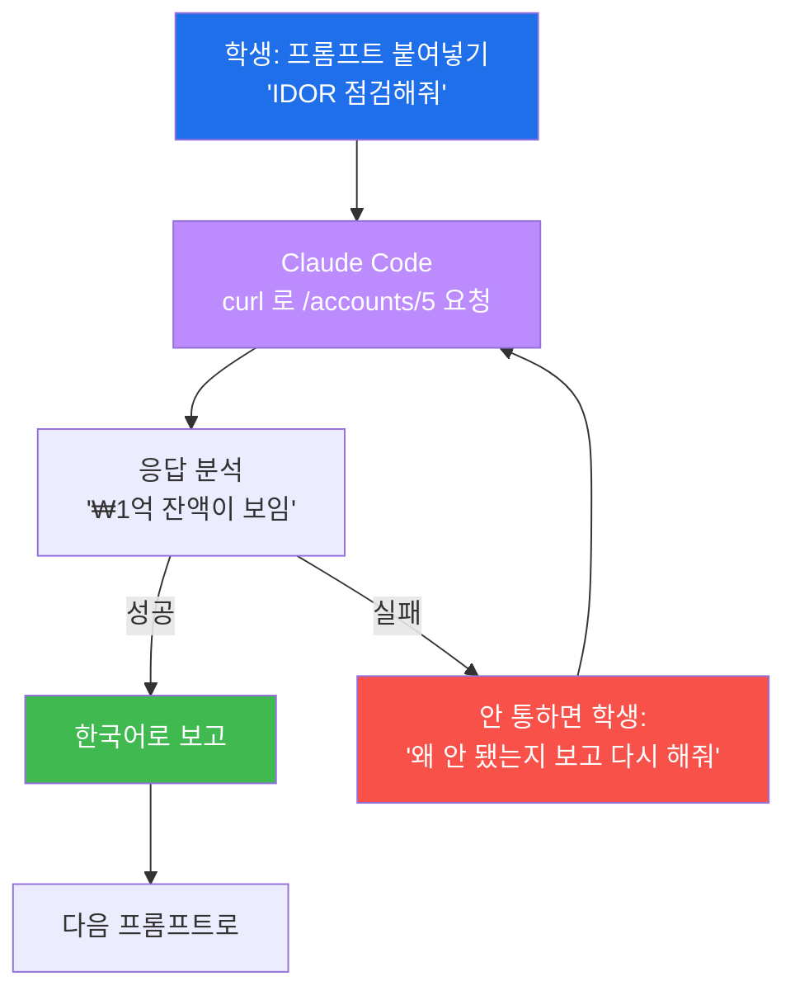
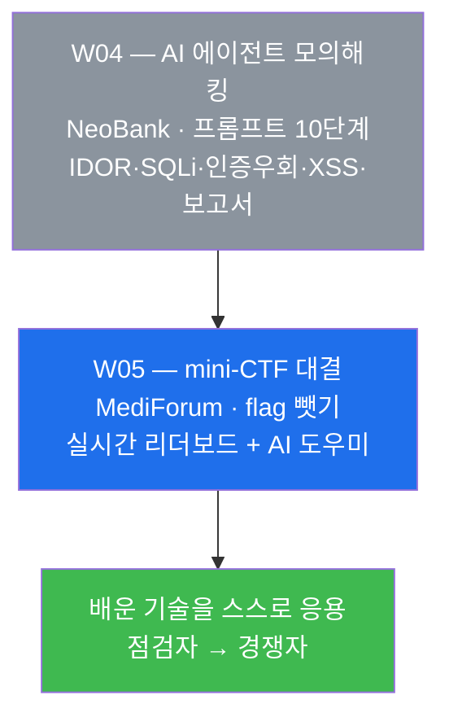

# Week 04 — AI 에이전트(Claude Code)와 함께하는 모의해킹 (NeoBank)

> **본 주차의 한 줄 요약**
>
> 지난주(Week 03)까지 학생은 SQL 인젝션·XSS·로그인 약점을 **자기 손으로 한 줄씩** 두드렸다.
> 이번 주엔 운전대를 바꿔 잡는다 — **AI 에이전트(Claude Code)가 운전하고, 학생은 내비게이션처럼
> 방향만 정한다.** 표적은 일부러 허술하게 만든 가상 인터넷 은행 **NeoBank**. 학생은 평범한 고객
> 'alice' 로 시작해, 정해진 **프롬프트 10단계를 복사→붙여넣기**만 하면서 에이전트가 정찰부터
> 약점 점검, 그리고 마지막 **점검 보고서 작성**까지 스스로 해내는 과정을 지켜본다. 오늘의 하이라이트는
> 일반 고객인 내가 **남의 ₩1억 비밀 계좌를 들여다보고**, **헤더 단 한 줄로 전 회원의 주민번호와
> API 키가 줄줄 새는** 순간이다.

---

## 학습 목표

이번 주가 끝나면 학생은 다음을 **직접**(에이전트를 부려서) 할 수 있다.

1. 모의해킹(침투 테스트)이 무엇이고 왜 "허락"이 핵심인지, 그리고 그 3단계(정찰 → 점검 → 보고)가
   각각 무엇을 하는지 자기 말로 설명한다.
2. Claude Code 에게 **표적과 허락 범위를 못 박고**(NeoBank 하나만) 점검을 시작시키며, 결과가 안
   나오면 "왜 안 됐는지 보고 다른 방법으로 다시 해줘"라고 방향을 다시 잡아 준다.
3. 프롬프트로 **IDOR**(주소의 번호만 바꿔 남의 ₩1억 계좌 열람)과 **SQL 인젝션 로그인 우회**
   (`' OR 1=1--`)를 재현시키고, 무엇이 왜 뚫렸는지 설명한다.
4. 프롬프트로 **인증 우회 헤더**(`X-Internal: 1`)를 붙여 관리자 API 를 열고, 거기서 새어 나오는
   **PII**(주민번호·API 키·비밀질문 답)를 확인한다.
5. 프롬프트로 **저장형 XSS**(송금 메모에 심은 스크립트)와 **권한 상승**(프로필 수정으로 내 역할을
   admin 으로)을 재현한다.
6. 에이전트에게 **취약점 점검 보고서(report.md)** 를 자동 작성시키고, 가장 위험한 발견 1건을
   골라 그 이유와 함께 발표한다.

> ⚠️ **인가된 실습만.** 오늘의 모든 행위(남의 계좌 열람·SQLi·헤더 위조·XSS)는 **우리 실습용
> NeoBank 한 대** 안에서만 한다. 에이전트에게도 처음 한 번 분명히 말해 둔다 — "NeoBank 만 점검해."
> 실제 은행·타인의 사이트를 허락 없이 같은 방법으로 건드리는 것은 **범죄**이며, 본 과정의 보안 서약
> 위반이다. 모의해킹의 첫 번째 규칙은 "공격 기술"이 아니라 "허락 범위"다.

---

## 시간 배분 (총 6시간)

| 시간 | 내용 | 유형 |
|------|------|------|
| 0:00–0:30 | 모의해킹이 뭐야? — 직업·계약·허락, 3단계(정찰→점검→보고) | 이론 |
| 0:30–0:55 | Week 03 복습(SQLi·XSS·인증) + 새 개념(IDOR·인증우회 헤더·권한상승) 비유로 | 이론 |
| 0:55–1:20 | "AI가 운전, 나는 내비" — 에이전트에게 일 시키는 법, 범위 못 박기 | 이론/시연 |
| 1:20–2:30 | 프롬프트 1~3 — 정찰 + 로그인/기능 흐름 + 기본 자격증명 | 실습 |
| 2:30–2:40 | 휴식 | — |
| 2:40–4:00 | 프롬프트 4~6 — IDOR(₩1억) + SQLi 로그인 우회 + SQLi 데이터 추출 | 실습 |
| 4:00–5:10 | 프롬프트 7~9 — 인증우회 헤더+PII + 저장형 XSS + 권한상승 | 실습 |
| 5:10–6:00 | 프롬프트 10 — 보고서 자동 작성 + 가장 위험한 1건 발표 + 다음 주 예고 | 실습/정리 |

---

## 0. 용어 해설 (오늘 처음 나오는 말)

오늘은 새 용어가 꽤 나온다. 겁먹을 필요 없다. 어차피 어려운 명령은 AI 가 짠다. 학생은 "이 말이 무슨
뜻인지" 감만 잡으면 된다. 아래 표는 본문에서 다시 짚지만, 헷갈리기 쉬운 핵심어를 먼저 일상 비유로
정리해 둔다.

| 용어 | 영문 | 뜻 | 비유 |
|------|------|----|------|
| **모의해킹** | Penetration Test | 허락받고 실제처럼 공격해 약점을 미리 찾아 주는 점검 | 도둑을 고용해 우리 집 약한 자물쇠를 미리 찾기 |
| **에이전트** | AI Agent (Claude Code) | 사람의 지시(프롬프트)를 받아 스스로 명령을 실행하고 결과를 풀어 주는 AI | 운전대를 잡은 운전기사 |
| **프롬프트** | Prompt | 에이전트에게 무엇을 할지 적어 주는 한국어 지시문 | 운전기사에게 알려 주는 목적지 |
| **범위/스코프** | Scope | 점검을 허락받은 표적의 경계(여기까지만) | "이 집만, 옆집은 절대 안 됨" |
| **정찰** | Reconnaissance | 표적이 뭘로 만들어졌는지·어떤 기능이 있는지 먼저 파악 | 건물 도면과 출입구를 답사 |
| **엔드포인트** | Endpoint | 서버의 한 주소(기능). 예: `/login`, `/accounts/5` | 건물 안의 각 방 호수 |
| **curl** | curl | 브라우저 없이 명령 한 줄로 서버에 요청을 보내는 도구 | 손으로 직접 쪽지를 보내는 우편 |
| **IDOR** | Insecure Direct Object Reference | 주소의 번호(id)만 바꿔 남의 데이터를 보는 결함 | 내 방 옆 방 번호를 눌러 그냥 들어가기 |
| **SQL 인젝션** | SQL Injection (SQLi) | 입력 칸에 데이터베이스 명령을 끼워 넣어 질의를 조작 | 주문서에 가짜 항목을 적어 결제 조작 |
| **인증 우회** | Authentication Bypass | 로그인 과정을 통째로 건너뛰고 들어가는 것 | 자물쇠를 푸는 게 아니라 경첩을 떼는 것 |
| **헤더** | HTTP Header | 요청에 함께 붙는 부가정보(누구인지·무슨 역할인지 등) | 택배 상자에 붙은 송장 메모 |
| **PII** | 개인식별정보 | 주민번호·전화·계좌·API 키 등 민감한 개인정보 | 신분증에 적힌 내용 전부 |
| **저장형 XSS** | Stored XSS | 서버에 저장된 악성 스크립트가 그 페이지를 보는 남에게 실행됨 | 게시판에 몰래 심어 둔 함정 |
| **권한 상승** | Privilege Escalation | 일반 사용자가 몰래 관리자 권한을 얻는 것 | 손님이 직원 명찰을 슬쩍 다는 것 |
| **Mass Assignment** | 일괄 대입 | 서버가 받지 말아야 할 필드(역할 등)까지 그대로 받아 주는 결함 | 신청서에 "직급: 사장"이라 적었는데 그대로 통과 |
| **보고서** | Pentest Report | 발견한 약점·근거·영향·고치는 법을 정리한 문서 | 건물 안전점검 결과지 |
| **OWASP Top 10** | — | 가장 흔한 웹 보안 위험 10가지를 정리한 세계 표준 목록 | 자주 깨지는 곳 베스트 10 |

> **헷갈리기 쉬운 한 쌍 — "인증 우회" vs "권한 상승".** 둘 다 남의 권한을 얻는 거라 비슷해 보이지만
> 출발점이 다르다. **인증 우회**는 아예 **로그인하지 않은 채** 안으로 들어가는 것이다(헤더 한 줄로
> 관리자 API 를 여는 것이 그 예). **권한 상승**은 **이미 로그인한 일반 사용자**가 슬쩍 자기 등급만
> 관리자로 올리는 것이다(프로필 수정에 "역할=admin"을 끼워 넣는 것). 출입에 비유하면, 인증 우회는
> 명찰 없이 직원 문으로 들어가기이고, 권한 상승은 손님 명찰을 직원 명찰로 바꿔 다는 것이다. 오늘
> NeoBank 에서 둘 다 직접 본다.

---

## 0.5 "AI가 운전, 나는 내비게이션" — 이번 주의 컨셉 심화

이번 주의 방식을 자동차 한 대에 비유하면 가장 빠르게 이해된다. 학생은 운전석이 아니라 **조수석의
내비게이션**에 앉는다.

운전(실제 명령 실행)은 전부 **AI 에이전트인 Claude Code** 가 한다. 정확한 SQL 문법을 외우는 일,
까다로운 `curl` 옵션을 한 글자도 안 틀리게 치는 일, 응답에서 의미 있는 줄을 골라내는 일 — 이 운전
기술은 모두 에이전트의 몫이다. 학생이 하는 일은 단 하나, **"다음은 여기로 가"** 라고 방향을 정해
주는 것이다. 그래서 오늘은 SQL 도, 셸 명령도 외울 필요가 없다.

그렇다면 내비게이션의 역할은 가벼운가? 전혀 아니다. **방향을 정하는 것이 모의해킹의 진짜 실력**이다.
어디를 의심할지(로그인? 계좌 주소? 헤더?), 어떤 순서로 두드릴지(정찰 먼저, 그다음 약점), 그리고
**어디까지만 갈지**(NeoBank 하나만)를 정하는 머리가 곧 점검자의 머리다. 운전기사가 아무리 능숙해도
목적지를 잘못 찍으면 엉뚱한 곳에 도착한다.



이 한 바퀴(내비가 방향 → 기사가 주행 → 조수석에 보고 → 다음 방향)가 오늘 10번 반복된다. 매번 학생은
프롬프트 한 개를 붙여넣고, 에이전트의 한국어 설명을 읽고, 다음으로 넘어간다.

---

## 1. 모의해킹이란 무엇인가 — 허락받은 침입

### 1.1 한 줄 정의와 왜 직업이 되는가

**모의해킹(침투 테스트, penetration test)** 은 **소유자에게 허락을 받고**, 실제 공격자처럼 시스템을
두드려 **약점을 먼저 찾아 주는 합법적인 점검**이다. 핵심 단어는 "공격"이 아니라 **"먼저"** 와
**"허락"** 이다. 진짜 도둑이 들기 전에, 고용된 사람이 우리 집의 약한 자물쇠·열린 창문을 미리 찾아내
알려 주는 것이다.

이건 실제 직업이다. 회사들은 자기 서비스가 안전한지 확인하려고 **모의해킹 회사(또는 화이트해커)와
계약**을 맺는다. 계약서에는 "어떤 시스템을, 언제부터 언제까지, 어떤 방법으로 점검해도 되는가"가
적힌다. 이 약속을 **범위(scope)** 와 **교전 규칙(Rules of Engagement)** 이라 부른다. 약속된 범위
밖을 건드리면, 아무리 좋은 의도였어도 불법이 된다. 그래서 점검자에게 가장 중요한 능력은 화려한 공격
기술이 아니라 **"여기까지만"을 지키는 규율**이다.

오늘 우리의 "계약서"는 단순하다 — **표적은 NeoBank 하나, 기간은 이 수업 시간, 방법은 프롬프트
10단계.** 에이전트에게도 이 범위를 처음에 못 박아 두면, 에이전트가 엉뚱한 사이트로 새지 않는다.

### 1.2 모의해킹의 3단계 — 정찰 → 점검 → 보고

모의해킹은 즉흥적으로 아무 데나 두드리는 게 아니라, 정해진 순서를 따른다. 크게 세 단계다.



**1단계 정찰** 은 표적이 무엇으로 만들어졌는지, 어떤 페이지와 기능이 있는지 지도를 그리는 일이다.
오늘 NeoBank 의 `/version` 을 보면 "Flask 1.0.2"라는 **낡은 버전**이 그대로 적혀 있다. 낡은 버전은
그 자체로 단서다 — "이 집은 오래된 자물쇠를 쓰는구나"를 알려 준다.

**2단계 점검** 은 정찰로 얻은 단서를 들고 약점을 하나씩 확인하는 일이다. 통하면 반드시 **증거**를
남긴다. "여기가 뚫린다"는 말만으로는 부족하고, 실제로 남의 계좌가 보인 화면이나 응답이 있어야 한다.

**3단계 보고** 가 모의해킹의 진짜 결과물이다. 점검자는 공격으로 끝내지 않고, **무엇이 왜 위험하고
어떻게 고치는지**를 문서로 정리해 회사에 넘긴다. 화이트해커의 가치는 "뚫었다"가 아니라 "고치게
도왔다"에 있다. 오늘 프롬프트 10번이 바로 이 보고서를 AI 에게 자동으로 쓰게 하는 단계다.

### 1.3 에이전트가 도는 작은 동작 루프

위 3단계 안에서, 에이전트는 각 점검 항목마다 더 작은 루프를 빠르게 돈다. 학생이 프롬프트 하나를
주면 에이전트는 다음을 자동으로 반복한다.



여기서 학생이 기억할 한 가지 — **한 번에 안 통해도 괜찮다.** 예를 들어 검색 SQLi 에서는 "컬럼 개수"를
맞춰야 하는데, 에이전트가 한 번에 못 맞히면 스스로 숫자를 바꿔 가며 다시 시도한다. 학생은 그냥
*"왜 안 됐는지 보고 다른 방법으로 한 번 더 해줘"* 라고만 하면 된다. 이 한 문장이 에이전트의 재시도
루프를 다시 돌린다.

---

## 2. Week 03 복습 + 오늘의 새 개념 (비유로)

오늘 점검할 약점 중 일부는 지난주에 손으로 해 본 것의 **복습이자 심화**이고, 일부는 **새 개념**이다.
표로 한눈에 보자.

| 약점 | 지난주(W03)에서 | 이번주(W04)에서 | 새것/복습 |
|------|----------------|----------------|-----------|
| SQL 인젝션 | DVWA 에서 손으로 한 줄씩 | AI 가 더 빠르고 깊게(로그인 우회 + 데이터 추출) | 복습+심화 |
| XSS | 반사형을 직접 입력창에 | 저장형(서버에 저장되어 남에게 발현) | 복습+심화 |
| 인증/로그인 | 약한 비밀번호 개념 | 기본 자격증명 + 인증 우회 헤더 | 복습+심화 |
| IDOR | (처음) | 주소 번호만 바꿔 남의 ₩1억 계좌 | **새것** |
| 인증 우회 헤더 | (처음) | `X-Internal: 1` 한 줄로 관리자 API | **새것** |
| 권한 상승 | (처음) | 프로필 수정으로 내 역할을 admin 으로 | **새것** |

### 2.1 SQL 인젝션 복습 — 비밀번호를 "푸는" 게 아니라 "건너뛴다"

서버가 로그인을 확인할 때, 안전하지 않게 짜면 대략 이런 데이터베이스 명령을 만든다.

```sql
SELECT * FROM users WHERE email = '<입력한 이메일>' AND password = '<입력한 비밀번호>';
```

여기서 이메일 칸에 평범한 글자 대신 `' OR 1=1--` 를 적으면 어떻게 될까. `'` 로 문자열을 닫고,
`OR 1=1`(항상 참)을 끼워 넣고, `--`(주석 표시)로 그 뒤 비밀번호 검사를 통째로 지워 버린다. 결과는
이렇게 변한다.

```sql
SELECT * FROM users WHERE email = '' OR 1=1--' AND password = 'x';
```

`OR 1=1` 때문에 조건이 무조건 참이 되고 비밀번호 검사는 사라졌으므로, 데이터베이스는 **맨 첫 번째
사용자(보통 관리자)** 를 돌려준다. 비밀번호를 한 번도 맞히지 않았는데 관리자로 로그인된다. 이것이
"푸는 게 아니라 건너뛴다"의 뜻이다. NeoBank 의 로그인은 바로 이 위험한 방식으로 짜여 있다(코드의
`login` 함수가 입력을 그대로 이어 붙인다).

### 2.2 저장형 XSS 심화 — 한 번 심으면 보는 사람마다 발현

지난주 본 **반사형 XSS** 는 내가 보낸 링크를 누가 클릭해야만 한 번 실행됐다. **저장형 XSS** 는 더
무섭다. 악성 스크립트가 **서버에 저장**되어, 그 페이지를 여는 **모든 사람**의 브라우저에서 실행된다.
NeoBank 에서는 송금할 때 적는 **메모(memo) 칸**이 이 함정이다. 메모에 `<script>...</script>` 를
넣어 송금하면, 그 거래가 보이는 계좌 상세 페이지(`/accounts/<id>`)를 누가 열든 스크립트가 깨어난다.
게시판에 한 번 심어 둔 함정이 지나가는 모든 사람을 노리는 셈이다.

### 2.3 IDOR — "주소의 번호만 바꿨을 뿐인데"



**IDOR** 는 "주소에 적힌 번호(id)를 서버가 너무 믿어서" 생기는 결함이다. 호텔 복도에서 내 방 번호
옆의 다른 번호를 누르자 그냥 문이 열려 버리는 상황과 같다. NeoBank 의 계좌 보기 기능(`/accounts/5`)은
"이 계좌가 진짜 네 거냐"를 **확인하지 않는다.** 그래서 일반 고객 alice 가 주소의 숫자만 5 로 바꾸면
**admin 의 비밀 계좌(잔액 ₩100,000,000)** 가 그대로 보인다. 오늘 가장 학생이 "우와" 하는 지점이다.

### 2.4 인증 우회 헤더 — "내부에서 온 요청이야"를 그대로 믿는 실수

요청에는 송장 메모처럼 **헤더(header)** 라는 부가정보를 붙일 수 있다. 문제는, 이 메모를 **누구나
마음대로 적을 수 있다**는 점이다. NeoBank 의 관리자 API(`/api/admin/users`)는 "로그인 안 했어도,
`X-Internal: 1` 이라는 메모만 붙어 있으면 내부 요청으로 믿고 통과시킨다." 즉 택배 송장에 "내부 직원
배송"이라고 손글씨로 적었더니 경비가 그냥 들여보내 주는 격이다. 헤더는 **신뢰의 경계로 쓰면 안 되는**
정보인데, 그걸 믿어 버린 것이 치명적 실수다.

### 2.5 권한 상승(Mass Assignment) — 신청서에 슬쩍 끼워 넣은 "직급: 사장"

마지막 새 개념은 **Mass Assignment 로 인한 권한 상승**이다. 프로필을 수정할 때 사용자는 보통 이름·
전화번호 정도만 바꿀 수 있어야 한다. 그런데 NeoBank 의 프로필 수정(`/api/profile/update`)은 보내는
값을 가려 받지 않고 **`role`(역할)까지 그대로 받아 준다.** 그래서 일반 사용자가 수정 요청에
`"role": "admin"` 을 슬쩍 끼워 넣으면, 자기 등급이 진짜 관리자로 올라간다. 입사지원서의 직급 칸에
"사장"이라 적었는데 인사팀이 그대로 등록해 버리는 황당한 상황이다. 방어는 간단하다 — **받을 필드를
미리 정해 두고(allow-list), 그 밖은 무시**하면 된다.

---

## 3. 표적 소개 — NeoBank (가상 은행)

**NeoBank** 는 학습을 위해 일부러 허술하게 만든 인터넷 뱅킹이다. Flask(파이썬 웹 도구) + SQLite
(작은 데이터베이스)로 만들어졌고, 안에는 미리 심어 둔 약점이 가득하다. 학생은 **평범한 고객 'alice'**
로 로그인한다. 오늘의 미션은 단순하다 — *"고객인 내가, 은행이 숨긴 비밀과 남의 돈을 얼마나 들여다볼
수 있을까?"*

### 3.1 데모 계정

| 데모 계정 | 비밀번호 | 역할 | 오늘 어떻게 쓰나 |
|-----------|----------|------|------------------|
| `alice@example.com` | `alice123` | 일반 고객 (= 나) | 여기로 로그인해 점검 시작 |
| `admin@neobank.local` | `admin` | 은행 관리자 | 기본 비밀번호가 안 바뀜 → 노려볼 대상 |
| `bob@example.com` | `bobpassword` | 일반 고객 | 데이터 추출 때 함께 노출됨 |
| `carol@example.com` | `qwerty` | 일반 고객 | 비밀번호가 약함(`qwerty`) |
| `teller1@neobank.local` | `teller1` | 창구 직원 | 데이터 추출 때 함께 노출됨 |

### 3.2 오늘 두드릴 핵심 엔드포인트와 약점

아래는 NeoBank 의 실제 코드에서 확인한 사실이다. 에이전트가 이 주소들을 두드린다.

| 엔드포인트(주소) | 무슨 기능 | 숨은 약점 |
|------------------|-----------|-----------|
| `/version` | 버전 정보 | 낡은 Flask 1.0.2 등을 그대로 노출(정찰 단서) |
| `/login` | 로그인 폼 | 입력을 SQL 에 직접 합침 → SQLi 로그인 우회 |
| `/accounts/<id>` | 계좌 상세 보기 | 소유 확인 없음 → IDOR(남의 계좌 열람) |
| `/search?q=` | 거래 메모 검색 | 입력을 SQL 에 직접 합침 → UNION 데이터 추출 |
| `/transfer` | 송금(메모 포함) | 메모를 필터 없이 저장·출력 → 저장형 XSS |
| `/api/admin/users` | 관리자용 회원 목록 | `X-Internal: 1` 로 인증 우회 + PII 평문 노출 |
| `/api/profile/update` | 프로필 수정 | `role` 까지 받아 줌 → 권한 상승 |

### 3.3 은행 안에 숨은 ₩1억

NeoBank 의 데이터베이스에는 admin 계정에 묶인 **비밀 계좌(슬러시 계좌)** 가 하나 있다 — 계좌번호
`9999-9999-9999`, 잔액 **₩100,000,000(1억)**, 내부 번호 `id = 5`. 일반 고객 화면에는 절대 보이지
않게 되어 있다. 하지만 IDOR 결함 때문에, 주소를 `/accounts/5` 로 바꾸는 순간 이 1억이 alice 의
눈앞에 펼쳐진다. (참고로 `id = 1` 은 admin 의 주계좌 ₩999,999,999 이다.) 오늘의 하이라이트가 바로 이
순간이다.

### 3.4 접속 방법

희생자 VM 에서 `cd infra && ./start.sh` 로 NeoBank 를 기동한 뒤, 공격자 VM 의 Claude Code 작업
폴더에서 시작한다. 표적 주소는 `http://<victim-ip>:3001` 이다(같은 머신이면 `http://localhost:3001`).
`<victim-ip>` 자리에는 실제 희생자 IP 를 넣는다.

---

## 4. 에이전트에게 일을 시키는 법

오늘 학생이 진짜로 익혀야 할 기술은 SQL 이 아니라 **"AI 에게 일을 제대로 시키는 법"** 이다. 핵심은 세
가지다 — 범위를 못 박기, 좋은 프롬프트 주기, 안 되면 다시 시키기.

### 4.1 처음 단 한 번 — 범위를 못 박는다

Claude Code 를 켜고, **맨 처음 한 번** 다음을 붙여넣어 범위를 분명히 한다. 이 한 번이 에이전트가
엉뚱한 사이트로 새는 것을 막는 가장 중요한 안전장치다.

```
지금부터 너는 모의해킹 점검자야. 표적은 우리 실습용 NeoBank
(http://<victim-ip>:3001) 하나뿐이고, 절대 다른 사이트는 건드리지 마.
curl 로 요청을 보내고, 찾은 것을 한국어로 쉽게 설명해줘. 준비됐으면 시작하자.
```

여기서 `<victim-ip>` 는 실제 IP 로 바꾼다. 이 문장에는 점검자가 계약서에 적는 세 가지가 다 들어
있다 — **표적**(NeoBank 하나), **방법**(curl), **산출물**(한국어 설명). 범위를 글로 못 박으면,
에이전트도 그 선을 넘지 않는다.

### 4.2 좋은 프롬프트의 모양

좋은 프롬프트는 "무엇을, 어디서, 무엇을 확인할지"가 분명하다. 막연히 "해킹해줘"가 아니라, 예를 들면
*"`/accounts/1` 부터 `/accounts/5` 까지 열어서, 내 계좌가 아닌데도 잔액이 보이는지, 특히 잔액이
비정상적으로 큰 계좌가 있는지 찾아 줘"* 처럼 **표적·범위·확인 포인트**를 함께 준다. 오늘 lab 에 적힌
10개 프롬프트는 이미 이렇게 잘 다듬어져 있으니, 학생은 그대로 복사해 쓰면 된다.

### 4.3 안 되면 — "왜 안 됐는지 보고 다른 방법으로"

에이전트도 한 번에 못 맞힐 때가 있다(특히 검색 SQLi 의 컬럼 개수 맞추기). 그럴 때 학생이 SQL 을 알
필요는 없다. 그냥 이렇게 말하면 된다.

```
방금 건 안 통한 것 같아. 왜 안 됐는지 응답을 보고, 다른 방법으로 한 번 더 시도해줘.
```

그러면 에이전트는 §1.3 의 재시도 루프를 다시 돌려, 응답에서 원인을 읽고 페이로드를 바꿔 다시 시도한다.
이게 "내비게이션이 경로를 재탐색"하는 순간이다.



---

## 5. 오늘 점검할 약점 미리보기 (프롬프트 ↔ 약점)

10개 프롬프트가 어떤 약점을 노리고, 무엇을 발견하면 성공인지(= 에이전트가 찾아내야 할 "우와 포인트")를
한눈에 정리한다. lab 의 10단계와 정확히 1:1 로 맞물린다.

| 프롬프트 | 약점 | OWASP | 에이전트가 찾아내야 할 것 ("우와" 포인트) |
|----------|------|-------|--------------------------------------------|
| 1 | 정찰(버전 노출) | A06 | `Flask 1.0.2` 등 낡은 버전이 그대로 보임 |
| 2 | 로그인/기능 흐름 | — | alice 로그인 성공 + 기능 지도(대시보드·계좌·송금·검색) |
| 3 | 기본 자격증명 | A07 | `admin@neobank.local / admin` 으로 관리자 로그인 |
| 4 | IDOR | A01 | `/accounts/5` = admin 비밀 ₩1억 계좌 열람 |
| 5 | SQLi 로그인 우회 | A03 | 비번 없이 `' OR 1=1--` 로 관리자(첫 사용자) 진입 |
| 6 | SQLi 데이터 추출 | A03 | 전 회원 이메일·비밀번호(평문)가 한 번에 |
| 7 | 인증우회 + PII | A07/A02 | `X-Internal: 1` 한 줄로 주민번호·API 키 노출 |
| 8 | 저장형 XSS | A03 | 메모에 심은 스크립트가 계좌 페이지에서 발현 |
| 9 | 권한상승(Mass Assignment) | A01 | 프로필 수정으로 내 역할이 admin 으로 |
| 10 | 보고서 자동 작성 | — | AI 가 점검 결과지(report.md)를 뚝딱 |

---

## 6. 실습 안내 — 프롬프트 10단계 (lab_week04.yaml)

각 프롬프트를 **4축**으로 설명한다 — **왜 하나 / 무엇을 알게 되나 / 결과 해석(성공의 모습) / 실전
의미.** 학생은 명령을 직접 칠 필요가 없다. lab 에 적힌 프롬프트를 복사해 붙여넣고, 에이전트의 설명을
읽고, 다음으로 넘어가면 된다. 합격 임계값은 0.7 이다.

### 프롬프트 1 — 정찰 (버전 노출)

> **왜 하나.** 점검의 첫걸음은 표적의 정체를 아는 것이다. 무엇으로 만들어졌고, 낡은 부품을 쓰는지
> 먼저 본다.
>
> **무엇을 알게 되나.** 에이전트가 `/version` 과 `/health` 를 확인해, NeoBank 가 **Flask 1.0.2**
> 라는 낡은(알려진 보안 문제가 있는) 버전과 오래된 의존성(requests 2.6.0, PyJWT 1.4.0, Pillow 8.0.0)을
> 쓴다는 사실을 보고한다.
>
> **결과 해석(성공의 모습).** 에이전트가 "Flask 1.0.2 는 알려진 취약점이 있는 버전"이라고 짚으면
> 성공이다. 버전을 외부에 그대로 노출한 것 자체가 약점(A06)이다.
>
> **실전 의미.** 모든 점검의 시작점. 낡은 버전·노출된 정보는 다음 공격의 단서가 된다.

### 프롬프트 2 — 로그인/기능 흐름 파악

> **왜 하나.** 비틀 곳을 알려면 먼저 정상 사용 흐름을 익혀야 한다. 점검자는 항상 정상 동작부터 본다.
>
> **무엇을 알게 되나.** 에이전트가 일반 고객 `alice@example.com / alice123` 로 로그인하고(세션
> 쿠키로 이후 요청 유지), 대시보드·계좌 보기·송금(`/transfer`)·검색(`/search`) 같은 기능의 지도를
> 그린다.
>
> **결과 해석(성공의 모습).** alice 로그인 성공 + 주요 기능 목록 정리. 이 지도가 이후 IDOR·XSS
> 점검의 기준점이 된다.
>
> **실전 의미.** "이 앱이 무엇을 하는가"를 모르면 어디가 위험한지도 모른다. 기능 지도가 점검의 좌표다.

### 프롬프트 3 — 기본 자격증명

> **왜 하나.** 많은 시스템이 출고 시의 관리자 계정 비밀번호를 안 바꾼 채 운영된다. 점검 초기에 반드시
> 확인하는, 가장 흔한 침투구다.
>
> **무엇을 알게 되나.** 에이전트가 `admin@neobank.local` 에 `admin` 같은 흔한 비밀번호로 로그인을
> 시도해, 그대로 관리자로 들어가지는지 확인한다.
>
> **결과 해석(성공의 모습).** `admin@neobank.local / admin` 로그인 성공 보고. 점수는 낮아도 영향은
> 크다 — 관리자 권한을 통째로 내준다.
>
> **실전 의미.** 점검 체크리스트의 단골 1번 항목. 의외로 자주 발견되고, 발견되면 가장 치명적이다.

### 프롬프트 4 — IDOR (오늘의 하이라이트, ₩1억)

> **왜 하나.** 입력(주소의 번호)을 서버가 너무 믿으면 남의 데이터가 새어 나온다. 그 대표가 IDOR 다.
>
> **무엇을 알게 되나.** 에이전트가 alice 로 로그인한 채 `/accounts/1` 부터 `/accounts/5` 까지
> 차례로 열어, 내 계좌가 아닌데도 잔액·거래내역이 보이는지, 특히 잔액이 비정상적으로 큰 계좌가
> 있는지 찾는다.
>
> **결과 해석(성공의 모습).** `/accounts/5` 에서 계좌번호 `9999-9999-9999`, 잔액 **₩100,000,000**
> 인 admin 비밀 계좌를 찾아 보고하면 성공. 학생이 가장 "우와" 하는 순간이다. 원인은 단 하나 —
> 서버가 "이 계좌가 네 거 맞아?"를 묻지 않았기 때문.
>
> **실전 의미.** 은행·쇼핑·의료 어디서든 흔한, 그리고 영향이 가장 큰 약점 중 하나다. 주소 번호만으로
> 남의 자산·개인정보가 새는 일은 현실에서도 자주 일어난다.

### 프롬프트 5 — SQLi 로그인 우회

> **왜 하나.** 비밀번호를 맞히는 게 아니라 검사 자체를 건너뛰는, 더 강력한 인증 공격을 직접 본다.
>
> **무엇을 알게 되나.** 에이전트가 로그인 이메일 칸에 `' OR 1=1--` 를 넣어, 비밀번호 없이도 로그인이
> 되는지, 그리고 어떤 계정으로 들어가지는지 확인한다.
>
> **결과 해석(성공의 모습).** 비밀번호 없이 로그인 성공 + 첫 사용자(=admin)로 진입 보고. 핵심
> 깨달음 — 비밀번호가 아무리 강해도, 로그인 쿼리가 안전하지 않으면 통째로 우회된다.
>
> **실전 의미.** SQLi 로그인 우회가 가능하면 다른 모든 인증 방어가 무의미해진다. 그래서 점검 우선순위가
> 매우 높다.

### 프롬프트 6 — SQLi 데이터 추출

> **왜 하나.** SQLi 의 진짜 힘은 로그인 우회를 넘어, 데이터베이스 내용을 통째로 빼내는 데 있다.
>
> **무엇을 알게 되나.** 에이전트가 거래 검색(`/search?q=`)에 UNION 기반 SQLi 를 시도해, `users`
> 테이블의 이메일·비밀번호를 결과 화면에 끌어온다. 검색 결과는 `transfers`(거래) 테이블 기준이라
> **컬럼 개수**를 맞춰야 하는데, 한 번에 안 맞으면 에이전트가 숫자를 바꿔 가며 스스로 시행착오로
> 해결한다.
>
> **결과 해석(성공의 모습).** alice123·bobpassword·qwerty·admin 같은 회원 비밀번호가 **평문**으로
> 목록에 떠오르면 성공. (NeoBank 는 학습용이라 비밀번호를 일부러 평문으로 저장한다.)
>
> **실전 의미.** "한 칸의 입력으로 전 회원 자격증명이 샌다"는, 데이터 유출 사고의 전형이다. 컬럼 수
> 맞추기를 AI 가 대신 해 주는 것이 오늘의 "AI 가 운전"의 좋은 예다.

### 프롬프트 7 — 인증우회 헤더 + PII (가장 충격적)

> **왜 하나.** "내부 요청"이라는 표식(헤더)을 그대로 믿는 실수가 얼마나 위험한지, 헤더 한 줄로
> 보여 준다.
>
> **무엇을 알게 되나.** 에이전트가 `/api/admin/users` 에 로그인 없이 요청하면 막히지만,
> `X-Internal: 1` 헤더를 붙이면 통과되는지 확인하고, 응답에 어떤 개인정보가 들었는지 살핀다.
>
> **결과 해석(성공의 모습).** 헤더 한 줄로 인증을 건너뛴 뒤, 전 회원의 **주민번호(ssn)·전화·API 키
> (api_key)·비밀질문 답(secret_answer)** 이 평문으로 줄줄이 노출되면 성공. 오늘 가장 임팩트가 큰
> 발견이다.
>
> **실전 의미.** 헤더는 누구나 위조할 수 있으므로 **신뢰의 경계**로 써서는 안 된다는 교훈. 게다가
> 민감정보를 평문으로 응답에 담은 것이 피해를 키웠다.

### 프롬프트 8 — 저장형 XSS

> **왜 하나.** 저장된 입력을 필터 없이 출력하면, 그 페이지를 보는 모든 사람의 브라우저에서 코드가
> 실행된다는 것을 체감한다.
>
> **무엇을 알게 되나.** 에이전트가 송금(`/transfer`)의 memo 칸에 `<script>alert(document.cookie)
> </script>` 를 넣어 송금한 뒤, 그 거래가 보이는 계좌 상세(`/accounts/<id>`)에서 스크립트가 필터
> 없이 그대로 삽입·실행되는지 확인한다.
>
> **결과 해석(성공의 모습).** 메모의 `<script>` 태그가 계좌 페이지에 그대로 렌더되면(필터 없음)
> 성공. 실제론 이 스크립트로 다른 고객의 세션 쿠키를 훔칠 수 있다(원리 이해).
>
> **실전 의미.** 저장형 XSS 는 한 번 심으면 지속적으로 여러 피해자를 노린다. 댓글·메모·프로필 같은
> "저장되어 남에게 보이는 입력"은 반드시 필터링해야 한다.

### 프롬프트 9 — 권한 상승 (Mass Assignment)

> **왜 하나.** 서버가 받지 말아야 할 필드까지 받아 주면, 사용자가 스스로 자기 권한을 올릴 수 있다는
> 것을 직접 본다.
>
> **무엇을 알게 되나.** 에이전트가 `/api/profile/update` 에 프로필 수정을 보낼 때 `"role":"admin"`
> 을 함께 끼워 넣고, 실제로 권한이 admin 으로 바뀌는지(`/api/me` 등으로) 확인한다.
>
> **결과 해석(성공의 모습).** `role=admin` 주입 후 본인 권한이 admin 으로 상승하면 성공. 입사지원서에
> "직급: 사장"을 적었더니 통과된 셈이다.
>
> **실전 의미.** 방어는 명확하다 — 받을 필드를 미리 정해 두는 allow-list. 오늘 본 IDOR·인증우회와 함께,
> "입력을 무비판적으로 믿으면 안 된다"는 한 줄 교훈으로 묶인다.

### 프롬프트 10 — 보고서 자동 작성 (오늘의 결과물)

> **왜 하나.** 모의해킹의 진짜 산출물은 "공격"이 아니라 "고치게 돕는 보고서"다. 이 단계가 오늘 전체의
> 마무리다.
>
> **무엇을 알게 되나.** 에이전트가 지금까지 찾은 취약점들을 [제목 / OWASP 분류 / 위치(엔드포인트) /
> 재현 방법 / 영향 / 권장 대책] 항목으로 정리해, 한국어 markdown 보고서 `report.md` 로 저장한다.
>
> **결과 해석(성공의 모습).** `report.md` 파일이 생성되고, 오늘 찾은 7개 이상(정찰·IDOR·SQLi 로그인
> 우회·SQLi 추출·인증우회/PII·XSS·권한상승)이 OWASP 분류·대책과 함께 정리되면 성공.
>
> **실전 의미.** 실제 점검의 마지막은 늘 보고서다. 발견을 영향·대책과 함께 설명해야 회사가 고칠 수
> 있다. 학생은 보고서를 읽고 **가장 위험하다고 생각하는 1건**을 골라 그 이유를 발표한다 — 공격자에서
> 방어자로 시선을 옮기는 순간이다.

---

## 7. 자주 하는 실수 / FAQ

오늘 실습에서 학생들이 자주 막히거나 헷갈리는 지점을 미리 정리한다.

**Q. 에이전트가 NeoBank 말고 다른 사이트를 건드리려 하면?** — 처음에 범위를 못 박았어도, 혹시
에이전트가 다른 주소를 시도하려 하면 곧바로 *"NeoBank(`http://<victim-ip>:3001`) 만 점검해. 다른
곳은 절대 안 돼"* 라고 다시 말해 멈춘다. 범위는 언제든 다시 못 박을 수 있다.

**Q. IDOR 점검할 때 admin 으로 로그인하면 안 되나요?** — 안 된다. 오늘의 핵심은 **일반 고객
alice 인 채로** 남의 계좌가 보인다는 것이다. admin 으로 로그인하면 "관리자니까 보이는 게 당연"해져서
취약점의 충격이 사라진다. IDOR·XSS·권한상승 점검은 모두 **alice 세션**으로 진행한다.

**Q. 검색 SQLi(프롬프트 6)에서 한 번에 데이터가 안 나와요.** — 정상이다. 검색은 거래 테이블 기준이라
컬럼 개수를 맞춰야 한다. *"왜 안 됐는지 보고 다른 컬럼 수로 다시 시도해줘"* 라고 하면 에이전트가
스스로 숫자를 바꿔 가며 맞춘다. 학생이 SQL 을 알 필요는 없다.

**Q. `<victim-ip>` 에 뭘 넣나요?** — 희생자 VM 의 실제 IP 다. 공격자와 희생자가 같은 머신이면
`localhost` 를 쓴다. 프롬프트의 `<victim-ip>` 를 실제 값으로 바꿔서 붙여넣는다.

**Q. 에이전트가 너무 많은 약점을 한꺼번에 보고해요.** — 오늘은 **프롬프트 순서대로 한 항목씩** 가는
것이 원칙이다. 한 번에 다 시키지 말고, 1 → 2 → 3 … 순서로 하나씩 확인하며 "우와 포인트"를 직접 느낀
뒤 다음으로 넘어간다.

**Q. 이걸 진짜 은행에 해도 되나요?** — **절대 안 된다.** 오늘 모든 행위는 우리 실습용 NeoBank
한 대 안에서만 합법이다. 실제 서비스에 허락 없이 같은 짓을 하면 범죄다. 모의해킹은 "허락"이 있어야
비로소 점검이 된다.

---

## 8. 다음 주차 (Week 05) 예고 — mini-CTF 대결

마지막 주(Week 05)엔 오늘까지 배운 모든 것을 **mini-CTF**(깃발 뺏기 대회)로 겨룬다. 한 번도 안 써 본
사이트 **MediForum** 에서, 숨은 **flag(깃발)** 를 먼저 찾는 사람이 점수를 얻고 **실시간 리더보드**에
순위가 뜬다. 막히면 **CTF 안의 AI 도우미**에게 힌트를 물어볼 수 있다. 오늘 익힌 IDOR·SQLi·XSS·인증
우회가 그대로, 그리고 약간의 응용으로 깃발이 된다. 이번 주가 "AI 와 함께 차근차근 점검"이었다면,
다음 주는 "AI 의 도움을 받아 스스로 깃발을 찾는 대결"이다.


