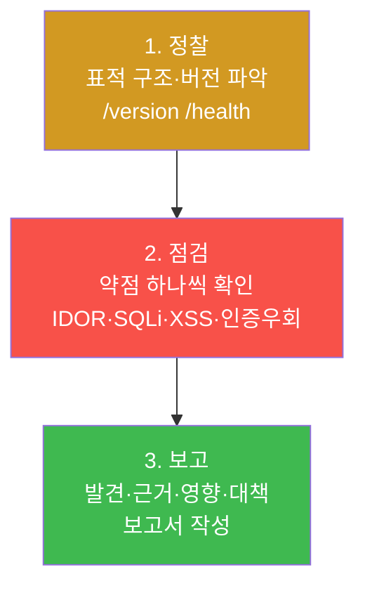
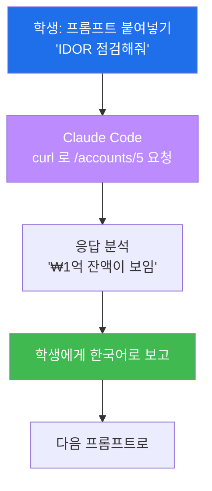

# Week 04 — AI 에이전트와 함께하는 모의해킹 (NeoBank)

> **본 주차의 한 줄 요약**
>
> 지난주엔 내 손으로 일일이 공격했다. 이번 주엔 **AI 에이전트(Claude Code)가 운전대를 잡는다.**
> 학생은 정해진 **프롬프트를 복사→붙여넣기** 만 하면, 에이전트가 가상 은행 **NeoBank** 를 상대로
> 정찰→점검→**보고서 작성**까지 스스로 진행한다. 표적은 "남의 ₩1억 비밀 계좌가 보이는 은행"이다.
> 변수가 생기지 않도록 모든 프롬프트와 "에이전트가 찾아야 할 것"을 정확히 적어 두었다.

---

## 학습 목표

이번 주가 끝나면 학생은 다음을 **직접** 할 수 있다.

1. 모의해킹의 3단계(정찰 → 점검 → 보고)를 자기 말로 설명한다.
2. Claude Code 에게 표적 URL과 **허락 범위**를 알려주고 점검을 시작시킨다.
3. 프롬프트로 **IDOR**(남의 계좌 보기)와 **SQL 인젝션 로그인 우회**를 재현시킨다.
4. 프롬프트로 **인증 우회 헤더**(`X-Internal: 1`)로 개인정보(주민번호·API키)가 새는 것을 확인한다.
5. 프롬프트로 **저장형 XSS**(거래 메모)를 심고 발현시킨다.
6. 에이전트에게 **취약점 점검 보고서(markdown)** 를 자동 작성시켜 발표한다.

---

## 시간 배분 (총 6시간)

| 시간 | 내용 | 유형 |
|------|------|------|
| 0:00–0:40 | 모의해킹이 뭐야? 절차(정찰→점검→보고), 허락의 범위 | 이론 |
| 0:40–2:00 | 프롬프트 1~3 — 정찰 + 로그인 흐름 + 기본 자격증명 | 실습 |
| 2:00–3:30 | 프롬프트 4~6 — IDOR + SQLi 로그인 우회 + 데이터 추출 | 실습 |
| 3:30–5:00 | 프롬프트 7~9 — 인증우회 PII + XSS + 권한상승 | 실습 |
| 5:00–6:00 | 프롬프트 10 — 보고서 자동 작성 + 발표 | 실습 |

---

## 0. 용어 해설 (오늘 처음 나오는 말)

| 용어 | 영문 | 뜻 | 비유 |
|------|------|----|------|
| **모의해킹** | Penetration Test | 허락받고 실제처럼 공격해 약점을 찾는 점검 | 의뢰받은 모의 침입 훈련 |
| **정찰** | Reconnaissance | 표적의 구조·기술·버전을 먼저 파악 | 건물 도면·출입구 답사 |
| **IDOR** | Insecure Direct Object Reference | 주소의 번호만 바꿔 남의 데이터를 보는 결함 | 옆방 번호로 들어가기 |
| **헤더** | HTTP Header | 요청에 붙는 추가 정보(인증·역할 등) | 출입증에 적힌 부가정보 |
| **PII** | 개인식별정보 | 주민번호·전화·계좌 등 민감 개인정보 | 신분증 내용 |
| **저장형 XSS** | Stored XSS | 서버에 저장된 악성 스크립트가 다른 사람에게 발현 | 게시판에 심어둔 함정 |
| **점검 보고서** | Pentest Report | 발견 취약점·근거·영향·대책 정리 문서 | 안전점검 결과지 |

### 0.5 핵심 — "AI가 운전, 나는 내비게이션"

이번 주 방식은 운전과 같다. **운전(실제 명령 실행·페이로드 작성)은 AI 에이전트가** 한다.
학생은 **내비게이션처럼 "다음은 여기로 가"** 라고 방향만 정해 준다. 그래서 SQL 문법이나 curl
옵션을 외울 필요가 없다. 다만 **출발 전 약속**이 있다 — 표적은 **우리 실습용 NeoBank 하나뿐**,
그 밖으로는 절대 나가지 않는다. 이걸 에이전트에게도 분명히 말해 준다("NeoBank 만 점검해").

---

## 1. 모의해킹의 3단계

- **정찰**: 표적이 뭘로 만들어졌는지, 어떤 페이지·기능이 있는지 본다.
- **점검**: 약점을 하나씩 두드린다. 통하면 "근거(증거)"를 남긴다.
- **보고**: 무엇이·왜 위험하고·어떻게 고치는지 정리한다. 화이트해커의 진짜 결과물은 **보고서**다.

---

## 2. 표적 소개 — NeoBank (가상 은행)

NeoBank 는 일부러 허술하게 만든 인터넷 뱅킹이다. 학생은 **평범한 고객 'alice'** 로 로그인한다.
미션은 단순하다 — *"고객인 내가, 은행이 숨긴 비밀과 남의 돈을 얼마나 들여다볼 수 있나?"*

| 데모 계정 | 비밀번호 | 역할 |
|-----------|----------|------|
| `alice@example.com` | `alice123` | 일반 고객(=나) |
| `admin@neobank.local` | `admin` | 은행 관리자(노려볼 대상) |

은행 안에는 **admin 의 비밀 계좌(잔액 ₩100,000,000)** 가 숨어 있다. 오늘의 하이라이트는
일반 고객인 내가 이 ₩1억을 들여다보는 순간이다.

### 접속
희생자 VM에서 `./start.sh` 후, 공격자 VM의 Claude Code 작업 폴더에서 시작한다. 표적 주소는
`http://<victim-ip>:3001` 이다. (같은 머신이면 `http://localhost:3001`)

---

## 3. 에이전트에게 일을 시키는 법

Claude Code 를 켜고, **맨 처음 단 한 번** 범위를 못 박는다:

> *"지금부터 너는 모의해킹 점검자야. 표적은 우리 실습용 NeoBank
> (http://<victim-ip>:3001) **하나뿐**이고, 절대 다른 사이트는 건드리지 마. curl 로 요청을
> 보내고, 찾은 것을 한국어로 쉽게 설명해줘. 준비됐으면 시작하자."*

이후엔 lab 의 **프롬프트 1~10을 순서대로** 붙여넣기만 하면 된다. 에이전트가 명령을 실행하고,
무엇을 찾았는지 풀어서 설명한다. 결과가 안 나오면 *"왜 안 됐는지 보고 다른 방법으로 한 번 더
시도해줘"* 라고 하면 스스로 방법을 바꾼다.

---

## 4. 오늘 점검할 약점 미리보기

| 프롬프트 | 약점 | OWASP | "우와" 포인트 |
|----------|------|-------|----------------|
| 1 | 정찰(버전 노출) | A06 | 낡은 Flask 버전이 그대로 보임 |
| 2~3 | 로그인 흐름 + 기본 자격증명 | A07 | admin/admin 으로 관리자 로그인 |
| 4 | IDOR | A01 | 남의 ₩1억 비밀 계좌 열람 |
| 5 | SQLi 로그인 우회 | A03 | 비번 없이 `' OR 1=1--` 로 관리자 진입 |
| 6 | SQLi 데이터 추출 | A03 | 전 회원 이메일·비번이 한 번에 |
| 7 | 인증우회 + PII | A07/A02 | `X-Internal:1` 헤더로 주민번호·API키 노출 |
| 8 | 저장형 XSS | A03 | 거래 메모에 심은 스크립트가 발현 |
| 9 | 권한상승(mass assignment) | A01 | 프로필 수정으로 내 역할을 admin 으로 |
| 10 | 보고서 자동 작성 | — | AI가 점검 결과지를 뚝딱 |

---

## 실습 안내 (lab_week04.yaml)

각 프롬프트는 "그대로 복사해 붙여넣을 문장"과 "에이전트가 찾아내야 할 것(합격 기준)"으로
구성된다. 학생은 명령을 직접 칠 필요가 없다 — **방향만 정하고, 결과를 읽고, 다음으로** 간다.

- **정찰(1)**: 표적의 정체를 먼저 파악하는 이유 = 어디가 약한지 단서를 얻기 위함.
- **IDOR(4)**: 주소의 번호 하나로 남의 돈이 보인다 → "입력(번호)을 너무 믿은" 결과.
- **SQLi(5,6)**: 지난주 DVWA에서 손으로 한 걸, 이번엔 AI가 더 빠르고 깊게.
- **인증우회/PII(7)**: 헤더 한 줄로 개인정보가 줄줄 → 가장 충격적인 결과.
- **보고서(10)**: 공격이 목적이 아니라 **고치게 돕는 것**이 목적임을 문서로 체득.

---

## 다음 주차 예고

마지막 주(Week 05)엔 배운 모든 걸 **mini-CTF** 로 겨룬다. 한 번도 안 써본 사이트 **MediForum**
에서, **flag(깃발)** 를 먼저 찾는 사람이 점수를 얻고 **실시간 리더보드** 에 순위가 뜬다. 막히면
**CTF 안의 AI 도우미** 에게 물어볼 수 있다. 오늘까지 배운 IDOR·SQLi·XSS가 그대로, 그리고 약간의
응용으로 깃발이 된다.
