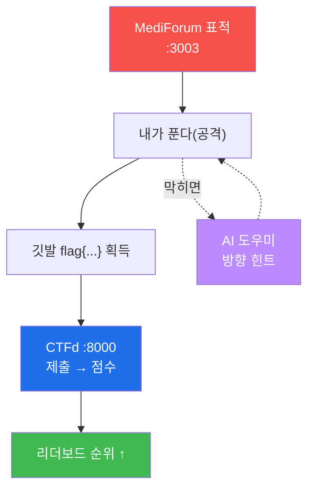

# Week 05 — 🏁 mini-CTF (MediForum + CTFd)

> **본 주차의 한 줄 요약**
>
> 배운 모든 걸 **게임**으로 겨룬다. 한 번도 안 써본 사이트 **MediForum** 에 숨겨진 **깃발(flag)**
> 을 먼저 찾는 사람이 점수를 얻고, **실시간 리더보드** 에 순위가 뜬다. 막히면 **CTF 안의 AI
> 도우미** 에게 힌트를 물어볼 수 있다(단, 깃발은 안 알려준다 — 직접 찾는 재미!). 지금까지 배운
> 정찰·개인정보 노출·IDOR·세션·XSS 가 그대로, 그리고 **약간의 응용** 으로 깃발이 된다.

---

## 학습 목표

이번 주가 끝나면 학생은 다음을 **직접** 할 수 있다.

1. CTF 가 무엇인지(깃발·점수·리더보드)와 규칙을 이해한다.
2. CTFd 에 회원가입하고, 문제를 풀어 깃발을 제출해 점수를 얻는다.
3. 막혔을 때 **AI 도우미** 에게 좋은 질문을 던져 힌트를 얻는다.
4. 배운 기법(정찰·PII 노출·IDOR·예측 세션·저장형 XSS)을 새 사이트에 **스스로** 적용한다.
5. 리더보드에서 내 순위를 확인하고, 끝까지 더 많은 깃발을 노린다.

---

## 시간 배분 (총 4시간+)

| 시간 | 내용 | 유형 |
|------|------|------|
| 0:00–0:30 | CTF 가 뭐야? 깃발·점수·리더보드 규칙 | 이론 |
| 0:30–1:00 | CTFd 회원가입 + AI 도우미 사용법 + 워밍업(정찰) | 실습 |
| 1:00–3:30 | 문제 풀이(쉬움→응용), AI에게 물어가며 깃발 사냥 | 실습 |
| 3:30–4:00 | 시상 + 회고 + "이제 뭘 더 배울까" | 정리 |

---

## 0. 용어 해설 (오늘 처음 나오는 말)

| 용어 | 영문 | 뜻 | 비유 |
|------|------|----|------|
| **CTF** | Capture The Flag | 숨은 깃발(정답 문자열)을 찾아 점수를 얻는 해킹 대회 | 보물찾기 |
| **flag(깃발)** | flag | 문제를 풀면 얻는 정답 문자열 `flag{...}` | 보물 안의 암호 |
| **CTFd** | — | CTF 대회를 여는 웹 플랫폼(문제·채점·순위) | 보물찾기 운영본부 |
| **리더보드** | Scoreboard | 참가자 점수 실시간 순위표 | 게임 랭킹 |
| **카테고리** | Category | 문제 종류(Recon/Web 등) | 문제 분야 |
| **AI 도우미** | — | 막혔을 때 힌트를 주는 챗봇(깃발은 안 알려줌) | 보물찾기 코치 |

### 0.5 CTF 의 규칙 — "보물찾기"로 이해하기

CTF 는 보물찾기다. 각 문제마다 `flag{...}` 형태의 **깃발(보물)** 이 어딘가 숨어 있다. 그 깃발을
찾아 **CTFd 의 제출칸에 넣으면 점수** 가 오른다. 더 어려운 문제일수록 점수가 높다. 모두의 점수가
**리더보드** 에 실시간으로 뜨니, 친구보다 한 문제라도 더 풀면 순위가 올라간다. 막히면 **AI
도우미** 에게 "이 문제 어디서부터 봐야 해?"라고 물을 수 있다 — 단, 도우미는 **방향만** 알려주고
**깃발 자체는 안 알려준다.** 찾는 재미는 네 몫이다.

---

## 1. 오늘의 표적 — MediForum (익명 의료 커뮤니티)

MediForum 은 환자·의사가 익명으로 글을 쓰는 의료 커뮤니티다(일부러 허술하게 만든 표적).
지금까지 표적(DVWA·NeoBank)과 달리 **오늘 처음 보는 사이트** 다. 즉, 정해진 답을 외워서가
아니라 **배운 감각으로 스스로** 찾아야 한다. 접속: `http://<victim-ip>:3003`.

---

## 2. 오늘의 6문제 — 무엇을 배운 걸 쓰나

각 문제는 지난 주차에 배운 기법과 연결된다. 앞쪽은 **배운 그대로**, 뒤쪽은 **약간의 응용** 이다.

| # | 문제(카테고리) | 점수 | 배운 곳 | 한 줄 |
|---|----------------|------|---------|------|
| 1 | 페이지 속 깃발 (Recon) | 50 | W03 개발자도구 | 화면 너머 **소스 보기** 에 답이 |
| 2 | 인증 없는 회원 API (Web/PII) | 100 | W04 PII 노출 | 로그인 없이 열리는 API 에서 비밀 키 |
| 3 | 남의 진료기록 (IDOR) | 150 | W04 IDOR | 주소의 번호만 바꿔 남의 기록 |
| 4 | 관리자 쪽지 도청 (Web) | 150 | W03/W04 인증 결함 | 누구나 열리는 관리자 DM |
| 5 | 예측 가능한 세션 (응용) | 200 | W03 쿠키 | 쿠키 값을 바꿔 **관리자로 변신** |
| 6 | 저장형 XSS (응용) | 200 | W03/W04 XSS | 글에 스크립트를 심어 **관리자 봇** 을 낚기 |

> 총 850점. 순서대로 풀면 자연스럽게 어려워진다. 1~2번은 워밍업, 5~6번이 보스다.

---

## 3. AI 도우미를 잘 쓰는 법

도우미는 **코치** 다. 깃발을 대신 찾아주지 않는다. 대신 이렇게 물으면 좋은 힌트가 온다.

- ❌ "5번 문제 깃발 뭐야?" → 안 알려준다.
- ✅ "예측 가능한 세션이 뭐야? MediForum 쿠키는 어떻게 생겼어?" → 개념·방향을 알려준다.
- ✅ "로그인 없이 개인정보가 새는 API 는 보통 주소가 어떻게 생겼어?" → 찾을 위치 힌트.

**좋은 질문 = 좋은 힌트.** 막히면 "지금 뭘 시도했는데 안 됐어, 다음에 뭘 보면 좋을까?"처럼
**내가 한 것 + 다음 방향** 을 물어라.

---

## 실습 안내 (lab_week05.yaml)

lab 에는 6문제를 푸는 **추천 순서와 방향** 이 담겨 있다. 단, **깃발 값과 정확한 페이로드는 적지
않았다** — 그건 직접 찾는 게 CTF 다(강사용 상세 풀이는 `solutions/` 에 따로 있다). 각 문제마다
"무엇을 배운 것인지 / 어디부터 보면 좋은지 / 합격(깃발 형태)"을 안내한다.

- **정찰(1)**: 브라우저 **소스 보기(Ctrl+U)** 와 개발자도구로 화면에 안 보이는 것을 본다.
- **PII API(2)**: 로그인 없이 열리는 `/api/...` 를 찾아 관리자의 비밀 키를 줍는다.
- **IDOR(3)**: 진료기록 주소의 번호를 바꿔 본다.
- **관리자 DM(4)**: 인증이 빠진 관리자 전용 API 를 찾는다.
- **예측 세션(5, 응용)**: 쿠키 `MFSID` 값의 규칙을 추측해 관리자로 변신한다.
- **저장형 XSS(6, 응용)**: 글/댓글에 스크립트를 심어 "관리자 봇" 을 낚는다.

---

## 다음은? (특강을 마치며)

오늘로 특강이 끝난다. 너는 이제 **AI 에이전트와 함께 웹을 만들고, 점검하고, 뚫고, 보고서를
쓰는** 한 사이클을 직접 해봤다. 여기서 더 가고 싶다면:

- **버그 바운티** — 허락된 프로그램에서 진짜 약점을 신고하고 포상받기.
- **CTF 대회** — picoCTF 같은 입문용 온라인 대회 참가.
- **방어(블루팀)** — 오늘 본 공격을 **막는** 쪽 공부.

가장 중요한 건 변하지 않는다 — **허락된 곳에서만.** 너의 기술은 무엇이든 될 수 있다.
좋은 방향으로 쓰는 해커가 되길.
