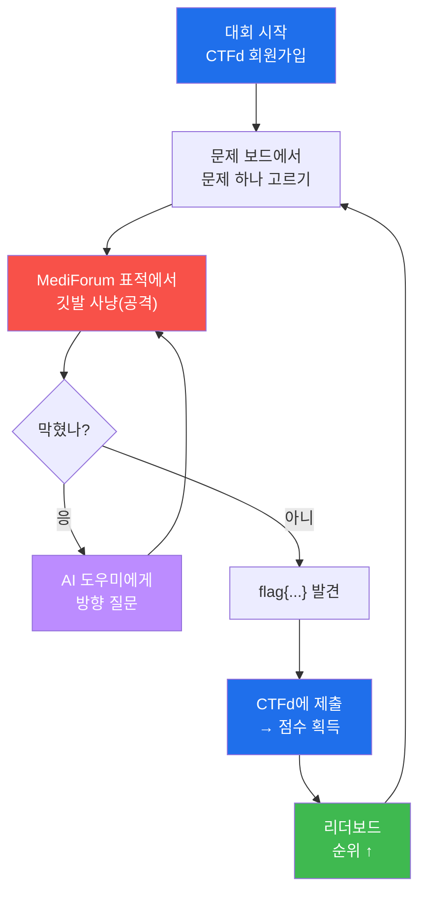
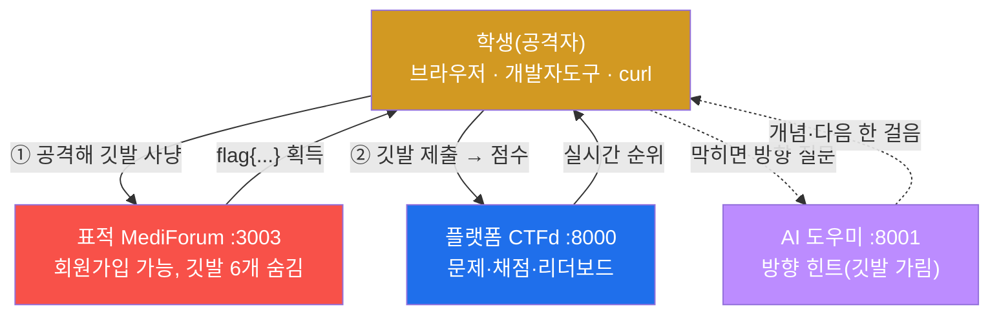
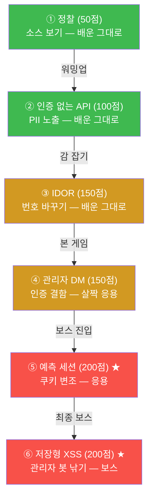
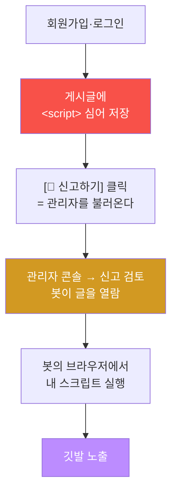
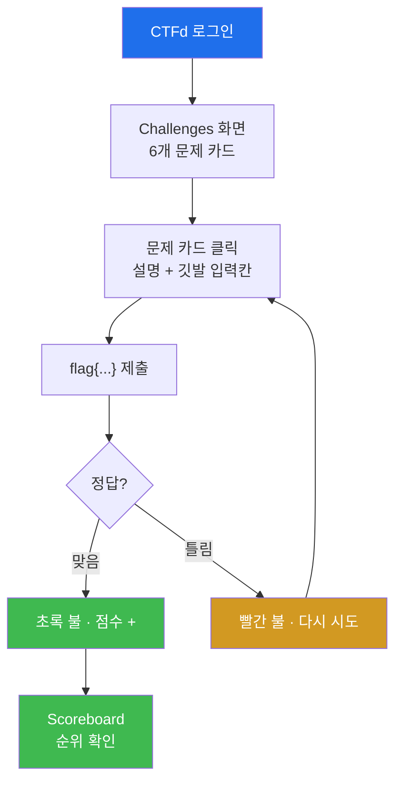
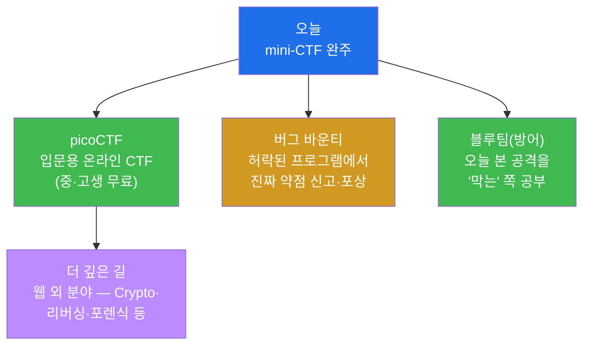

# Week 05 — 🏁 mini-CTF: 표적 MediForum + 플랫폼 CTFd

> **본 주차의 한 줄 요약**
>
> 지난 4주 동안 배운 모든 걸 이제 **게임**으로 겨룬다. 한 번도 안 써본 의료 커뮤니티
> **MediForum** 에 깃발(flag) 6개가 숨어 있다. 정찰로 소스 안을 들여다보고, 인증을 깜빡한
> API 를 줍고, 주소의 번호를 바꿔 남의 진료기록을 열고, 인증이 빠진 관리자 쪽지를 엿보고,
> 규칙적인 쿠키 값을 바꿔 관리자로 변신하고, 마지막엔 글에 스크립트를 심어 관리자 봇을 낚는다.
> 찾은 깃발을 **CTFd** 플랫폼에 제출하면 점수가 오르고, **실시간 리더보드** 에 내 순위가 뜬다.
> 막히면 **AI 도우미** 에게 방향을 물어볼 수 있다 — 단, 깃발 자체는 절대 안 알려준다. 찾는
> 재미는 온전히 네 몫이다. 이건 특강의 마지막 날이자, 진짜 해커처럼 "스스로 찾아내는" 첫
> 무대다.
>
> **오늘의 규칙 하나 — 6문제 전부 브라우저(크롬/엣지) + F12 만으로 풀린다.** 명령어를 외울
> 필요도, 주소를 찍어서 맞힐 필요도 없다. 사이트가 스스로 다음 단계를 알려 준다:
> `robots.txt` 를 읽고, F12 **Network** 로 화면이 부르는 API 를 보고, 주소창의 번호를 바꾸고,
> **Cookies** 를 들여다보고, 화면의 **버튼**을 누르면 된다. 이 다섯 가지가 오늘의 전 무기다.

---

## 학습 목표

이번 주가 끝나면 학생은 다음을 **직접** 할 수 있다.

1. CTF 가 무엇인지 — 깃발·점수·카테고리·리더보드 — 와 그 규칙을 한 문장으로 설명한다.
2. CTFd 플랫폼에 회원가입하고, 문제를 풀어 깃발을 제출해 점수를 얻고, 리더보드에서 내 순위를
   확인한다.
3. 지금까지 배운 다섯 가지 기법(정찰·인증 없는 API·IDOR·인증 결함·예측 세션·저장형 XSS)을
   **처음 보는 사이트** 에 스스로 적용한다.
4. 막혔을 때 AI 도우미에게 **좋은 질문**(깃발 달라고 조르지 않고, 개념·방향을 묻기)을 던져
   다음 한 걸음의 힌트를 얻는다.
5. 해킹 윤리의 핵심 — "허락된 곳에서만" — 을 스스로 되새기고, 다음에 무엇을 더 배울지(picoCTF·
   버그바운티·블루팀) 자기 학습 경로를 그린다.

---

## 시간 배분 (총 4시간+)

| 시간 | 내용 | 유형 |
|------|------|------|
| 0:00–0:25 | CTF 가 뭐야? 역사(DEF CON·picoCTF)·깃발·점수·카테고리·리더보드 규칙 | 이론 |
| 0:25–0:45 | 오늘의 표적 MediForum 소개 + 6문제가 어느 주차에서 배운 것인지 지도 보기 | 이론 |
| 0:45–1:05 | CTFd 회원가입 + AI 도우미 사용법 + 워밍업(정찰 1문제) | 실습 |
| 1:05–3:15 | 문제 풀이(쉬움→응용→보스), AI에게 물어가며 깃발 사냥 | 실습 |
| 3:15–3:45 | 시상 + 회고: "오늘 푼 6문제가 곧 실제 사고였다" | 정리 |
| 3:45–4:00 | 윤리 재강조 + "이제 뭘 더 배울까" 학습 경로 안내 | 정리 |

---

## 0. 용어 해설 (오늘 처음 나오는 말)

오늘은 "대회"라는 새 무대가 생긴다. 무대에 오르기 전, 진행 요원이 쓰는 말부터 익혀두자. 아래
표의 용어는 본문에서 다시 짚지만, 헷갈리기 쉬운 것은 먼저 일상 비유로 정리해 둔다.

| 용어 | 영문 | 뜻 | 비유 |
|------|------|----|------|
| **CTF** | Capture The Flag | 숨은 깃발(정답 문자열)을 찾아 점수를 얻는 해킹 대회 | 보물찾기 |
| **flag(깃발)** | flag | 문제를 풀면 얻는 정답 문자열, 보통 `flag{...}` 모양 | 보물 상자 안에 든 암호 종이 |
| **CTFd** | CTFd | CTF 대회를 여는 웹 플랫폼(문제 등록·채점·순위 자동) | 보물찾기 운영본부 |
| **Jeopardy 방식** | Jeopardy-style | 여러 문제를 자유롭게 골라 푸는 가장 흔한 CTF 형식 | 퀴즈쇼 보드(원하는 칸 골라 풀기) |
| **카테고리** | Category | 문제의 분야(Recon·Web·Crypto 등) | 도서관의 책장 분류 |
| **리더보드** | Scoreboard | 참가자 점수를 실시간으로 줄 세우는 순위표 | 게임 랭킹판 |
| **점수(배점)** | Points | 문제마다 정해진 값, 어려울수록 높음 | 보물의 등급(동·은·금) |
| **제출** | Submit | 찾은 깃발을 플랫폼 입력칸에 넣어 정답 확인받기 | 보물을 운영본부에 가져가 도장 받기 |
| **표적** | Target | 깃발이 숨어 있는, 공격해도 되는 연습용 사이트 | 보물이 묻힌 허가된 놀이터 |
| **AI 도우미** | AI helper | 막혔을 때 방향만 알려주는 코치 챗봇(깃발은 안 줌) | 보물찾기 안내 코치 |
| **정찰** | Reconnaissance | 공격 전 표적을 둘러보며 단서를 모으는 일 | 보물찾기 전 지형 살피기 |
| **IDOR** | Insecure Direct Object Reference | 주소의 번호(id)만 바꿔 남의 데이터를 보는 약점 | 1호실 열쇠로 2호실까지 열리는 호텔 |
| **저장형 XSS** | Stored XSS | 글에 심어둔 스크립트가 그 글을 보는 사람의 화면에서 실행되는 약점 | 방명록에 몰래 적어둔 마법 주문 |
| **세션 쿠키** | Session cookie | 로그인 후 "아까 그 사람"임을 증명하는, 브라우저가 든 출입증 | 놀이공원 손목밴드 |
| **robots.txt** | — | "검색엔진아 여기는 긁지 마"를 적어 두는 파일. 역설적으로 숨기고 싶은 주소 목록이 된다 | 대문에 붙인 "여기는 보지 마세요" 쪽지 |
| **Network 탭** | DevTools Network | 화면이 뒤에서 어떤 주소를 부르는지 전부 보여주는 F12 탭 | 주방으로 오간 주문서 사본철 |

> **헷갈리기 쉬운 한 쌍 — 표적(MediForum)과 플랫폼(CTFd).** 오늘은 사이트가 두 개다. **표적**
> MediForum 은 우리가 **공격해서 깃발을 캐내는** 곳이고, **플랫폼** CTFd 는 캐낸 깃발을 **가져가
> 점수로 바꾸는** 곳이다. 보물찾기로 치면 MediForum 은 보물이 묻힌 들판이고, CTFd 는 보물을 들고
> 가서 "진짜 맞네요" 도장을 찍어주는 운영 천막이다. 둘을 헷갈리면 "보물을 캐러 천막에 들어가는"
> 엉뚱한 일이 벌어진다. 깃발은 항상 **MediForum 에서 캐고, CTFd 에 제출한다.**

---

## 0.5 "보물찾기"로 이해하는 CTF — 깊이 들어가기

CTF 는 한마디로 **보물찾기**다. 다만 보물이 산속에 묻힌 게 아니라 **웹사이트의 허술한 틈** 속에
숨어 있다. 각 문제마다 `flag{...}` 모양의 깃발(보물 암호)이 어딘가에 있고, 그걸 찾아 운영본부
(CTFd)에 가져가 입력칸에 넣으면 점수가 오른다. 더 깊고 어려운 곳에 묻힌 보물일수록 점수가 높다.
모두의 점수가 리더보드에 실시간으로 뜨니, 친구보다 한 문제라도 먼저 풀면 순위가 쑥 올라간다.

이 보물찾기에는 세 가지 황금률이 있다. 첫째, **깃발은 외워서가 아니라 찾아서 얻는다.** 오늘의
표적 MediForum 은 한 번도 안 써본 사이트라, 정답을 미리 알 수 없다. 둘째, **AI 도우미는 코치이지
보물 위치 안내판이 아니다.** "이 문제 어디부터 보면 돼?"라고 방향을 물으면 친절히 답하지만,
"깃발 뭐야?"라고 조르면 입을 다문다(아예 답에서 `flag{...}` 를 가려버린다). 셋째, **순서가 곧
난이도다.** 1번은 워밍업, 숫자가 커질수록 어려워지고, 5·6번은 "보스"다. 막히면 더 쉬운 문제로
돌아가 점수를 쌓고, 자신감이 붙으면 다시 도전하면 된다.

이 한 바퀴 — 고르고 → 사냥하고 → (막히면 묻고) → 제출하고 → 순위 보고 → 다시 고르고 — 가
오늘 4시간 동안 계속 돈다. 게임처럼 보이지만, 이 한 바퀴가 곧 **진짜 보안 점검자가 하루를 보내는
방식**이기도 하다.

---

## 1. CTF 의 짧은 역사 — 해커들의 올림픽

CTF 라는 놀이는 갑자기 생긴 게 아니다. 1996년, 세계에서 가장 유명한 해커 컨퍼런스 **DEF CON**
(미국 라스베이거스에서 매년 열리는, 해커들의 큰 축제)에서 처음으로 본격적인 CTF 대회가 열렸다.
당시엔 팀끼리 서로의 서버를 지키면서 동시에 공격하는 격렬한 형식이었다. 이걸 **Attack-Defense
(공방전)** 방식이라 부른다 — 내 깃발은 지키고 남의 깃발은 뺏는, 실시간 전투에 가깝다.

하지만 공방전은 준비물이 많고 초보에겐 너무 어렵다. 그래서 오늘날 가장 흔하고, 우리가 오늘 하는
방식은 **Jeopardy(제퍼디) 방식**이다. 제퍼디는 미국 퀴즈쇼 이름인데, 여러 문제가 격자판처럼
펼쳐져 있고 참가자가 **원하는 문제를 골라 푸는** 형식을 가리킨다. 카테고리(Web·Crypto·Recon
등)와 점수가 칸마다 적혀 있고, 풀면 그 점수를 얻는다. 우리 6문제도 정확히 이 방식이다.

입문자에게 가장 유명한 무대는 **picoCTF** 다. 미국 카네기멜런 대학교가 중·고등학생을 위해 만든
무료 온라인 CTF 로, 매년 수만 명이 참가한다. 오늘 특강이 끝난 뒤 "더 풀고 싶다"는 생각이 들면,
picoCTF 가 바로 다음 놀이터다. 즉 오늘의 mini-CTF 는 picoCTF 같은 진짜 대회로 가기 전,
**축소판 연습 경기**인 셈이다.

> **왜 보안 회사들이 CTF 선수를 뽑을까?** CTF 에서 좋은 성적을 내려면 "남이 안 보는 곳을 보고,
> 규칙의 빈틈을 찾고, 끝까지 포기하지 않는" 사고력이 필요하다. 이건 학교 시험으로는 잘 안
> 드러나는 능력이라, 실제로 많은 보안 기업이 CTF 순위를 채용에서 눈여겨본다. 오늘 네가 푸는 한
> 문제 한 문제가, 그 사고력의 첫 근육 운동이다.

---

## 2. 오늘의 표적 — MediForum (익명 의료 커뮤니티)

MediForum 은 환자와 의사가 익명으로 글을 쓰고, 쪽지(DM)를 주고받고, 진료기록을 보관하는 의료
커뮤니티다. 물론 진짜 병원 사이트는 아니고, **공부를 위해 일부러 허술하게 만든 표적**이다. 의료
사이트를 고른 데는 이유가 있다 — 의료 정보(진단명·처방·주민번호)는 세상에서 가장 민감한 개인정보
중 하나라, "이게 새면 얼마나 큰일인지"가 피부로 와닿기 때문이다. 오늘 네가 IDOR 로 남의 진료기록을
여는 순간, 그게 게임이 아니라 실제로 벌어졌다면 어떤 일이 났을지 상상해 보라.

지금까지의 표적(DVWA·NeoBank)과 결정적으로 다른 점이 하나 있다 — MediForum 은 **오늘 처음 보는
사이트**다. 정해진 답을 외워 따라 치는 게 아니라, 배운 감각으로 **스스로** 단서를 찾아야 한다.
접속 주소는 `http://<victim-ip>:3003` 이고, 회원가입도 직접 할 수 있다(어떤 문제는 가입·로그인이
먼저 필요하다).

이 그림이 오늘 하루의 지도다. 학생(나)을 가운데 두고, 왼쪽 MediForum 에서 깃발을 캐고, 오른쪽
CTFd 에 제출하고, 막히면 아래 AI 도우미에게 묻는다. 이 삼각형을 머리에 새겨두면, 4시간 내내 길을
잃지 않는다.

---

## 3. 6문제 지도 — 어느 주차에서 배운 걸 쓰나

오늘의 6문제는 하늘에서 떨어진 게 아니다. 전부 **지난 주차에 이미 배운 기법**이 새 사이트에서
다시 나타난 것이다. 앞쪽 문제는 배운 그대로, 뒤쪽 두 문제는 한 단계 더한 응용이다. 아래 지도는
"이 문제가 사실은 그때 그거였구나"를 한눈에 보여준다.

| # | 문제 (카테고리) | 점수 | 배운 곳 | 한 줄 핵심 |
|---|-----------------|------|---------|-----------|
| 1 | 페이지 속 깃발 (Recon) | 50 | W03 정찰·개발자도구 | 화면 너머 **소스 보기** 에 답이 적혀 있다 |
| 2 | 인증 없는 회원 API (Web) | 100 | W04 PII 노출·접근통제 | 로그인 없이 열리는 API 가 비밀 키를 통째로 내준다 |
| 3 | 남의 진료기록 (IDOR) | 150 | W04 IDOR | 주소의 번호만 바꿔 남의 기록을 연다 |
| 4 | 관리자 쪽지 도청 (Web) | 150 | W03/W04 인증 결함 | "관리자 전용"인데 인증을 안 거는 API |
| 5 | 예측 가능한 세션 (응용) | 200 | W03 쿠키·세션 | 규칙적인 쿠키 값을 바꿔 **관리자로 변신** |
| 6 | 저장형 XSS — 관리자 봇 (응용) | 200 | W03/W04 XSS | 글에 스크립트를 심어 **관리자 봇** 을 낚는다 |

> 총 **850점**. 순서대로 풀면 자연스럽게 어려워진다. 1·2번은 몸풀기, 3·4번은 본 게임, 5·6번이
> 보스전이다. 난이도 곡선을 그림으로 보면 이렇다.

이제 각 문제가 **어떤 약점**을 묻는지, 그 개념을 짧게 복습하자. 풀이(정확한 주소·페이로드·깃발
값)는 일부러 적지 않는다 — 그건 직접 찾는 게 CTF 이고, 강사용 `solutions/` 에만 있다.

### 3.1 문제 ① 정찰 — 화면 너머의 소스 (W03 복습)

**개념 한 줄.** 정찰(Reconnaissance)은 공격 전에 표적을 둘러보며 단서를 모으는 일이다. 그중
가장 기본은 **소스 보기** — 브라우저 화면에 안 보여도, 그 페이지를 만든 원본 코드(HTML)에는 더
많은 게 적혀 있다. 개발자가 깜빡 지우지 않은 메모(주석)나 숨은 입력칸이 거기 남아 있곤 한다.

**왜 중요한가.** 우리 눈에 보이는 화면은 "잘 차려진 식탁"일 뿐이고, 소스는 "주방"이다. 주방을
들여다보면 손님에게 안 보이려던 메모가 보인다. 실제로 개발자가 "임시로 적어두고 나중에 지우자"고
한 비밀번호·내부 주소·토큰이 주석으로 남아 새는 사고가 끊이지 않는다.

**어디부터 보나(방향).** 두 가지를 한다. 먼저 주소창에 **`/robots.txt`** 를 넣어 본다 —
"수집 금지" 목록이 사실은 **이 사이트가 숨기고 싶은 주소 목록**이라, 오늘 4·5·6번의 지도가 된다.
그다음 게시글, 특히 **공지** 같은 글을 열고 **소스 보기(Ctrl+U)** 또는 개발자도구(F12)로 HTML 을
직접 본다. 화면엔 안 보이지만 **주석(`<!-- ... -->`)** 안에 누군가 깜빡 남긴 깃발이 있는지 살핀다.
이건 W03 에서 개발자도구로 정보 노출을 찾던 그 감각 그대로다.

### 3.2 문제 ② 인증 없는 회원 API — 접근통제 실패 (W04 복습)

**개념 한 줄.** API 는 사람 화면이 아니라 **프로그램끼리 데이터를 주고받는 뒷문**이다. 정상이라면
"너 로그인했어?"를 먼저 묻고 데이터를 줘야 하는데, 그걸 깜빡한 API 는 **로그인 없이도** 개인정보를
통째로 내준다. 이걸 **접근통제 실패(Broken Access Control)** 라고 한다.

**왜 중요한가.** 화면(웹페이지)에는 로그인 벽을 잘 세워놓고, 정작 그 화면이 쓰는 뒷문 API 에는
벽을 안 세우는 실수가 흔하다. 공격자는 화면을 두드리는 대신 뒷문 주소를 직접 호출한다. 회원
목록 API 하나가 뚫리면 전체 사용자의 이름·이메일·전화번호, 심지어 비밀 키까지 쏟아진다 — 이게
W04 에서 본 **PII(개인식별정보) 노출**이다.

**어디부터 보나(방향).** 주소를 추측하지 않는다 — **발견한다.** 상단 메뉴 **회원 찾기** 화면으로
가서 `F12` → **Network** 탭을 켜 둔 채 검색을 눌러 보라. 이 화면이 뒤에서 **어떤 주소를 부르는지**
그대로 보인다. 그 줄을 클릭해 **Response(응답)** 를 열면 서버가 돌려준 JSON 이 나오고, 같은 주소를
주소창에 붙여 넣으면 **로그인 없이도** 그대로 열린다. 응답 안에서 역할이 `admin` 인 계정의 비밀 키
(`api_key`)를 찾으면 거기에 깃발이 있다. (`/robots.txt` 에도 이 주소가 적혀 있다.)

### 3.3 문제 ③ 남의 진료기록 — IDOR (W04 복습)

**개념 한 줄.** IDOR(Insecure Direct Object Reference)은 주소에 들어간 **번호(id)** 만 바꿔도
서버가 "이거 네 거 맞아?"를 안 물어보면, 남의 데이터가 그대로 보이는 약점이다.

**왜 중요한가.** 1호실 손님에게 준 열쇠로 2호실·3호실 문까지 다 열리는 호텔을 상상해 보라. 내
진료기록 주소가 `.../records/4` 라면, 4를 5로 바꿨을 때 막히지 않으면 그게 곧 남의 진료기록이다.
의료 정보에서 이게 터지면, 누구의 진단명·처방을 모르는 사람이 들여다보는, 상상하기 싫은 일이
벌어진다. W04 에서 NeoBank 의 계좌 번호를 바꿔보던 그 손맛 그대로다.

**어디부터 보나(방향).** 상단 메뉴 **진료기록**(`/records`)으로 간다. 기록 목록에서 아무거나
**[상세 보기]** 를 누르면 주소창 끝에 번호가 붙는다. 그 번호를 1, 2, 3… 으로 바꿔가며(또는 화면
아래 **[다음 기록 ▶]** 버튼으로) 열어 본다. 어떤 기록의 **처방 / 소견** 란에 깃발이 숨어 있다.
"막힘 없이 다음 번호가 열린다"는 사실 자체가 이미 약점의 증거다.

### 3.4 문제 ④ 관리자 쪽지 도청 — 인증 결함 (W03/W04 복습)

**개념 한 줄.** 이름은 "관리자 전용"인데, 정작 "당신이 관리자인가"를 **확인하지 않는** API 가
있다. 문패만 'VIP 전용'이고 문은 잠겨 있지 않은 방인 셈이다.

**왜 중요한가.** ②번이 "일반 사용자용 뒷문이 안 잠긴" 경우라면, ④번은 한 단계 위인 "관리자용
뒷문이 안 잠긴" 경우다. 관리자 영역에는 더 민감한 게 모여 있다 — 여기서는 관리자들끼리 주고받은
**쪽지(DM)** 다. 그 쪽지 중 하나에 서버 비밀이 적혀 있다면? 인증을 안 거는 관리자 API 하나가
조직 전체의 비밀 통로가 된다.

**어디부터 보나(방향).** 1번에서 읽은 **`/robots.txt`** 를 다시 펼친다. 관리자 관련 경로가 적혀
있다. 거기 적힌 **관리자 콘솔**로 들어가면 — 로그인하지 않았는데도 그냥 열린다. 메뉴에서
**✉️ 쪽지 감사** 를 누르면 회원들이 주고받은 쪽지가 표로 전부 뜬다. 그 본문 중 하나에 깃발이 있다.

### 3.5 문제 ⑤ 예측 가능한 세션 — 관리자로 변신 (W03 응용)

**개념 한 줄.** 로그인하면 서버는 "넌 이제 그 사람"이라는 출입증, 즉 **세션 쿠키** 를 준다. 그런데
이 출입증의 번호가 `sess-2001`, `sess-2002` 처럼 **예측 가능한 규칙**으로 발급되면, 공격자는 값을
바꿔 **남의 출입증으로 위장**할 수 있다.

**왜 중요한가.** 출입증 번호가 손님이 들어온 순서대로 1번, 2번… 이라고 해보자. 그러면 "가장 먼저
들어온 사람(보통 관리자)은 1번에 가깝겠구나" 하고 추측할 수 있다. 내 출입증 번호가 2003번이라면,
더 낮은(이른) 번호로 바꿔보며 관리자의 출입증을 찾아 올라타는 것이다. 이게 W03 에서 쿠키를
들여다보던 공부가 한 단계 자란 응용이다. 좋은 세션 값은 **추측 불가능한 무작위**여야 하는데, 이
표적은 일부러 규칙적으로 만들어 두었다.

**어디부터 보나(방향).** 회원가입·로그인 후 `F12` → **Application**(파이어폭스는 **저장소**) →
**Cookies** 에서 내 `MFSID` 값을 본다. 그 형태(규칙)를 관찰하되, 확신이 안 서면 **계정을 하나 더
만들어** 로그인해 보라 — 번호가 어떻게 변하는지 바로 보인다. 그다음 robots.txt 에 적힌 **관리자
전용 금고**로 들어가면 403(접근 거부)이 뜨는데, **그 화면의 '운영 메모'를 반드시 읽자.** 규칙에
대한 결정적 힌트가 적혀 있다. 마지막으로 개발자도구에서 `MFSID` 값을 직접 고치고 **F5(새로고침)**.

### 3.6 문제 ⑥ 저장형 XSS — 관리자 봇 낚기 (W03/W04 응용·보스)

**개념 한 줄.** XSS(Cross-Site Scripting)는 내가 쓴 **스크립트가 다른 사람의 브라우저에서 실행되는**
약점이다. 그중 **저장형(Stored)** 은 게시판이나 댓글처럼 **글이 저장되어 다른 사람에게도 보이는**
곳에 스크립트를 심는 것이라 더 위험하다.

**왜 중요한가.** 방명록에 마법 주문을 적어두면, 그 페이지를 여는 모든 사람이 주문에 걸린다. 특히
이 문제의 표적은 "신고된 글을 검토하는 **관리자(봇)**"가 있다고 가정한다. 즉 내가 글에 스크립트를
심어두면, 그걸 검토하러 온 관리자의 화면에서 내 스크립트가 실행된다 — 가장 권한 높은 사람을 낚는,
그래서 오늘의 최종 보스다. 글이 필터 없이 그대로 출력되는 곳이 표적이 된다.

**어디부터 보나(방향).** 이 문제는 **화면을 따라가면 도착한다.** ① 회원가입·로그인 후 새 글을
쓰는데 본문에 `` 를 그대로 적어 저장한다. ② 저장된 글 아래의
**[🚨 신고하기]** 버튼을 눌러 관리자를 부른다. ③ robots.txt 에서 본 **관리자 콘솔**로 가서
**[🤖 신고 검토(관리자 봇)]** 를 누른다. 봇이 신고된 글을 열어 보고, 본문에서 실행 가능한 코드를
발견하면 깃발이 나타난다. "심는다 → 신고한다 → 관리자가 본다 → 깃발"의 흐름이 핵심이다.

---

## 4. 플랫폼 CTFd 사용법 — 깃발을 점수로 바꾸는 곳

깃발을 캤다면, 이제 운영본부 CTFd 로 가져갈 차례다. CTFd 는 전 세계 CTF 대회가 가장 널리 쓰는
오픈소스 플랫폼으로, 문제 목록·자동 채점·실시간 리더보드를 한곳에서 제공한다.

먼저 `http://<victim-ip>:8000` 에 접속해 **회원가입**한다(닉네임은 리더보드에 그대로 뜨니 보기
좋은 걸로). 로그인하면 **Challenges(문제)** 화면에 6개의 카드가 보인다. 카드마다 제목·카테고리·
점수가 적혀 있고, 카드를 누르면 문제 설명과 **깃발 입력칸**이 나온다. MediForum 에서 캔
`flag{...}` 를 그 칸에 넣고 제출하면, 맞으면 초록 불과 함께 점수가 오르고 틀리면 빨간 불이 뜬다.

**Scoreboard(리더보드)** 메뉴에서는 모두의 점수가 실시간으로 줄 세워진다. 동점일 때는 **먼저
도달한 사람이 위**다 — 그래서 같은 문제라도 1분이라도 빨리 푸는 게 순위에 유리하다.

---

## 5. AI 도우미를 잘 쓰는 법 — 좋은 질문이 좋은 힌트를 부른다

`http://<victim-ip>:8001` 의 AI 도우미는 **코치**다. 깃발을 대신 찾아주지 않으며, 행여 깃발이
답에 섞여 나와도 자동으로 가려버린다. 그러니 "깃발 알려줘"는 시간 낭비다. 대신 **개념과 방향**을
물으면, 막힌 매듭을 푸는 다음 한 걸음을 알려준다. 핵심 원리는 단순하다 — **나쁜 질문은 답을
달라는 것이고, 좋은 질문은 생각할 거리를 달라는 것**이다.

| 상황 | ❌ 나쁜 질문 (답이 안 옴) | ✅ 좋은 질문 (힌트가 옴) |
|------|--------------------------|-------------------------|
| 시작이 막막함 | "5번 깃발 뭐야?" | "예측 가능한 세션이 뭐야? 어디서부터 봐야 해?" |
| 위치를 모름 | "API 주소 그대로 알려줘" | "로그인 없이 개인정보가 새는 API 는 보통 주소가 어떻게 생겼어?" |
| 한 번 시도했는데 실패 | "안 돼, 정답 줘" | "쿠키 값을 X로 바꿔봤는데 403이 떠. 다음에 뭘 점검하면 좋을까?" |
| 개념 자체가 헷갈림 | "IDOR 풀어줘" | "IDOR 가 뭐야? 주소의 번호를 어떻게 바꿔보는 거야?" |

좋은 질문에는 공통 공식이 있다 — **"내가 지금까지 한 것 + 막힌 지점 + 다음에 뭘 보면 좋을지"** 를
함께 담는 것이다. 예를 들어 "②번에서 `/api/users` 를 열어 사용자 목록은 봤는데, 어떤 필드에
비밀 키가 있는지 모르겠어. 어떤 필드 이름을 눈여겨봐야 해?"처럼. 이렇게 물으면 도우미는 네가 한
일을 이해하고 딱 한 걸음만큼의 힌트를 준다. 이건 나중에 진짜 동료·선배에게 질문할 때도 똑같이
통하는 기술이다 — **잘 막힌 사람일수록 질문을 잘한다.**

> **막혔을 때의 순서.** ① 문제 설명과 카테고리를 다시 읽는다(카테고리가 곧 힌트다). ② 이미 배운
> 어느 주차의 기법인지 떠올린다(위 3번 지도 활용). ③ 표적을 한 번 더 둘러보며 단서를 찾는다. ④
> 그래도 막히면 AI 도우미에게 "내가 한 것 + 다음 방향"을 묻는다. ⑤ 정 안 되면 더 쉬운 문제로
> 잠시 옮겨 점수를 쌓고 자신감을 회복한다. 포기만 안 하면 길은 있다.

---

## 6. 자주 하는 실수 / FAQ

처음 CTF 를 하는 학생이 거의 똑같이 겪는 함정들을 미리 모아둔다. 한 번 읽어두면 헛고생을 크게
줄인다.

**Q1. 깃발을 찾았는데 자꾸 "오답"이라고 떠요.** 두 가지만 확인하라.
① `flag{...}` 를 **중괄호까지 통째로** 넣었는가? (가장 흔한 실수 1위 — 안쪽 글자만 넣는 것)
② **지금 열어 둔 문제 번호가 맞는가?** 5번에서 찾은 깃발을 3번 칸에 넣는 실수가 의외로 많다.
깃발은 "본 대로 정확히" 제출하는 게 원칙이다. (우리 채점기는 앞뒤 공백·대소문자·중괄호
누락 정도는 너그럽게 봐주지만, **다른 문제의 답이나 오타는 그대로 오답**이다.)

**Q2. 어떤 문제는 시작도 안 돼요.** 5·6번은 **회원가입·로그인이 먼저** 필요하다(글을 쓰거나 내
쿠키를 봐야 하니까). MediForum 에서 가입부터 하고 도전하라. 반대로 1~4번은 로그인 없이도 된다.

**Q2-1. 어디서부터 봐야 할지 아예 모르겠어요.** 막히면 무조건 **`/robots.txt`** 부터 열어라.
오늘 문제의 절반은 거기서 출발한다. 그다음 `F12` 를 켜고 **Network** 탭을 본 채로 화면을
조작해 보라 — 사이트가 뒤에서 무슨 일을 하는지 다 보인다.

**Q3. 표적 사이트가 안 열려요.** CTFd(`:8000`)와 MediForum(`:3003`)을 헷갈리지 않았는지 본다.
그래도 안 되면 표적이 기동 중인지 확인이 필요하다(강사에게 문의). 깃발은 **항상 MediForum 에서
캐고, CTFd 에 제출**한다는 걸 기억하라.

**Q4. AI 도우미가 답을 안 줘요.** 의도된 동작이다. 깃발을 직접 묻지 말고 **개념·방향**을 물어라
(위 5번 표 참고).

**Q5. 한 문제에 너무 오래 막혀요.** CTF 의 정석은 **풀리는 것부터 푸는 것**이다. 막히면 미련 없이
다른 문제로 옮겨 점수를 쌓고, 머리를 식힌 뒤 돌아오라. 종종 다른 문제를 풀다 보면 막혔던 문제의
실마리가 보인다.

**Q6. 점수가 높은 문제만 노려도 되나요?** 동점일 때 먼저 푼 사람이 위이므로, **쉬운 문제를 빠르게
쓸어 담아 점수를 선점**하는 편이 보통 유리하다. 보스 문제는 그다음에.

---

## 7. 실습 안내 (lab_week05.yaml)

실습지 `lab_week05.yaml` 에는 6문제를 푸는 **추천 순서와 방향**이 담겨 있다. 단, **깃발 값과
정확한 페이로드는 적지 않았다** — 그건 직접 찾는 게 CTF 이기 때문이다(강사용 상세 풀이는
`solutions/` 에 따로 있다). 각 문제마다 "무엇을 배운 것인지 / 어디부터 보면 좋은지 / 합격 기준
(깃발을 CTFd 에 제출해 정답 처리)"을 안내한다.

| 순서 | 문제 | 무엇을 배운 것 | 브라우저 출발점 |
|------|------|----------------|-----------------|
| 1 | 정찰 | W03 개발자도구 | `/robots.txt` 읽기 → [공지] 글 **소스 보기(Ctrl+U)** |
| 2 | 인증 없는 회원 API | W04 PII 노출 | **회원 찾기** 화면 + `F12 → Network` |
| 3 | 남의 진료기록(IDOR) | W04 IDOR | **진료기록** 메뉴 → 주소창의 번호를 바꾼다 |
| 4 | 관리자 DM 도청 | W03/W04 인증 결함 | robots.txt → **관리자 콘솔** → 쪽지 감사 |
| 5 | 예측 가능한 세션(응용) | W03 쿠키/세션 | `F12 → Cookies` 의 `MFSID` 를 고치고 F5 |
| 6 | 저장형 XSS(보스) | W03/W04 XSS | 글쓰기 → **[🚨 신고하기]** → 관리자 콘솔의 검토 |

> **curl 은 한 번도 필요 없다.** 위 여섯 가지 출발점이 전부다. (강사용 풀이에는 "같은 일을
> 기계가 하는 방식"으로 curl 예시도 함께 적혀 있지만, 수업에서는 쓰지 않는다.)

각 실습을 시작하기 전, 스스로에게 네 가지를 물어보라 — **왜 이걸 하나(어떤 약점인가) / 무엇을
알게 되나(어떤 데이터·권한이 새나) / 결과를 어떻게 해석하나(막힘 없이 열렸다 = 약점 확인) / 실전
의미는 무엇인가(실제로 터지면 어떤 사고인가)**. 이 네 축은 단순히 깃발을 줍는 것을 넘어, "내가 지금
무슨 약점을 증명하고 있는지"를 의식하게 해준다. 그게 게임 참가자와 진짜 점검자의 차이다.

---

## 8. 마무리 — 특강을 마치며

오늘로 5주짜리 AI 웹 해킹 특강이 끝난다. 돌아보면 너는 짧은 시간에 한 사이클을 통째로 해봤다 —
웹이 어떻게 동작하는지 보고, AI 에이전트와 함께 표적을 정찰하고, 취약점을 직접 찾아 뚫고, 인증과
세션의 약점을 점검하고, 마지막으로 처음 보는 사이트에서 **스스로** 깃발을 캐냈다. 처음엔 "소스
보기"라는 말도 낯설었을 텐데, 오늘은 그걸 무기로 보물을 찾고 있었다. 그 성장이 진짜다.

### 8.1 변하지 않는 단 하나 — 윤리

기술을 배운 만큼, 한 가지는 더 깊이 새겨야 한다. **허락된 곳에서만.** 오늘 네가 푼 모든 공격 —
정찰·인증 없는 API·IDOR·인증 결함·세션 변조·저장형 XSS — 은 **격리된 연습용 표적(MediForum)** 에서,
공부를 위해 일부러 열어둔 곳을 대상으로 했다. 똑같은 행위를 허락 없는 실제 사이트에 하면 그건
공부가 아니라 **범죄**다. 진짜 해커와 범죄자를 가르는 건 실력이 아니라 **선택**이다. 같은 칼이
요리사 손에선 음식이 되고, 다른 손에선 흉기가 되듯, 네 기술이 무엇이 될지는 네가 정한다. 부디
지키는 쪽, 알리는 쪽, 고치는 쪽의 해커가 되길 바란다.

### 8.2 다음 학습 경로 — 여기서 더 가고 싶다면

**picoCTF** 는 오늘 한 보물찾기의 진짜 무대다. 무료이고 난이도가 완만해, 혼자서도 한 문제씩 풀며
실력을 쌓기 딱 좋다. **버그 바운티**는 기업이 "우리 사이트의 약점을 찾아주면 포상하겠다"고 공개한
프로그램에 참여하는 길이다 — **허락된 범위 안에서만** 진짜 서비스를 점검하고, 찾은 약점을 신고해
보상받는다. **블루팀(방어)** 은 방향을 반대로 돌려, 오늘 본 공격들을 **탐지하고 막는** 쪽을 배우는
길이다. 공격을 이해한 사람만큼 좋은 수비수도 없다. 더 멀리 보면, 웹 너머에 암호(Crypto)·리버싱·
포렌식 같은 넓은 세계가 기다린다.

어느 길을 고르든, 오늘 네가 키운 근육 — **남이 안 보는 곳을 보고, 규칙의 빈틈을 찾고, 막혀도
포기하지 않는** 사고력 — 은 그대로 따라간다. 그게 이 특강이 너에게 남기고 싶은 진짜 선물이다.
좋은 방향으로 쓰는 해커가 되길. 수고했고, 축하한다. 🏁
