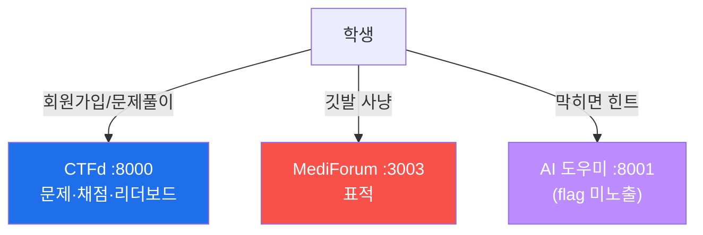

# 🏁 mini-CTF 운영 가이드 (Week 05)

MediForum(:3003)을 표적으로 한 6문제 CTF를, **CTFd(:8000)** 위에서 운영한다.
회원가입 · 실시간 리더보드 · **AI 도우미(:8001)** 연동까지 포함한다.



## 0. 기동

```bash
cd ../infra
./start.sh          # mediforum(:3003) · ctfd(:8000) · ai-helper(:8001) 포함 기동
```

## 1. CTFd 최초 셋업 (1회)

1. `http://<victim-ip>:8000` 접속 → 안내에 따라 **대회 이름 / 관리자 계정** 생성.
2. 가입 방식: **Settings → 회원가입 허용(Registration: Public)** 으로 두면 학생이 직접 가입.
3. 시작/종료 시간은 비워두거나 수업 시간에 맞춘다.

## 2. 문제 일괄 등록 (AI/자동)

문제·깃발·힌트는 `challenges.yml` 에 정의돼 있고, 스크립트가 CTFd API로 한 번에 등록한다.

```bash
# CTFd → Settings → Access Tokens 에서 토큰 발급 후:
pip install requests pyyaml
python3 import_challenges.py \
  --ctfd http://<victim-ip>:8000 \
  --token <ACCESS_TOKEN> \
  --victim <victim-ip>          # 문제 설명의 {VICTIM} 치환
```

> 수동 등록을 원하면 CTFd → **Admin → Challenges → +** 에서 `challenges.yml` 내용을 그대로 입력해도 된다.

등록되는 6문제(난이도 순):

| # | 문제 | 카테고리 | 점수 | 응용 |
|---|------|----------|------|------|
| 1 | 페이지 속 깃발 | Recon | 50 | |
| 2 | 인증 없는 회원 API | Web | 100 | |
| 3 | 남의 진료기록 (IDOR) | Web | 150 | |
| 4 | 관리자 쪽지 도청 | Web | 150 | |
| 5 | 예측 가능한 세션 | Web | 200 | ★ |
| 6 | 저장형 XSS — 관리자 봇 | Web | 200 | ★ |

## 3. AI 도우미 (질문·답변 연동)

`http://<victim-ip>:8001` — 학생이 **문제를 고르고 질문하면 방향 힌트**를 준다. **깃발은 절대
알려주지 않는다**(응답의 `flag{...}` 는 자동 가림). 백엔드는 환경변수로 고른다.

| 모드 | 설정 | 비고 |
|------|------|------|
| **오프라인(기본)** | 아무것도 설정 안 함 | 문제별 단계 힌트. 인터넷/GPU 없이도 항상 동작 |
| **Anthropic** | `ANTHROPIC_API_KEY=sk-ant-...` | 모델 `ANTHROPIC_MODEL`(기본 claude-haiku-4-5) |
| **Ollama(개인 GPU)** | `OLLAMA_URL=http://<gpu>:11434` | tw2 와 동일한 방식. 모델 `OLLAMA_MODEL` |

설정은 `infra/` 에 `.env` 파일을 만들어 넣으면 compose가 읽는다. 예:
```bash
# infra/.env
ANTHROPIC_API_KEY=sk-ant-xxxxx
```
> **CTFd 화면에 도우미 띄우기(선택):** CTFd → Admin → Pages 에서 새 페이지를 만들고
> `<iframe src="http://<victim-ip>:8001" style="width:100%;height:600px;border:0"></iframe>`
> 를 넣으면 대회 메뉴 안에서 바로 도우미를 쓸 수 있다.

## 4. 리더보드

`http://<victim-ip>:8000/scoreboard` — 점수가 실시간 반영된다. 동점일 땐 먼저 도달한 팀이 위.

## 5. 정답 풀이 (강사 전용)

각 문제의 **정확한 깃발 획득 절차**는 [`../solutions/SOLUTIONS.md`](../solutions/SOLUTIONS.md) 에
있다. **학생 배부 금지** — 수업 후 교재로 배부할 때만 공개한다.

## ⚠️ 주의
- `challenges.yml` 과 `solutions/` 에는 **깃발이 들어 있다.** 학생에게 이 폴더를 보여주지 말 것.
- 표적·CTFd 는 폐쇄망/로컬에서만. 끝나면 `cd ../infra && ./stop.sh purge`.
