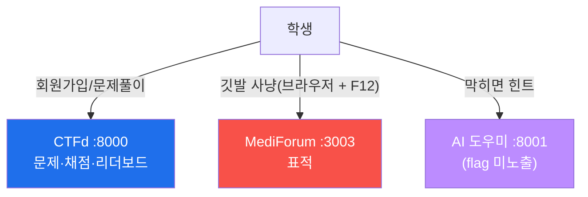

# 🏁 mini-CTF 운영 가이드 (Week 05)

MediForum(:3003)을 표적으로 한 6문제 CTF를, **CTFd(:8000)** 위에서 운영한다.
회원가입 · 실시간 리더보드 · **AI 도우미(:8001)** 연동까지 포함한다.



## 0. 기동

```bash
cd ../infra
./start.sh hub        # 강사 서버: 강좌사이트(:8090) · CTFd(:8000) · AI도우미(:8001)
./start.sh victim     # 학생 PC : DVWA(:8088) · NeoBank(:3001) · MediForum(:3003) · AICompanion(:3005)
./start.sh            # 한 대에서 전부 (교실이 아니라 혼자 테스트할 때)
```

## 1. CTFd 최초 셋업 (1회)

**(A) 자동 — 관리자 생성 + 토큰 발급 한 방에:**
```bash
pip install requests pyyaml
python3 setup_ctfd.py --ctfd http://<hub-ip>:8000 --admin admin --password '원하는비번' --email admin@ezweb.local
# 출력 마지막 줄 TOKEN=... 을 2단계 import 에 사용
```
**(B) 수동:** `http://<hub-ip>:8000` 접속 → **대회 이름 / 관리자 계정** 생성 →
**Settings → Registration: Public**(학생 직접 가입) → 시작/종료 시간 설정(선택).

> 강좌 사이트(:8090)에서 학생이 회원가입하면 **CTFd 계정도 같이 만들어진다**(연동 설정 시).
> `site/README` 의 `CTFD_URL` / `CTFD_ADMIN_TOKEN` 환경변수 참고.

## 2. 문제 일괄 등록

```bash
python3 import_challenges.py \
  --ctfd http://<hub-ip>:8000 \
  --token <ACCESS_TOKEN> \
  --victim <victim-ip> \        # 문제 설명의 {VICTIM} 치환
  --replace                     # 기존 문제를 지우고 새로 등록(재실행 시)
```

등록이 끝나면 스크립트가 **자동으로 재조회해서 깃발이 문제에 제대로 연결됐는지 검증**하고
`✓ / ✗` 로 보고한다. ✗ 가 하나라도 있으면 학생이 정답을 넣어도 오답 처리되니 반드시 고친다.

> **관용 채점.** 문제마다 깃발을 2개 등록한다 — 정적(대소문자 무시) + 정규식.
> 정규식이 **앞뒤 공백 · 대소문자 · 중괄호 누락**(`flag{...}` 대신 `...` 만 입력)까지
> 정답 처리한다. 실제 수업에서 났던 오답의 대부분이 중괄호 누락이었기 때문이다.
> 단, **다른 문제의 답이나 오타는 그대로 오답**이므로 문제의 의미는 유지된다.

| # | 문제 | 카테고리 | 점수 | 브라우저 출발점 |
|---|------|----------|------|-----------------|
| 1 | 페이지 속 깃발 | Recon | 50 | `Ctrl+U` 소스 보기 |
| 2 | 인증 없는 회원 API | Web | 100 | `F12 → Network` |
| 3 | 남의 진료기록 (IDOR) | Web | 150 | 주소창의 기록 번호 |
| 4 | 관리자 쪽지 도청 | Web | 150 | `robots.txt → /admin` |
| 5 | 예측 가능한 세션 ★ | Web | 200 | `F12 → Cookies` |
| 6 | 저장형 XSS — 관리자 봇 ★ | Web | 200 | 글쓰기 → 신고 → 검토 |

**모든 문제는 브라우저 + F12 만으로 풀 수 있게 설계되어 있다.** 주소를 "찍어서 맞히는"
문제는 없다 — `robots.txt`, Network 탭, 화면의 버튼이 다음 단계를 알려 준다.

## 3. ★ 수업 전 자가 점검 (반드시)

```bash
python3 verify_ctf.py --victim <victim-ip> --ctfd http://<hub-ip>:8000 --token <TOKEN> --submit
```

이 스크립트가 하는 일:
1. 표적(MediForum)을 **실제로 6문제 다 풀어** 깃발을 뽑아낸다.
2. `challenges.yml` 의 정답과 글자 하나까지 비교한다.
3. CTFd 에 등록된 깃발을 조회해 **문제-깃발 연결**을 확인한다.
4. `--submit` 을 주면 **테스트 계정으로 실제 제출**해 `correct` 가 뜨는지까지 본다.

전부 ✓ 면 "찾아서 넣었는데 오답" 사고는 구조적으로 발생하지 않는다.
(`--submit` 으로 만든 테스트 계정은 리더보드에 남으니 수업 전 CTFd → Admin → Users 에서 삭제)

## 4. AI 도우미 (질문·답변 연동)

`http://<hub-ip>:8001` — 학생이 **문제를 고르고 질문하면 방향 힌트**를 준다. **깃발은 절대
알려주지 않는다**(응답의 `flag{...}` 는 자동 가림). 백엔드는 환경변수로 고른다.

| 모드 | 설정 | 비고 |
|------|------|------|
| **오프라인(기본)** | 아무것도 설정 안 함 | 문제별 단계 힌트. 인터넷/GPU 없이도 항상 동작 |
| **오픈 모델(DGX Spark)** | `OLLAMA_URL=http://<dgx>:11434` | 특강 본편과 같은 방식. 모델 `OLLAMA_MODEL` |
| **Anthropic** | `ANTHROPIC_API_KEY=sk-ant-...` | 모델 `ANTHROPIC_MODEL` |

설정은 `infra/.env` 파일에 넣으면 compose가 읽는다. 예:
```bash
# infra/.env
OLLAMA_URL=http://192.168.0.60:11434
OLLAMA_MODEL=deepseek-r1:70b
```
> **CTFd 화면에 도우미 띄우기(선택):** CTFd → Admin → Pages 에서 새 페이지를 만들고
> `<iframe src="http://<hub-ip>:8001" style="width:100%;height:600px;border:0"></iframe>`

## 5. 리더보드

`http://<hub-ip>:8000/scoreboard` — 점수가 실시간 반영된다. 동점일 땐 먼저 도달한 팀이 위.

## 6. 정답 풀이 (강사 전용)

각 문제의 **브라우저 절차 + 왜 뚫리나 + 방어책**은
[`../solutions/SOLUTIONS.md`](../solutions/SOLUTIONS.md) 에 있다.
강좌 사이트에서도 **admin 등급 계정으로 로그인해야만** `/solutions` 에서 열린다.

## ⚠️ 주의
- `challenges.yml` 과 `solutions/` 에는 **깃발이 들어 있다.** 학생에게 이 폴더를 보여주지 말 것.
- 표적·CTFd 는 폐쇄망/로컬에서만. 끝나면 `cd ../infra && ./stop.sh purge`.
