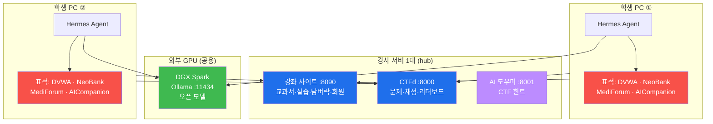

# 🏫 배포 · 수업 운영 가이드

> **한 줄 결론:** 강의·CTF·담벼락은 **강사 서버 1대(hub)** 에서 중앙 운영하고,
> **표적(희생자) 사이트는 학생 PC 각자(victim)** 에 띄운다. AI 두뇌(모델)는 외부
> **DGX Spark** 한 대를 반 전체가 공유한다.

---

## 1. 전체 그림



| 구성요소 | 어디에 | 몇 대 | 왜 |
|----------|--------|-------|-----|
| 강좌 사이트 · CTFd · AI 도우미 | 강사 서버 | **1대** | 점수·회원·자료는 한곳에 모여야 한다 |
| 표적 4종(DVWA·NeoBank·MediForum·AICompanion) | **학생 PC 각자** | 인원수 | 서로 방해하지 않게 |
| Hermes Agent | 학생 PC 각자 | 인원수 | 표적(로컬)에 닿아야 하므로 |
| 오픈 모델(Ollama) | DGX Spark | **1대(공용)** | GPU 는 비싸고, 모델은 공유해도 안전 |

---

## 2. 왜 표적을 학생 PC 마다 띄우나 (중앙 1대면 안 되는 이유)

교실에서 표적 한 대를 반 전체가 공유하면 **반드시 다음 사고가 난다.**

| 실습 | 한 대를 공유하면 벌어지는 일 |
|------|------------------------------|
| W03 CSRF | 한 학생이 DVWA admin 비밀번호를 `hacked123` 으로 바꾸는 순간 **반 전체가 로그인 불가** |
| W03 Reset DB | 누군가 *Create/Reset Database* 를 누르면 **남들의 진행이 초기화** |
| W03 웹셸 | 30명이 같은 `shell.php` 를 덮어쓰며 서로의 결과를 지운다 |
| W04 권한상승 | alice 의 role 이 admin 으로 바뀌면 **뒷사람은 IDOR 의 '충격'을 못 느낀다** |
| W05 저장형 XSS | 한 명이 스크립트를 심으면 **나머지 29명은 6번 문제가 이미 풀린 상태**로 보인다(부정행위) |
| 특별 세션 RAG 오염 | 한 명이 지식베이스를 오염시키면 **모두의 챗봇이 오염** |

반대로 **CTFd 는 반드시 중앙 1대**여야 한다. 점수·리더보드·순위가 한곳에 모여야 대회가 성립한다.
표적은 각자, 채점은 중앙 — 이 조합이 정답이다.

> **깃발이 학생마다 달라지지 않나요?** 안 달라진다. MediForum 은 **부팅할 때마다 깃발을 강제로
> 다시 심으므로**(`ensure_ctf_flags()`), 모든 학생 PC 의 깃발이 `ctf/challenges.yml` 과 정확히
> 같다. 학생 A 가 찾은 깃발과 학생 B 가 찾은 깃발이 동일하고, 중앙 CTFd 가 그걸 채점한다.

---

## 3. 설치 절차

### 3-1. 강사 서버 (hub) — 수업 전날

```bash
git clone https://github.com/mrgrit/easy_web_hacking_class.git
cd easy_web_hacking_class

# ① 서버 기동 (강좌 사이트 · CTFd · AI 도우미)
cd infra && ./start.sh hub

# ② CTFd 관리자 생성 + 토큰 발급
cd ../ctf
python3 setup_ctfd.py --ctfd http://127.0.0.1:8000 \
   --admin admin --password '강한비번' --email admin@ezweb.local
#   → 마지막 줄 TOKEN=... 을 복사

# ③ 문제 6개 등록 (표적 IP 는 안내용이므로 대표값이면 된다)
python3 import_challenges.py --ctfd http://127.0.0.1:8000 \
   --token <TOKEN> --victim localhost --replace

# ④ ★ 자가 점검 — 표적 한 대를 띄워 두고 실행
cd ../infra && ./start.sh victim          # (강사 PC 에서 테스트용으로)
cd ../ctf
python3 verify_ctf.py --victim 127.0.0.1 --ctfd http://127.0.0.1:8000 --token <TOKEN> --submit
#   → 전부 ✓ 가 나와야 수업 시작. ✗ 가 하나라도 있으면 고친 뒤 다시.
```

**⑤ CTFd 계정 자동 연동 켜기 (권장)** — `infra/.env` 파일을 만든다.

```bash
# infra/.env
SITE_SECRET_KEY=아무거나-길고-랜덤한-문자열
ADMIN_SIGNUP_CODE=강사만-아는-코드
CTFD_ADMIN_TOKEN=<위에서 발급한 TOKEN>
CTFD_PUBLIC_URL=http://192.168.0.10:8000     # 학생에게 안내할 CTFd 주소
# AI 도우미를 오픈 모델로 돌리려면:
OLLAMA_URL=http://192.168.0.60:11434
OLLAMA_MODEL=qwen3:32b
```

```bash
cd infra && ./start.sh hub     # 재기동하면 .env 가 반영된다
```

이제 학생이 **강좌 사이트에서 회원가입 한 번**만 하면 CTFd 계정까지 같은 아이디·비밀번호로
자동 생성된다.

**⑥ 강사 계정 만들기** — 강좌 사이트(`:8090`)에서 **가장 먼저** 가입한다.
첫 번째 가입자는 자동으로 **관리자(admin)** 등급이 된다. (이후 가입자는 학생 등급이며,
관리자 코드를 입력한 경우에만 관리자가 된다.)

> ⚠️ **수업 시작 전 반드시 확인** — `👥 수강생` 화면에서 학생 계정이 전부 **학생 등급**인지 본다.
> 관리자 등급이면 정답·해설이 그대로 보인다.

### 3-2. 학생 PC (victim) — 첫 시간에 함께

```bash
git clone https://github.com/mrgrit/easy_web_hacking_class.git
cd easy_web_hacking_class

# 맨바닥(도커도 없는 상태)이면 이 한 줄이 전부 설치·기동한다
./setup.sh victim

# 이미 도커가 있으면
cd infra && ./start.sh victim
```

그다음 Week 02 실습대로 **Hermes Agent 설치 + DGX Spark 모델 연결**을 진행한다.

### 3-3. DGX Spark (AI 두뇌) — 강사가 미리

```bash
# ① Ollama 설치
curl -fsSL https://ollama.com/install.sh | sh

# ② 반 전체가 접속할 수 있게 외부 바인딩 (기본은 127.0.0.1 만 듣는다!)
sudo mkdir -p /etc/systemd/system/ollama.service.d
sudo tee /etc/systemd/system/ollama.service.d/override.conf >/dev/null <<'EOF'
[Service]
Environment="OLLAMA_HOST=0.0.0.0:11434"
Environment="OLLAMA_KEEP_ALIVE=24h"
Environment="OLLAMA_NUM_PARALLEL=4"
EOF
sudo systemctl daemon-reload && sudo systemctl restart ollama

# ③ 모델 내려받기 (도구 호출을 지원하는 모델을 고를 것 — 아래 §4 참고)
ollama pull qwen3:32b
ollama pull deepseek-r1:70b      # 설명·추론용(도구 호출 지원 여부는 반드시 확인)

# ④ 컨텍스트 넓히기 (에이전트 작업에는 64k 이상 권장)
cat > /tmp/Modelfile <<'EOF'
FROM qwen3:32b
PARAMETER num_ctx 64000
EOF
ollama create qwen3-64k -f /tmp/Modelfile

# ⑤ 학생 계정 만들기 (ssh 실습용)
sudo adduser student01     # … 인원수만큼

# ⑥ 확인
curl http://<dgx-ip>:11434/api/tags
```

---

## 4. ⚠️ 모델 선택 — 수업 전 반드시 확인할 것

에이전트가 **파일을 만들고 명령을 실행하려면**, 모델이 **도구 호출(tool calling)** 을
지원해야 한다. 이건 모델·버전마다 다르다.

- **추론(reasoning) 특화 모델**(`deepseek-r1` 계열 등)은 설명·개념 질문에는 훌륭하지만,
  버전에 따라 도구 호출을 지원하지 않아 **에이전트로 쓰면 말만 하고 아무 파일도 안 만든다.**
- 수업 전 **강사가 직접 검증**해 도구 호출이 되는 모델을 1~2개 골라 칠판에 적어 둔다.

**검증 방법 (5분)**

```bash
# 학생 PC 에서 Hermes 를 그 모델로 설정한 뒤
cd ~/tmp-test && hermes
# hermes 안에서:
#   지금 폴더에 hello.txt 파일을 만들고 안에 'ok'라고 써줘.
# 나와서:
cat hello.txt        # 파일이 실제로 생겼으면 그 모델은 사용 가능
```

**권장 운영** — 도구 호출이 되는 모델을 **주 모델**로 지정하고, 추론 모델은
"개념을 자세히 설명해 주는 조수"로 별도 안내한다(`/model` 로 전환).

---

## 5. 네트워크 · 방화벽 체크리스트

| 방향 | 포트 | 필요 여부 |
|------|------|-----------|
| 학생 PC → 강사 서버 | 8090, 8000, 8001 | ✅ 필수 |
| 학생 PC → DGX Spark | 11434(Ollama), 22(ssh) | ✅ 필수 |
| 학생 PC → 학생 PC | — | ❌ 불필요 (표적은 각자 localhost) |
| 인터넷 → 어디든 | — | ❌ **절대 열지 말 것** |

> 🚨 **표적 사이트를 공인 IP 에 노출하지 마세요.** 일부러 취약하게 만든 서버입니다.
> 폐쇄망 또는 NAT 뒤에서만 운영하고, 수업이 끝나면 `./stop.sh purge` 로 내립니다.

---

## 6. 수업 진행 순서 (권장 타임라인)

| 시점 | 강사 | 학생 |
|------|------|------|
| **수업 전날** | hub 기동 → CTFd 셋업 → 문제 등록 → **verify_ctf.py 로 검증** → DGX 모델 검증 | — |
| **Week 01** | 강좌 사이트 주소 안내 | 강좌 사이트 **회원가입**(= CTF 계정 동시 생성), 서약서 서명 |
| **Week 02 앞부분** | DGX 계정·주소·모델명 배포 | `./setup.sh victim` 으로 표적 설치 → ssh 접속 실습 |
| **Week 02 중반** | 도구 호출 검증 도와주기 | Hermes 설치 → 모델 연결 → `hello.txt` 검증 |
| **Week 03~04** | 순회 지도 | 브라우저로 실습, 에이전트로 점검 |
| **Week 05 직전** | `verify_ctf.py` 재실행(표적 재기동 후) | — |
| **Week 05** | 리더보드 띄워 두기 | CTF 참가 |
| **특별 세션** | AICompanion 은 mock 모드로 충분 | AI 서비스 모의해킹 3주 |
| **종료 후** | `./stop.sh purge` (양쪽 다) | 표적 삭제 |

---

## 7. 자주 겪는 운영 문제

**Q. 학생이 강좌 사이트에 접속을 못 해요.**
강사 서버의 IP 를 다시 확인하고(`hostname -I`), 방화벽에서 8090 이 열려 있는지 본다.
`http://<hub-ip>:8090/_health` 가 열리면 서버는 정상이다.

**Q. CTF 에서 깃발을 넣었는데 오답이래요.**
`ctf/verify_ctf.py --submit` 을 돌린다. 세 가지를 자동으로 확인해 준다 —
표적의 실제 깃발 / `challenges.yml` 정답 / CTFd 에 등록된 깃발. 하나라도 어긋나면 알려 준다.
과거 이 문제의 원인은 **등록 스크립트가 깃발을 문제에 연결하지 못한 것**이었고, 지금은 등록
직후 자동 검증한다.

**Q. 학생 PC 표적이 예전 상태로 꼬였어요.**
```bash
cd infra && ./stop.sh purge && ./start.sh victim
```
MediForum 은 재기동만 해도 깃발이 원상 복구된다.

**Q. 에이전트가 너무 느려요.**
DGX Spark 한 대에 반 전체가 몰리면 줄을 선다. 대책 — ① `OLLAMA_NUM_PARALLEL` 을 올린다,
② 더 작은 모델을 보조로 둔다, ③ **브라우저 실습과 에이전트 실습을 조를 나눠 교차 진행**한다
(어차피 모든 실습이 브라우저로도 되므로 이게 가장 확실하다).

**Q. 학생 계정이 관리자로 만들어졌어요.**
`👥 수강생` 화면에서 **학생으로** 버튼을 눌러 내린다. 첫 가입자만 자동 관리자가 되므로,
**강사가 반드시 가장 먼저 가입**해야 한다.

**Q. 인터넷이 없는 교실이에요.**
Hermes Agent 설치와 Docker 이미지 빌드에는 인터넷이 필요하다. **수업 전에 미리** 설치·빌드해
두면 수업 당일에는 인터넷 없이도 전부 돌아간다(모델도 DGX 로컬, AICompanion 도 mock 모드).

---

## 8. 한 대로 다 하고 싶다면 (소규모·개인 학습)

인원이 아주 적거나 혼자 공부한다면 한 대에 전부 띄워도 된다.

```bash
./setup.sh          # 맨바닥에서 전부 설치 + 기동 + CTFd 자동 셋업
# 또는
cd infra && ./start.sh
```

이 경우 표적 주소는 전부 `localhost` 이고, 위의 "서로 방해" 문제는 생기지 않는다.
