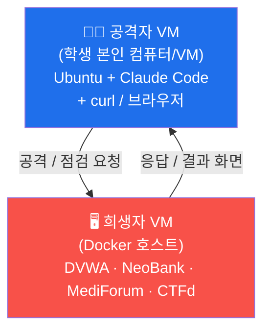

# 실습 인프라 — 희생자 VM & 공격자 VM

이 특강은 **딱 두 대의 컴퓨터(VM)** 만 있으면 됩니다. 복잡한 기존 인프라(el34 등)는 쓰지 않습니다.



- **공격자 VM** = 학생이 직접 쓰는 리눅스(Ubuntu) 한 대. 여기에 **Claude Code** 와 브라우저, `curl` 이 깔립니다. (설치법은 Week 02)
- **희생자 VM** = 일부러 취약하게 만든 웹사이트들이 Docker 로 떠 있는 한 대. 학생은 이 사이트를 공격/점검합니다.

> 두 역할을 **한 대의 노트북에서** 같이 돌려도 됩니다(희생자 컨테이너를 띄우고, 같은 머신에서 브라우저로 접속). 교실 환경이라면 강사 1대를 희생자로, 학생들은 각자 공격자로 두는 방식을 권장합니다.

---

## 0. 준비물 (희생자 VM)

- Ubuntu 22.04+ (또는 Docker 가 도는 리눅스)
- Docker + Docker Compose 플러그인

```bash
# Docker 설치 (Ubuntu)
sudo apt-get update
sudo apt-get install -y docker.io docker-compose-plugin
sudo usermod -aG docker $USER   # 로그아웃 후 재로그인하면 sudo 없이 docker 사용
```

## 1. 희생자 사이트 전부 띄우기

```bash
cd infra
./start.sh            # 특강 기본 4종: DVWA / NeoBank / MediForum / CTFd
# 보너스 사이트까지: ./start.sh extras
```

뜨고 나면 아래 주소로 접속됩니다 (`<victim-ip>` = 희생자 VM의 IP, 같은 머신이면 `localhost`).

| 사이트 | 주소 | 쓰는 주차 | 로그인 |
|--------|------|-----------|--------|
| **강좌 사이트** | `http://<victim-ip>:8090` | 전 주차 | 없음 (커리큘럼·교과서·실습·다운로드 포털) |
| **DVWA** | `http://<victim-ip>:8088` | Week 03 | `admin` / `password` (첫 접속 시 *Create / Reset Database*) |
| **NeoBank** | `http://<victim-ip>:3001` | Week 04 | 데모계정 `alice@example.com` / `alice123` (그 외 bob/carol/teller1, admin) |
| **MediForum** | `http://<victim-ip>:3003` | Week 05 (CTF 표적) | 사이트 내 **회원가입** 후 로그인 |
| **CTFd** | `http://<victim-ip>:8000` | Week 05 (CTF 플랫폼) | 최초 1회 관리자 셋업 |
| **AI 도우미** | `http://<victim-ip>:8001` | Week 05 (힌트 챗봇) | 없음 (flag 미노출) |
| *govportal* | `:3002` | (보너스) | extras |
| *aicompanion* | `:3005` | (보너스) | extras |
| *adminconsole* | `:3004` | (보너스) | extras |
| *juiceshop* | `:3000` | (보너스) | extras |

## 2. DVWA 첫 설정 (Week 03 전에 1회)

1. `http://<victim-ip>:8088` 접속 → `admin` / `password` 로그인
2. 맨 아래 **Create / Reset Database** 클릭
3. 좌측 **DVWA Security** → **Low** 로 설정 후 *Submit*
   - 초보 학생용이라 **반드시 Low** 로 둡니다. (변수 없이 딱 짜인 결과가 나오게)

## 3. CTFd 첫 설정 (Week 05 전에 1회)

`ctf/README.md` 참고. 요약:
1. `http://<victim-ip>:8000` 접속 → 최초 관리자 계정 생성
2. 문제·flag·힌트 일괄 등록 — CTFd → Settings → Access Tokens 발급 후:
   ```bash
   cd ../ctf && pip install requests pyyaml
   python3 import_challenges.py --ctfd http://<victim-ip>:8000 --token <TOKEN> --victim <victim-ip>
   ```
3. 학생은 회원가입 후 문제 풀이, **Scoreboard** 에서 실시간 순위 확인. 힌트는 AI 도우미(`:8001`).

## 4. 내리기

```bash
./stop.sh           # 컨테이너만 내림(데이터 보존)
./stop.sh purge     # 볼륨까지 완전 삭제
```

---

## ⚠️ 보안 경고

여기 사이트들은 **고의로 취약**합니다. 절대 공인 IP/인터넷에 노출하지 마세요. 반드시
- 폐쇄망 또는 NAT 뒤의 로컬 VM,
- 방화벽으로 외부 차단,
- 실습 끝나면 `./stop.sh purge`

상태에서만 운영하세요. 커스텀 사이트(NeoBank/MediForum 등)는 [mrgrit/ccc](https://github.com/mrgrit/ccc/tree/main/contents/vuln-sites) 의 교육용 취약 사이트를 가져온 것입니다.
