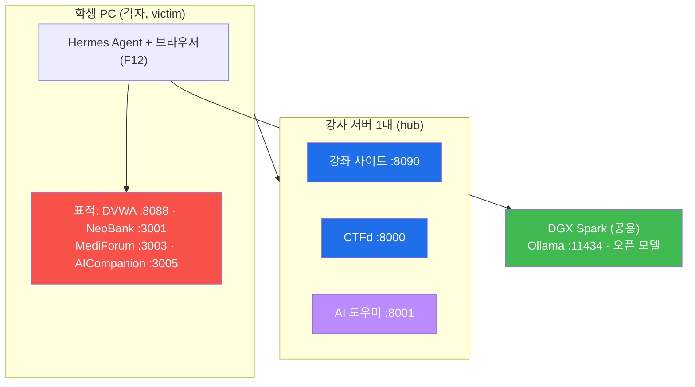

# 실습 인프라 — 강사 서버(hub) & 학생 PC(victim)

이 특강은 두 역할로 나뉩니다. **강의·CTF는 중앙 1대, 표적은 학생 PC 각자.**
왜 그렇게 나누는지와 교실 운영 팁은 [`../docs/DEPLOYMENT.md`](../docs/DEPLOYMENT.md) 에 있습니다.



- **공격자** = 학생이 직접 쓰는 리눅스(Ubuntu) 한 대. 여기에 **Hermes Agent** 와 브라우저가 깔립니다. (설치법은 Week 02)
- **AI 두뇌** = 외부 **DGX Spark** 의 Ollama(`:11434`). Hermes 가 여기로 질문을 보냅니다.
- **표적** = 같은 학생 PC 에서 Docker 로 뜨는 취약 사이트들. 서로 방해하지 않도록 각자 띄웁니다.

---

## 0. 준비물

- Ubuntu 22.04+ (또는 Docker 가 도는 리눅스)
- Docker + Docker Compose 플러그인

> **🚀 아무것도 안 깔렸다면** 레포 루트의 한 방 스크립트가 Docker/파이썬 설치부터 기동·
> CTFd 자동셋업·DVWA 초기화까지 전부 해줍니다:
> ```bash
> ./setup.sh hub        # 강사 서버
> ./setup.sh victim     # 학생 PC
> ./setup.sh            # 한 대에서 전부
> ```

```bash
# (수동) Docker 설치 (Ubuntu)
sudo apt-get update
sudo apt-get install -y docker.io docker-compose-plugin
sudo usermod -aG docker $USER   # 로그아웃 후 재로그인하면 sudo 없이 docker 사용
```

## 1. 기동

```bash
cd infra
./start.sh hub        # 강사 서버: 강좌사이트 · CTFd · AI 도우미
./start.sh victim     # 학생 PC : DVWA · NeoBank · MediForum · AICompanion
./start.sh            # 한 대에서 전부 (혼자 테스트)
./start.sh extras     # + 보너스 표적(govportal / adminconsole / juiceshop)
```

| 사이트 | 주소 | 프로필 | 쓰는 주차 | 로그인 |
|--------|------|--------|-----------|--------|
| **강좌 사이트** | `:8090` | hub | 전 주차 | 사이트 내 **회원가입**(첫 가입자=관리자) |
| **CTFd** | `:8000` | hub | Week 05 | 최초 1회 관리자 셋업 |
| **AI 도우미** | `:8001` | hub | Week 05 | 없음 (flag 미노출) |
| **DVWA** | `:8088` | victim | Week 03 | `admin` / `password` (첫 접속 시 *Create / Reset Database*) |
| **NeoBank** | `:3001` | victim | Week 04 | `alice@example.com` / `alice123` (그 외 bob/carol/teller1, admin) |
| **MediForum** | `:3003` | victim | Week 05 (CTF 표적) | 사이트 내 **회원가입** |
| **AICompanion** | `:3005` | victim | 특별 세션 | `alice` / `alice123`, `admin` / `admin` |
| *govportal* | `:3002` | extras | (보너스) | |
| *adminconsole* | `:3004` | extras | (보너스) | |
| *juiceshop* | `:3000` | extras | (보너스) | |

## 2. 환경 설정 (`infra/.env`, 선택)

```bash
# 강좌 사이트
SITE_SECRET_KEY=길고-랜덤한-문자열
ADMIN_SIGNUP_CODE=강사만-아는-코드
CTFD_ADMIN_TOKEN=<CTFd Access Token>       # 넣으면 가입 시 CTF 계정 자동 생성
CTFD_PUBLIC_URL=http://192.168.0.10:8000   # 학생에게 안내할 CTFd 주소

# AI 도우미 / AICompanion 을 실제 오픈 모델로 돌릴 때
OLLAMA_URL=http://192.168.0.60:11434
OLLAMA_MODEL=qwen3:32b
AIC_LLM_BACKEND=mock                       # ollama 로 바꾸면 AICompanion 이 진짜 모델을 씀
```

## 3. DVWA 첫 설정 (Week 03 전에 1회)

1. `http://localhost:8088` 접속 → `admin` / `password` 로그인
2. 맨 아래 **Create / Reset Database** 클릭
3. 좌측 **DVWA Security** → **Low** 로 설정 후 *Submit*
   - 초보 학생용이라 **반드시 Low**. (`./setup.sh victim` 이 자동으로 해 줍니다)

## 4. CTFd 첫 설정 (Week 05 전에 1회, 강사 서버에서)

`../ctf/README.md` 참고. 요약:
```bash
cd ../ctf
python3 setup_ctfd.py --ctfd http://127.0.0.1:8000 --admin admin --password '비번' --email admin@ezweb.local
python3 import_challenges.py --ctfd http://127.0.0.1:8000 --token <TOKEN> --victim <표적IP> --replace
python3 verify_ctf.py --victim <표적IP> --ctfd http://127.0.0.1:8000 --token <TOKEN> --submit   # ★ 필수
```

## 5. 내리기

```bash
./stop.sh           # 컨테이너만 내림(회원·CTF 점수 등 데이터 보존)
./stop.sh purge     # 볼륨까지 완전 삭제(전부 초기화)
```

표적이 꼬였을 때 학생 PC 에서:
```bash
./stop.sh purge && ./start.sh victim
```
MediForum 은 **재기동만 해도 깃발이 원상 복구**됩니다(`ensure_ctf_flags()`).

---

## ⚠️ 보안 경고

여기 사이트들은 **고의로 취약**합니다. 절대 공인 IP/인터넷에 노출하지 마세요. 반드시
- 폐쇄망 또는 NAT 뒤의 로컬 VM,
- 방화벽으로 외부 차단,
- 실습 끝나면 `./stop.sh purge`

상태에서만 운영하세요. 커스텀 사이트(NeoBank/MediForum)는
[mrgrit/ccc](https://github.com/mrgrit/ccc/tree/main/contents/vuln-sites),
AICompanion 은 [mrgrit/el34](https://github.com/mrgrit/el34/tree/main/vuln-sites/aicompanion)
의 교육용 취약 사이트를 가져온 것입니다.
